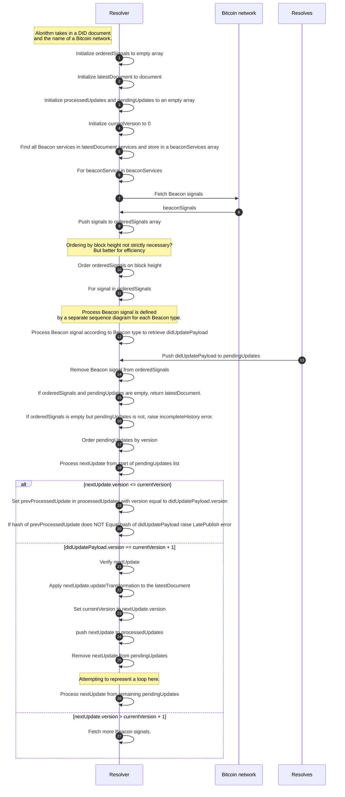
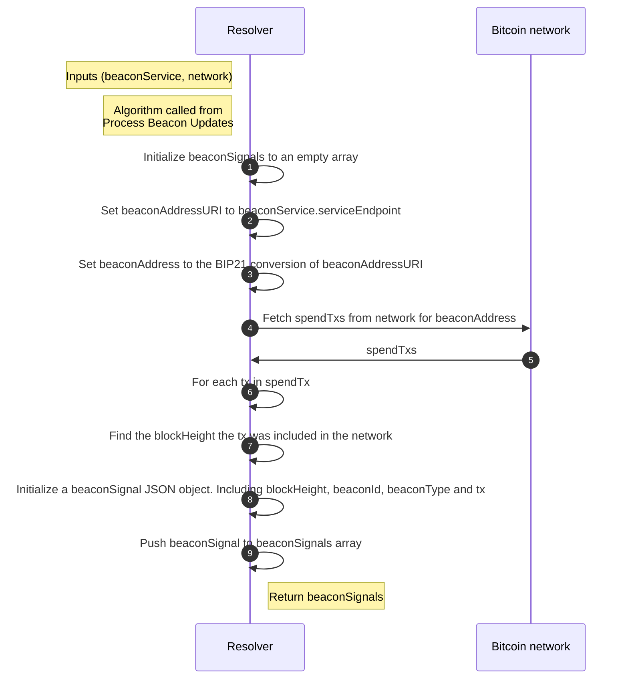
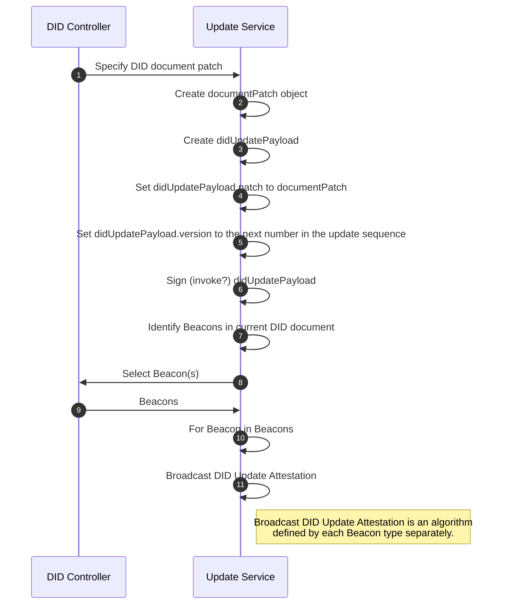
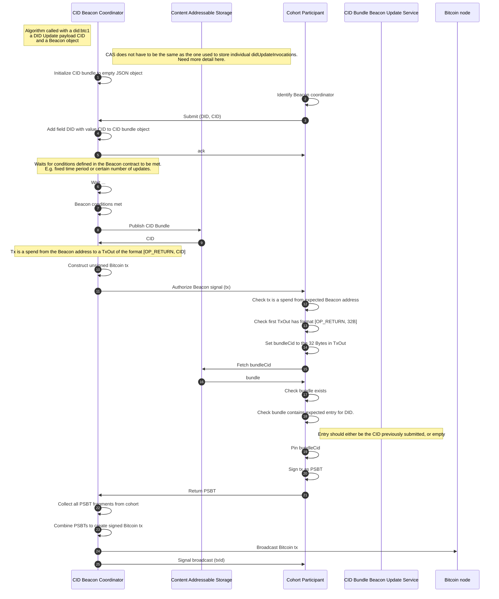
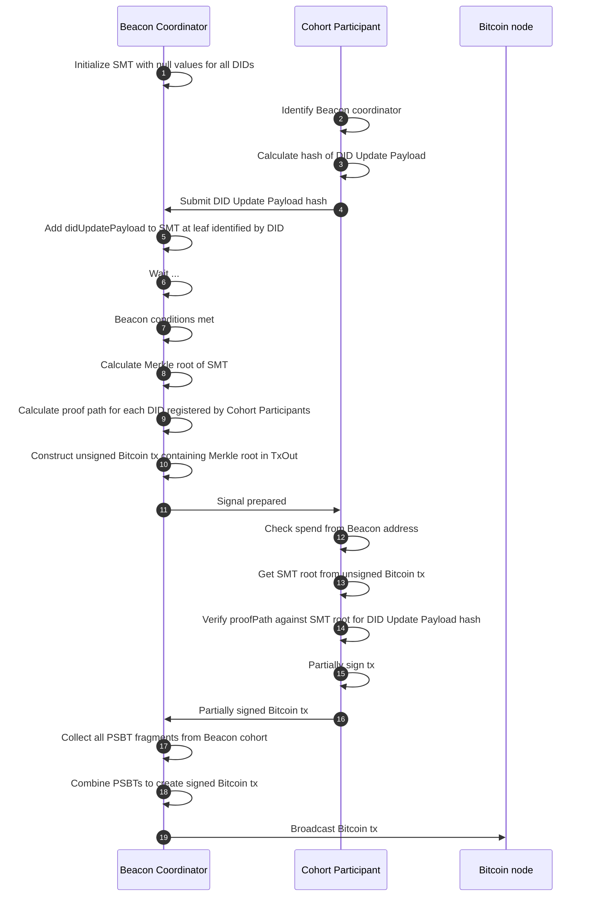
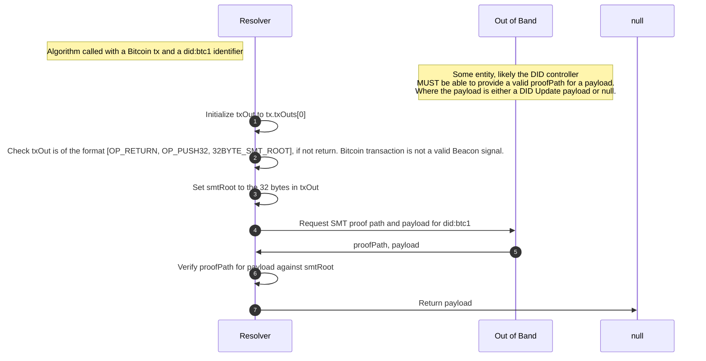

# did:btc1 DID Method Specification

- Ryan Grant <rgrant@contract.design> [Digital Contract Design](https://contract.design/)
- Will Abramson <will@legreq.com> [Legendary Requirements](legreq.com)
- Joe Andrieu <joe@legreq.com> [Legendary Requirements](legreq.com)
- Kevin Dean <kevin@legreq.com> [Legendary Requirements](legreq.com)
- Dan Pape <dpape@contract.design> [Digital Contract Design](https://contract.design/)
- Jennie Meier <jennie@contract.design> [Digital Contract Design](https://contract.design/)

Publication Date: 20th September 2024

Copyright &copy; 2024 Digital Contract Design

Licence Statement: TODO

# Abstract

# Table of Contents

1. [Introduction](#1-introduction)
2. [Terminology](#2-terminology)
3. [Syntax](#3-syntax)
4. [CRUD Operations](#4-crud-operations)
5. [Update Beacons](#5-update-beacons)
6. [Security Considerations](#6-security-considerations)
7. [Privacy Considerations](#7-privacy-considerations)

# 1. Introduction

**did:btc1** is a DID Method using the Bitcoin blockchain as a Verifiable Data Registry to announce changes to the DID document.

### Motivation

Public digital identity was introduced to the Internet through PGP's foundational legal work in the 1990's.  Since the late 2010's, with Decentralized Identifiers, digital identity can be preserved through a rotation of key material, without relying on a centralized party.  However, identity is not complete without options for privacy as well, and the initial promise of privacy in the DID ecosystem was dubious.  In particular, DIDs that are shared with a relying party can be seen by not only that party but also by any third party resolver that the relying party contracts with.  Over time, leakage will occur and surveillance-capitalism entities will collect most of the long-lived DIDs in use, as they have with all of our identities.

There is a mitigation available: "Pairwise DIDs", which are DIDs created for every different special purpose that may occur.  This includes not only a new DID created for every new person one starts a conversation with, but also every business that one transacts with, every group that one joins, and every online task that requires managing identity or key material.

However, if the DID document is leaked every time the DID is used, this parwise DID doeesn't accomplish much, either.  The next step is a private DID document, transferred directly from the DID controller to the relying party.  We call this transfer "Sidecar" delivery.  When a relying party who is willing to cooperate with privacy concerns has the capacity to act as their own resolver, then privacy has a chance.

**did:btc1** is created for those who wish to have it all:
* resistance to censorship;
* non-correlation through pairwise DIDs;
* private communication of the DID document;
* a closed loop on private DID resolution;
* long-term identifiers that can support frequent updates; 
* non-repudiation appropriate for serious contracts; and
* efficiency (in cost and energy usage), via offline DID creation and aggregatable updates.

### Comparison with other DID Methods that rely on Bitcoin's blockchain for anchoring

#### did:btcr

BTCR is the original Bitcoin DID Method.  It kept its focus on censorship resistance.  It has the following limitations:
* It is prohibitively expensive to maintain many DIDs, because both creation and every update require a separate on-chain transaction.
* It requires storing the data for the DID document somewhere public and exposed via OP_RETURN: either at a URL, or accessible via content-addressed storage such as IPFS.
* Once a DID document has been revealed as connected to a transaction, it could be possible for colluding miners to target the controlling funds for censorship, which might block updates (although this is currently highly unlikely since no valid transaction has ever been successfully censored from the blockchain by miners).
* When all of the prior updates were kept online, BTCR provided non-repudiation, however it is possible to take prior updates offline and still resolve the current BTCR update as a valid DID Document, so it cannot guarantee non-repudiation.

#### did:ion

ION anchors on the Bitcoin blockchain following a sidetree approach.  It has the following limitations:
* Although in the normal case where data is available this DID Method performs fine, it does not fully address the late publishing problem, and thus attackers may manipulate edge cases to create doubt about signatures used for attestation.
* It stores DID documents on IPFS, and thus does not allow keeping the DID document private between the DID controller and a relying party, even if they are capable of their own did:ion resolution.

#### did:btco

This DID Method stores the entire DID document on-chain in transactions using "inscriptions".  Because of this, its main feature of totally on-chain data is also its main structural limitation:
* Those transactions are very expensive.
* They cannot be kept private.

#### did:btc

This DID Method is like did:btco in that it also uses inscriptions.  It adds a batching mechanism that reduces overhead but still stores all data on-chain.  Its documentation lists "subject keys" as a feature, but they are just talking about defining additional keys in a DID document, which all of these DID Methods provide.  In summary its main limitations are:
* Creation and update require expensive transactions.
* did:btc does not contemplate a way to keep DID documents private.

#### did:btc1

### Limitations
* Resolvers require read-only view of all blocks arriving on the Bitcoin blockchain.
* DID controllers are responsible for providing the data referenced in their Beacons' updates (although many Beacons are expected to provide an archival service making Bundles publicly available).  If this data is not available, the DID will not verify.
* Because of the data availability responsibility, and the threat of a rogue Beacon publishing an invalid reference, the most secure Beacons will choose Bitcoin scripts that allow every DID controller a veto, although given current UTXO-sharing technology, this impedes availability.

### Features

* There is no proprietary blockchain, only the Bitcoin blockchain.
* Offline creation allows creating DIDs without any on-chain transactions.
* Aggregator Beacons can aggregate any number of updates from any number of DID controllers in one Bitcoin transaction.
* Non-repudiation is provided by - and *"Late Publishing"* is avoided by - ensuring 100% valid coverage of the entire update history without gaps or ambiguity.
* Public disclosure of DID documents can be avoided by using Sidecar delivery of the necessary DID history along with the DID itself.
* Public disclosure of updates to DID documents can also be avoided by only recording a Sparse Merkle Tree of proofs of DID updates on-chain.
* Resolvers need only filter transactions likely to contain updates for those DIDs of interest.
* Any kind of key can be included in a DID Document, using an update.
* Simple deterministic DIDs can be recovered from typical Bitcoin seed words.

### Future Directions

* zCaps delegation of the right to update only part of a DID Document;
* more scalable Aggregator Beacons will be possible with a "transaction introspection" upgrade to Bitcoin, such as OP\_CTV or OP\_CAT; and
* Beacons do not have to reuse their addresses if, in the controller's DID document, a descriptor is used instead of an address.

# 2. Terminology

**Beacon**

A Beacon is the mechanism by which updates to DID documents are announced and discovered. Beacons are identified by a Bitcoin address which is included as a service endpoint in a DID document along with a specific Beacon type. By spending from a Beacon address, DID controllers announce that an update to their DID has occurred (in the case of a SingleUpdate Beacon) or may have occurred (in the case of a CIDAggregator or SMTAggregator Beacons).

    [rgrant 20240920 02:47 UTC] Singleton Beacons is a better name for SingleUpdate Beacon
      ...because the beacon stays declared and can manage a second update, and so on.

**Singleton Beacons**

Singleton Beacons enable a single entity (possibly controlling multiple DIDs and possibly posting multiple updates) to independently post a DID Update Payload in a Beacon Signal.

    [rgrant 20240920 02:50 UTC] they would have to be extended to post
      a set of DID Update payloads

Since Beacon singletons do not rely on collaborators the way Aggregate Beacons do, making sure every DID document has at least one singleton Beacon guarantees updatability even if all aggregators fail.

**Aggregate Beacons**

Aggregate Beacons enabling multiple entities (possibly controlling multiple DIDs and possibly posting multiple updates) to collectively announce a set of DID Update Payloads in a Beacon Signal.

In an attack where an Aggregate Beacon refuses to sign a Beacon Signal including a controller's DID update, the DID controller can simply use another Beacon, including its recommended Singleton Beacon.

**Beacon Signal**

Beacon Signals are Bitcoin transactions that spend from a Beacon address and include a transaction output of the format [OP_RETURN, <32_bytes>]. Beacon Signals announce one or more DID Update payloads and provide a means for these payloads to be verified as part of the Beacon Signal. The type of the Beacon determines how these Beacon Signals should be constructed and processed to validate a set of DID Update payloads against the 32 bytes contained within the Beacon Signal.

**Authorized Beacon Signal (for a given DID)**

An Authorized Beacon Signal is a Beacon Signal from a Beacon with a Beacon address in a then-current DID document.

**DID Update Payload**

A capability invocation secured using Data Integrity that invokes the root capability to update a specific **did:btc1**. The signed payload includes a JSON Patch object defining a set of mutations to the DID document being updated.

**DID Update Bundle**

A JSON object that maps **did:btc1** identifiers to content identifiers for DID Update payloads for the identified DID. DID Update bundles are announced by CIDAggregator Beacons.

**Merkle Tree**

A tree data structure in which the leaves are a hash of a data block and every node that is not a leaf is a hash of its child node values. The root of a Merkle tree is a single hash that is produced by recursively hashing the child nodes down to the leaves of the tree. Given the root of a Merkle tree it is possible to provide a Merkle path that proves the inclusion of some data in the tree.

**Sparse Merkle Tree (SMT)**

A Sparse Merkle Tree (SMT) is a Merkle tree where each data point included at the leaf of the tree is indexed. This data structure enables proofs of both inclusion and non-inclusion of data at a given index. The instantiation in this specification has 2^256 leaves that are indexed by the sha256 hash of a **did:btc1** identifier.  The data attested to at the leaves of the tree is the DID Update payload for that **did:btc1** identifier that indexed to the leaf.

**Invocation**

See https://w3c-ccg.github.io/zcap-spec/#terminology

**Schnorr signatures**

An alternative to ECDSA signatures with some major advantages, such as being able to combine digital signatures from multiple parties to form a single digital signature for the composite public key. Bitcoin Schnorr signatures are still over the secp256k1 curve, so the same keypairs can be used to produce both Schnorr signatures and ECDSA signatures.

**Taproot**

Taproot is an upgrade to the Bitcoin blockchain implemented in November 2021. This upgrade enabled Bitcoin transactions to be secured using Schnorr signatures through the introduction of a new address, a taproot address.

**Unspent Transaction Output (UTXO)**

A Bitcoin transaction takes in transaction outputs as inputs and creates new transaction outputs potentially controlled by different addresses. An Unspent Transaction Output (UTXO) is a transaction output from a Bitcoin transaction that has not yet been included as an input, and hence spent, within another Bitcoin transaction.

**Content Identifier (CID)**

A Content Identifier (CID) is an identifier for some digital content (e.g., a file) generated from the content itself such that for any given content and CID generation algorithm there is a single, unique, collision-resistant identifier. This is typically done through some hashing function.

**Content Addressable Storage (CAS)**

Content Addressable Storage (CAS) is a data storage system where content is addressable using Content Identifiers (CIDs). The Interplanetary File System (IPFS) is an example of CAS.

**Non-Repudiation**

Non-repudiation is a feature of DID Methods that can clearly state that all data is available to present one canonical history for a DID. If some data is needed but not available, the DID Method must not allow DID resolution to complete.  Any changes to the history, such as may occur if a website edits a file, must be detected and disallowed.  The Late publishing problem breaks Non-Repudiation.

**Late Publishing**

Late publishing is the ability for DID updates to be revealed at a later point in time, which alters the history of a DID document such that a state, that appeared valid before the reveal, appears after late publishing to never have been valid.  Late Publishing breaks Non-Repudiation.

**Offline Creation**

Offline creation refers to when a **did:btc1** identifier and corresponding initial DID document are created without requiring network interactions.

**did:btc1** supports offline creation in two modes:
* Key Pair Deterministic Creation; and
* DID Document Initiated Creation.

**Sidecar**

A mechanism by which data necessary for resolving a DID is provided alongside the **did:btc1** identifier being resolved, rather than being retrieved through open and standardized means (e.g., by retrieving from IPFS).

To explain the metaphor, a sidecar on a motorcycle brings along a second passenger in a transformed vehicle, the same way the DID controller must bring along the DID Document history to transform the situation into one that is verifiable.

**Sidecar Data**

Data transmitted via Sidecar.

# 3. Syntax

A **did:btc1** DID consists of a `did:btc1` prefix, followed by an optional `version` number, an optional Bitcoin `network` identifier, and, finally, a `method-id` value. The `method-id` is a bech32 encoding of either a `key-value` representing a secp256k1 public key, or a `hash-value` of an initiating DID document. When the encoding is of a `key-value` the Human Readable Part (HRP) of the bech32 encoding is set to `k`. When the encoding is of a `hash-value` the HRP is set to `x`. The HRP is followed by a separator which is always `1`, this is then followed by the `bech32-encoding`.

The ABNF for a **did:btc1** DID follows:

```abnf
did-btc1 = "did:btc1:" [ version ":" ] [ network ":" ] method-id
version	= 1*DIGIT
network =  "mainnet" / "signet" / "testnet" / "regnet"
method-id = key-value / hash-value
hash-value = "x1" bech32-encoding
key-value = "k1" bech32-encoding
bech32-encoding = *bech32char
bech32char = "0" / "2" / "3" / "4" / "5" / "6" / "7" / "8" / "9" / "a" / "c" / "d" / "e" / "f" / "g" / "h" / "j" / "k" / "l" / "m" / "n" / "p" / "q" / "r" / "s" / "t" / "u" / "v" / "w" / "x" / "y" / "z"
```

ABNF is defined by the [IETF RFC5234](https://datatracker.ietf.org/doc/html/rfc5234).


## 3.1 Examples

All the four following DIDs are equivalent: 

* did:btc1:k1t5rm7vud58tyspensq9weyxc49cyxyvyh72w0n5hc7g5t859aq7sz45d5a - MOST COMMON
* did:btc1:<u>1:</u>k1t5rm7vud58tyspensq9weyxc49cyxyvyh72w0n5hc7g5t859aq7sz45d5a
* did:btc1:<u>mainnet:</u>k1t5rm7vud58tyspensq9weyxc49cyxyvyh72w0n5hc7g5t859aq7sz45d5a
* did:btc1:<u>1:mainnet:</u>k1t5rm7vud58tyspensq9weyxc49cyxyvyh72w0n5hc7g5t859aq7sz45d5a

# 4. CRUD Operations

This section defines the Create, Read, Update and Deactivate algorithms for the **did:btc1** method.

## 4.1 Create

A **did:btc1** identifier and associated DID document can either be created deterministically from a cryptographic seed, or it can be created from an arbitrary initiating DID document. In both cases, DID creation can be undertaken in an offline manner, i.e., the DID controller does not need to interact with the Bitcoin network to create their DID.

### 4.1.1 Deterministic Creation

For deterministic creation, the **did:btc1** identifier encodes a Secp256k1 public key. The key is then used to deterministically generate the initial DID document. The algorithm is as follows:

1. Optionally select a `version` for the DID. Defaults to 1.
2. Select a Bitcoin `network`. Defaults to `mainnet`.

3. Generate a secp256k1 key pair.

```
KeyGen() -> (secret_key, public_key)
```

4. Encode the public key using the bech32 encoding with a HRP value of k.

```
bech32('k', public_key) -> bech32_secp_pubkey
```
5. Construct and return the DID following the ABNF (Section 2), with the `key-value` set to the bech32_secp_pubkey. If `version` is not 1, then it MUST be included in the DID. If `network` is not mainnet, then it MUST be included in the DID.
```
return did:btc1:<version>:<network>:<bech32_secp_pubkey>
```

6. To expand this DID to its initial DID document, follow the read steps defined in [Section 4.2](#did_resolution).

### 4.1.2 Offline DID Document (Sidecar)

It is possible to create a **did:btc1** from some initiating arbitrary DID document. This allows for more complex initiating DID documents, including the ability to have Service Endpoints and Beacons that support aggregation.

1. Optionally select a `version`, it defaults to `1`.
2. Select a btc `network` for the DID, it defaults to `mainnet`.
3. Create an arbitrary intermediate DID document representation, without the `id` field. The DID document SHOULD include:
    - A verificationMethod
    - At least one Beacon service of the type SingleUpdateBeacon for an address on the specified Bitcoin `network` under the control of the DID controller
4. Generate a `cid` (content identifier) for the intermediate DID document representation. 

5. Bech32 encode the `cid` using the HRP value of `x`
```
bech32('x', public_key) -> bech32_cid
```

6. Construct DID as follows. If `version` is not 1, then it MUST be included in the DID. If `network` is not mainnet, then it MUST be included in the DID.

```
did = did:btc1:<version>:<network>:<bech32_cid>
```

7. Set an `initialDocument` to the copy of the `intermediateDocumentRepresentation`.

8. Set `initialDocument.id` to the value of the `did`.

9. For all verificationMethods, set the value of `verificationMethod.controller` to the `did`.


## 4.2 Read

The read method takes a **did:btc1** `identifier` and returns the latest DID document at the time of resolution. To do so, resolution first retrieves/generates the initial DID document for the identifier and subsequently processes all signals from Beacons included in that DID document. Applying updates to the DID document as appropriate in the order specified by their version. The chain of updates MUST form a continuous, ordered set otherwise the DID is considered invalid due to late publishing.

1. Initialize a document variable as an empty object.
2. Using a colon (`:`) as the delimiter, split the `identifier` into its components: a *scheme*, a *method*, a *version*, a *network*, and a *method-id*. The first component is always the *scheme* and MUST be the value of `did`. The second component is always the `method`. If DID contains only three components, set the *version* to `1` and *network* to `mainnet`. Use the third component of the DID as the *method-id*. If there are four components, check if the third component can be cast to an integer. If so, set *version* to this value and *network* to `mainnet`. Otherwise, set the *network* to the component value and *version* to `1`.
3. Check the validity of the identifier. The *scheme* MUST be the value `did`. The *method* MUST be the value `btc1`. The *version* MUST be convertible to a positive integer value. The *network* must be one of `mainnet`, ` signet`, `testnet`, or `regnet`. If any of these requirements fail an `InvalidDID` error MUST be raised.
4. Decode the `method-id` using bech32 to get `decode_result`
5. If `decode_result.hrp` value is a `x`, then the did:btc1 has an external initiating DID document. Run 3.2.2 External Resolution with `identifier`, `network` and `decode_result.value`
6. Else If `decode_result.hrp` value is `k`, then the `method-id` encodes a Secp256k1 public key that can be used to deterministically generate a DID document. Run 4.2.1 Deterministic Resolution with `identifier`, `network` and `decode_result.value`.
7. Else MUST raise `invalidHRPValue` error.

## 4.2.1 Deterministic Resolution

The deterministic resolution algorithm takes in `identifier`, `network` and `key_bytes` value. Where the `key_bytes` value is the result of bech32 decoding the `method-id`. The algorithm is as follows.

1. Set `document.id` to the identifier. 
2. Initialize a contextArray to empty array:
    - Append the DID core context (https://www.w3.org/ns/did/v1)
    - Append the Data Integrity context (https://w3id.org/security/data-integrity/v2)
    - Append a **did:btc1** context
    - Set `document['@context]' to contextArray`
3. Create initial verification method:
    3.1.  Initialize `verificationMethod` to an empty object
    3.2. Set `verificationMethod.id` to `#initialKey`
    3.3. Set `verificationMethod.type` to `SchnorrSecp256k1VerificationKey2024`
    3.4. Set `verificationMethod.controller` to `identifier`
    3.5. Set `verificationMethod.publicKeyMultibase` to `z` + the base58-btc encoding of the `key_bytes`.
4. Set `document.verificationMethod` to `verificationMethod`.
5. Initialize the `authentication`, `assertionMethod`, `capabilityInvocation`, and the `capabilityDelegation` properties in document to an array where the first item is the `verificationMethod.id`. 
6. Initialize the `document.services` property in `document` to the result of passing the `key_bytes`, `network` and `identifier` to the [4.2.3 Deterministically Generate Beacon Services](#423-deterministically-generate-beacon-services) Algorithm.
7. Run through the [4.2.4 Process Beacon Updates](#424-process-beacon-updates-algorithm) algorithm passing in the `document.services` property.

### 4.2.2 External Resolution

The external resolution algorithm takes in `identifier`, `network` and `cid_bytes` values. Where `cid_bytes` is the result of bech32 decoding the `method-id`. The initial `intermediateDocumentRepresentation` MAY be passed in to the resolver through a sidecar mechanism. If this is not provided through sidecar, the resolver MUST attempt to fetch the `intermediateDocumentRepresentation` from a Content Addressable Storage such as IPFS. If no document can be found, the resolver MUST raise an `invalidDID` error.

1. If no `intermediateDocumentRepresentation`, fetch `cid_bytes` from CAS. If no  `intermediateDocumentRepresentation` found raise `invalidDID` error.
2. Generate a `cid` for the `intermediateDocumentRepresentation`.
3. Check the `cid` value equals the `cid_bytes`. If not resolver MUST raise an `invalidDID` error.
4. Copy `intermediateDocumentRepresentation` to a `initialDocument` variable.
5. Set `initialDocument.id` to equal the `identifer`.
6. For each verification method in `initialDocument.verificationMethod` set the `controller` property to equal the `identifier`.
7. Run through the [4.2.4 Process Beacon Updates](#process_beacon_updates) algorithm passing in the `initialDocument`.


<div id="deterministically_generate_beacons"/>

### 4.2.3 Deterministically Generate Beacon Services

This algorithm deterministically generates three Beacons from the single `key_bytes` used to generate the deterministic **did:btc1**. One Beacon for each of the following three Bitcoin address types for the Bitcoin `network` specified by the DID: Pay to public key hash (p2pkh), pay to witness public key hash (p2wpkh) and pay to taproot (p2tr). Spends from these three addresses can be produced only through signatures from the `key-bytes`'s associated private key. Each Beacon is of the type SingleUpdateBeacon.

1. Initialize a `services` variable to an empty array.
2. Initialize a `p2pkhBeacon` variable to the result of passing `network`, `key_bytes`, `network` and `p2pkh` to 4.2.3.1 Deterministically Generate Beacon Service.
3. Push `p2pkhBeacon` to `services.
4. Initialize a `p2wpkhBeacon` variable to the result of passing `network`,`key_bytes` and `p2wpkh` to 4.2.3.1 Deterministically Generate Beacon Service.
5. Push `p2wpkhBeacon` to `services`.
6. Initialize a `p2trBeacon` variable to the result of passing `network`, `key_bytes` and `p2tr` to 4.2.3.1 Deterministically Generate Beacon Service.
7. Push `p2trBeacon` to `services`.
8. Return the `services` array.

#### 4.2.3.1 Deterministically Generate Beacon Service

Generates a Beacon service from a `key_bytes`, a btc `network` and an `addressType`.

1. Initialize a `beacon` variable to an empty object.
2. Initialize an `address` variable to the result of generating the Bitcoin address specified by the `addressType` from the `key_bytes` value.
3. Initialize an `addressURI` variable to the result of converting `address` to a URI as per **[BIP21](https://github.com/bitcoin/bips/blob/master/bip-0021.mediawiki)**
4. Set `beacon.type` to SingleUpdateBeacon.
5. Set the `beacon.id` value by concatenating `#initial` with the `addressType` value.
6. Set `beacon.serviceEndpoint` to `addressURI`.
7. Return `beacon`.


<div id="process_beacon_updates"/>

### 4.2.4 Process Beacon Updates Algorithm

This algorithm takes in an initial DID document and either returns either the latest DID document at the time of resolution or throws an error. It does this by identifying and processing Beacon Signals to retrieve DID Update payloads. These payloads are then verified and the DID document patches are applied starting with the earliest in block height. The resolver attempts to construct a single canonical history of the DID document up until the present moment of resolution.

The initial DID document should have been resolved and verified against a **did:btc1** identifier through either the algorithm defined in Section 4.2.1 Deterministic Resolution, or Section 4.2.2 External Resolution. The Beacon service endpoints within the initial DID document are retrieved and all Bitcoin spends from the Beacon addresses are fetched and ordered using block height. Bitcoin spends that are of the format of a Beacon Signal are then processed in order starting from the earliest included in the Bitcoin blockchain. Processing a Beacon Signal retrieves the DID Update payload announced to by the Beacon Signal, verifies it is an authorized update, checks it is the next update in the chain and applies the `patch` in the DID Update payload to the DID document. As Beacon Signals are processed and DID Update payloads applied, the set of Beacon Signals to process MUST be updated whenever the set of Beacons in the DID document changes. The algorithm MUST construct a single canonical history of DID updates after processing all relevant Beacon Signals from Beacons identified by the DID document throughout its history.

Each Beacon signal is a Bitcoin transaction of a particular format spent from a specific address identified as a Beacon service of a particular type in the DID document (See Section 5. Update Beacons). At the point in history determined by the block time of the beacon signal being processed, the Beacon that broadcast this signal MUST be in the DID document otherwise the signal can be discarded. The type of the Beacon, defines how a Beacon signal should be formatted and how to retrieve the DID update payload committed to by this Beacon signal. DID update payloads are ZCap-LD invocations containng a JSON patch that mutates the DID document (See [Section 4.3 Update](#43-update)). Resolvers MUST verify that the proof on the DID update payload is a valid invocation against a root capability generated from the `did:btc1` identifier following the algorithm in [Section 4.3.1.1 Root Capability](#4311-root-capability). The `patch` value in the DID update payload MUST increment the `versionId` property of the DID document. If a DID update payload sets the version of the DID document to more than one greater than the version of the current DID document at the time of processing, the DID MUST be considered invalid and an `incompleteHistory` error raised. If a DID update payload sets the version to less than or equal to the current DID document then the DID update payload MUST be the same hash as the previously applied update otherwise a `latePublishingError` MUST be raised.

This algorithm takes in a DID document, identifies its current active Beacons, and then fetches all signals from each Beacon. Beacon signals are Bitcoin transactions published by a Bitcoin address identified by beacon services in the DID document being resolved. These signals are then aggregated and ordered using the transaction's inclusion time within the Bitcoin network. Once complete, signals are processed in order. Processing signals retrieves DID update data, containing a set of deltas that mutate the DID document and the canonical order that this mutation should be applied to the DID document. Updates MUST be applied in the order they are defined and updates with the same order MUST be the equivalent. As each signal is processed, the set of aggregated beacon signals MUST be recalculated if the beacon services identified in the DID document changes. Once all signals from all active beacons have been processed the latest DID document is returned. 

The algorithm is as follows:

1.  Initialize a `orderedSignals` variable to an empty array.
2.  Initialize a `latestDocument` variable to `document`.
3.  Initialize `activeBeaconIDs` to an empty array.
4.  Initialize `currentVersion` to 0.
5.  Initialize `processedUpdates` and `pendingUpdates` to empty arrays.
6.  Identify all Beacons in the `document.service` array and store in a `beaconServices` array.
7.  For each `beaconService` in `beaconServices`:
  - If `beaconService.id` NOT IN  `activeBeaconIDs`:
      -  Set `beaconSignals` to the result of passing `beaconService` into the [4.2.4.1 Fetch Beacon Signals](#4241-fetch-beacon-signals-algorithm) algorithm. 
      - Push `beaconSignals` to the `orderedSignals` array.
      - Push `beaconService.id` to `activeBeaconIDs`
8. If `activeBeaconIDs.length !== beaconServices.length`:
  - Identify beaconIds in `activeBeaconIDs` and NOT in the `beaconServices` array. Store in `removedBeaconIDs`.
  - Remove all signals from the `orderedSignals` array with a `signal.beaconId` value in the `removedBeaconIDs` array.
  - Remove `removedBeaconIDs` from the `activeBeaconIDs` array.
  - Set `removedBeaconIDs` to an empty array
  - Expect the length of `activeBeaconIDs` to equal the length of `beaconServices`
9. If `orderedSignals` is empty AND `pendingUpdates` is empty, return `latestDocument`. Else if `pendingUpdates` remain, then throw IncompleteHistory error.
10.  Order the `orderedSignals` array using the `signal.blockHeight` property on each `signal` element in the array.
11. For each `signal` in `orderedSignals`:
  - Set `type` to `signal.beaconType`
  - Set `didUpdatePayload` to the result of passing `signal.tx` to the Process Beacon Signal algorithm defined by the corresponding Beacon `type`. See [Section 5 Beacons](#5-update-beacons).
  - Push `didUpdatePayload` to `pendingUpdates`
  - Remove `signal` from `orderedSignals`
12. Sort `pendingUpdates` by `version`.
13. for `didUpdatePayload` in `pendingUpdates`:
  - If `didUpdatePayload.version` <= `currentVersion`:
      - Set `prevProcessedUpdate` to the update with version `didUpdatePayload.version` in `processedUpdates`.
      - Check hash of `prevProcessedUpdate` is equal to `didUpdatePayload`. If not, then MUST raise a `latePublish` error.
  - Else if `didUpdatePayload.version` == `currentVersion + 1`:
    - Verify the `didUpdatePayload`, if invalid raise InvalidUpdateInvocation error.
    - Apply the JSON patch transformation `didUpdatePayload.patch` to the `latestDocument`
    - Set `currentVersion` to `didUpdatePayload.version`
    - Push `didUpdatePayload` to `processedUpdates`
- Else:
    - Unable to construct canonical update set, missing a version. Check for additional Beacon signals, return to Step 6.
- Return to step 6.



#### 4.2.4.1 Fetch Beacon Signals Algorithm


This algorithm takes in a Bitcoin `network` from the `identifier` and single `beaconService` as defined in a DID document. It then fetches all associated Bitcoin transactions and returns an array of beaconSignals. Each signal in the array contains the beaconId, the Bitcoin transaction, the Beacon type and the block height for the transaction.

1. Initialize a `beaconSignals` variable to an empty array.
2. Set `beaconAddressURI` to `beaconService.serviceEndpoint`
3. Set `beaconAddress` to the conversion of `beaconAddressURI` to a Bitcoin address following BIP21.
4. Set `spendTxs` to the spends on the Bitcoin blockchain `network` from the `beaconAddress`. 
2. Set `beaconAddressURI` to `beaconService.serviceEndpoint`.
3. Set `beaconAddress` to the conversion of `beaconAddressURI` to a Bitcoin address following BIP21.
4. Set `spendTxs` to the spends on the Bitcoin blockchain `network` from the `beaconAddress`. 
5. For each `tx` in `spendTx`:
  - Find the `blockHeight` the `tx` was included in the ledger
  - Initialize a `beaconSignal` variable to the value:
```json
{
    "beaconId": `beaconService.id`,
    "beaconType": `beaconService.type`,
    "blockHeight": `blockHeight`,
    "tx": `tx`
}
```
  - Push `beaconSignal` to the `beaconSignals` array
6. Return `beaconSignals`.



## 4.3 Update

An update is an invoked capability using the ZCap-LD data format, signed by the key that has the authority to make the update as specified in previous DID document. Capability invocations for updates MUST be authorized using data integrity following the schnorr-secp256k1-2024 cryptosuite and a proofPurpose of `capabilityInvocation`.

1. Construct a `documentPatch` object containing the set of JSON Patch transformations to the DID document.
2. Initialize a `didUpdatePayload` variable to an empty object.
3. Set `didUpdatePayload.@context` to the following list `["https://w3id.org/zcap/v1", "https://w3id.org/security/data-integrity/v2", "https://w3id.org/json-ld-patch/v1"]`
3. Set `didUpdatePayload.patch` to `documentPatch`.
4. Set `didUpdatePayload.version` to the version of the update. (Previous version plus one)
5. Invoke the `didUpdatePayload` by creating a valid capability invocation `proof` attribute as defined in the ZCap-LD specificaiton. The proof should be created with Data Integrity using the `schnorr-secp256k1-2024` cryptosuite and a verificationMethod with the `capabilityInvocation` verificationRelationship in the current DID document.
6. Identify a Beacon(s) from the set of Beacon services in the current DID document being updated.
7. Pass the `didUpdatePayload` and `beacon` to the Broadcast DID Update Attestation algorithm defined for the type of Beacon selected. (See [Section 5. Beacons](#5-update-beacons))





### 4.3.1 Update Capabilities

#### 4.3.1.1 Root capability

Given any **did:btc1** identifier, this specification defines a deterministic algorithm to generate a root capability from this identifier. This root capability is defined as the capability that controls authorization to update the DID's document. The algorithm is as follows:

1. Define `rootCapability` as an empty JSON.
2. Set `rootCapability['@context']` to 'https://w3id.org/zcap/v1'.
3. Set `rootCapability.id` to `urn:zcap:root:${encodeURIComponent(DID)}`,
4. Set `rootCapability.controller` to DID.
5. Set `rootCapability.invocationTarget` to DID.

Below is an example root capability for updating the DID document for **did:btc1:k1t5rm7vud58tyspensq9weyxc49cyxyvyh72w0n5hc7g5t859aq7sz45d5a**:

```json
{
  "@context": "https://w3id.org/zcap/v1",
  "id": "urn:zcap:root:did:btc1:k1t5rm7vud58tyspensq9weyxc49cyxyvyh72w0n5hc7g5t859aq7sz45d5a",
  "controller": "did:btc1:k1t5rm7vud58tyspensq9weyxc49cyxyvyh72w0n5hc7g5t859aq7sz45d5a",
  "invocationTarget": "did:btc1:k1t5rm7vud58tyspensq9weyxc49cyxyvyh72w0n5hc7g5t859aq7sz45d5a"
}
```

#### 4.3.1.2 An Invocation of the Root Capability to Update a DID document

An update invocation for a **did:btc1** is an invocation per the [ZCap-LD specification](https://w3c-ccg.github.io/zcap-spec/). The invocation contains a `patch`, which is a JSON patch object following [RFC6902](https://datatracker.ietf.org/doc/html/rfc6902) defining how the DID document should be mutated.


Below is an example of a `didUpdatePayload`. An invoked ZCap-LD capability containing a `patch` defining how the DID document for **did:btc1:k1t5rm7vud58tyspensq9weyxc49cyxyvyh72w0n5hc7g5t859aq7sz45d5a** should be mutated.

```jsonld
{'@context': [
  'https://w3id.org/zcap/v1',
  'https://w3id.org/security/data-integrity/v2',
  'https://w3id.org/json-ld-patch/v1'
  ],
 'patch': [
  {'op': 'add',
   'path': '/service/4',
   'value': {
    'id': '#linked-domain',
    'type': 'LinkedDomains',
    'serviceEndpoint': 'https://contact-me.com'
    }}
  ],
 'proof': {
  'type': 'DataIntegrityProof',
  'cryptosuite': 'secp-schnorr-2024',
  'verificationMethod':'did:btc1:k1t5rm7vud58tyspensq9weyxc49cyxyvyh72w0n5hc7g5t859aq7sz45d5a#initialKey',
  'invocationTarget':'did:btc1:k1t5rm7vud58tyspensq9weyxc49cyxyvyh72w0n5hc7g5t859aq7sz45d5a',
  'capability': 'urn:zcap:root:did%3Abtc1%3Ak1t5rm7vud58tyspensq9weyxc49cyxyvyh72w0n5hc7g5t859aq7sz45d5a',
  'capabilityAction': 'Write',
  'proofPurpose': 'assertionMethod',
  'proofValue':'z381yXYmxU8NudZ4HXY56DfMN6zfD8syvWcRXzT9xD9uYoQToo8QsXD7ahM3gXTzuay5WJbqTswt2BKaGWYn2hHhVFKJLXaDz'
  }
}
```


## 4.4 Deactivate

To deactivate a **did:btc1**, the DID controller MUST add the property `deactivated` with the value `true` on the DID document. To do this, the DID controller constructs a valid DID Update payload with a JSON patch that adds this propery and announce the payload through a Beacon in their current DID document following the algorithm in [Section 4.3 Update](#43-update). Once a **did:btc1** has been deactivated this state is considered permanent and resolution MUST terminate.


<a id="beacons"></a>

# 5. Update Beacons

Beacons are the mechanism by which a DID controller announces an update their DID document by broadcasting an attestation to this update onto the public bitcoin network. Beacons are identified by a Bitcoin address and emit Beacon signals by broadcasting a valid Bitcoin transaction that spends from this Beacon address. These transactions include attestations to a set of `didUpdatePayload`s, either in the form of Content Addressable Identifiers (CIDs) or Sparse Merkle Tree (SMT) roots. Beacons are included as a service in DID documents, with the Service Endpoint identifying a Bitcoin address to watch for Beacon signals. All Beacon signals broadcast from this Beacon MUST be processed as part of resolution. The type of the Beacon service in the DID document defines how Beacon signals should be processed.

**did:btc1** supports different Beacon types, with each type defining a set of algorithms for: 

1. How a Beacon can be established and added as a service to a DID document.
2. How attestations to DID updates are broadcast within Beacon signals.
3. How a resolver processes a Beacon signal, identifying, verifying and applying the authorized mutations to a DID document for a specific DID.

This is an extendable mechanism, such that in the future new Beacon types could be added. It would be up to the resolver to determine if the Beacon type is a mechanism they support and are willing to trust. If they are unable to support a Beacon type and a DID they are resolving uses that type then the DID MUST be treated as invalid.

The current, active Beacons of a DID document are specified in the document's `service` property. By updating the DID document, a DID controller can change the set of Beacons they can use to broadcast updates to their DID document over time. Resolution of a DID MUST process signals from all Beacons identified in the latest DID document and apply them in order determined by the version specified by the `didUpdatePayload`.


All resolvers of **did:btc1** DIDs MUST support the core Beacon types defined in this specification.


## 5.1 SingleUpdate Beacon

### 5.1.1 Establish Beacon

A SingleUpdate Beacon is a Beacon that can be used to publish a single DID Update Payload targeting a single DID document. The serviceEndpoint for this Beacon type is a Bitcoin address represented as a URI following the [BIP21 scheme](https://github.com/bitcoin/bips/blob/master/bip-0021.mediawiki). It is RECOMMENDED that this Bitcoin address be under the sole control of the DID controller.

The algorithm is as follows:

1. Generate a secp256k1 keypair.
2. Use the public key to generate a Bitcoin address. It is RECOMMENDED to use either p2pkh, p2wpkh, p2tr. However, other custom Bitcoin addresses are still valid. It is up to the DID controller to ensure the address is spendable by them alone.
  - It is possible to use an existing Bitcoin address
  - Before the Beacon can be used to publish an update it must be funded
4. Set `beaconUri` to the URI for the address following BIP21.
5. Initialize `beaconService` to:
```json
{
    "id": "#singleUpdateBeacon", //What should this be. Is it arbitrary?
    "type": "SingleUpdateBeacon", 
    "serviceEndpoint": beaconUri,
    "casType": "IPFS" // Optional hint at the CAS storage used 
}
```
6. Add `beaconService` to the DID document through an update following the algorithm defined in 4.3. Update


### 5.1.2 Broadcast DID Update attestation

This algorithm is called from 4.3 Update, if the Beacon being used is of the type SingleUpdateBeacon. A content identifier, `cid`, for the DID Update Payload the DID controller wishes to broadcast is passed into the algorithm. The Beacon constructs a Bitcoin transaction that spends from the beacon address to a transaction output of the format `[OP_RETURN, OP_PUSH32, cid]` and broadcasts this to the bitcoin network.

1. Initialize an `addressURI` variable to `beacon.serviceEndpoint`
2. Set `bitcoinAddress` to the decoding of `addressURI` following BIP21
3. Ensure `bitcoinAddress` is funded, if not fund this address
4. Initialize `spendTx` to a Bitcoin transaction that spends from the `bitcoinAddress` to a single transaction output. The output should have the following format `[OP_RETURN, OP_PUSH32, cid]`
5. Sign the `spendTx` using appropriate key
6. Broadcast `spendTx` to the bitcoin network

### 5.1.3 Process Beacon Signal

This algorithm is called as part of the resolution (See 4.2.4 Process Beacon Updates) with `tx` passed in.

1. Initialize a `txOut` variable to `tx.txOuts[0]`.
2. Check `txOut` is of the format `[OP_RETURN, OP_PUSH32, 32BYTE_CID]`, if not return. Bitcoin transaction is not a Beacon signal.
3. Set `cid` to the 32 bytes in `txOut`.
4. Set `didUpdatePayload` to the result of retrieving `cid` from Content Addressable Storage or Sidecar data. If not found MUST raise a `latePublishError`.
5. Return `didUpdatePayload`.

## 5.2 CIDAggregator Beacon

A Beacon of the type CIDAggregatedBTCBeacon is a Beacon that publishes Bitcoin transactions containing a Content Identifier (CID) announcing an aggregated DID Update bundle. Aggregated DID Update bundles are a JSON object that maps **did:btc1** identifiers to a CID value for the individual DID Update payload. The aggregated DID Update bundle CID SHOULD be resolvable against a Content Addressable Storage system such as IPFS, while the CID for the DID Update payload MAY be resolvable against a CAS or provided through a sidecar mechanism. It is RECOMMENDED that this type of Beacon is only included in a DID document if the DID controller is required to participate in authorizing Bitcoin transactions from this Beacon. In other words, this Beacon SHOULD identify an n-of-n p2tr Bitcoin address where n is the number of unique DID controllers submitting updates through the Beacon.

### 5.2.1 Establish Beacon

To establish a Beacon, a cohort of cooperating parties SHOULD generate an n-of-n p2tr Bitcoin address where each party contributes a public key. Furthermore, each party SHOULD verify that their key is part of the address and all other keys that are part of the address are keys with controllers able to produce valid signatures.

To establish a Beacon there are two roles. One is the cohort participant, they want to join a Beacon cohort and submit a request to do so with a key and proof of control over that key. The other is the Beacon coordinator, they advertise and curate Beacon cohorts by combining Beacon participants into cohorts, verifying proofs of control, and producing Beacon addresses. 


#### 5.2.1.1 Create Beacon Advertisement

Any entity may act in the role of Beacon coordinator, creating a Beacon advertisement that they can broadcast across any medium. A Beacon advert specifies the properties of Beacon that the coordinator intends to establish, including the Beacon type, cohort size, update frequency and response latency. Once the advert has been created and broadcast, the coordinator waits for enough participants to opt in before establishing the Beacon. 


#### 5.2.1.2 Beacon Opt-in

DID controllers who wish to participate in a Beacon first find potential Beacon advertisements that meet their needs. This includes checking the Beacon terms and update frequency etc. If satisfied, they create a secp256k1 cohort keypair and send an Opt-In response to the endpoint specified in the advertisement.

**Note: Beacon opt-in needs to provide a return interact. Is this another reason for providing a DID**


#### 5.2.1.3 Cohort Set

Once a Beacon aggregator has received enough opt-in responses from participants to satisfy the Beacon properties they generate the n-of-n p2tr Bitcoin address for the Beacon. The address and all the cohort public keys the address is constructed from are then sent to all participants in a CohortSet message.


#### 5.2.1.4 Add Beacon Service to DID document

A participant receiving a CohortSet message, verifies their cohort key is included in the cohort, calculates the p2tr Beacon address for themselves and verifies it matches the address provided. They MAY wait until the Beacon address is funded before adding the Beacon as a service in the DID document.

```json
{
    "id": "#cidAggregateBeacon",
    "type": "CIDAggregate",
    "serviceEndpoint": mmP2TRAddressUri
}
```

### 5.2.2 Broadcast DID Update Attestation

This is an algorithm involving two roles. First a set of cohort participants, second a Beacon coordinator collecting individual DID Update payload Content Identifiers (CIDs) for specific **did:btc1**'s and aggregating them into a DID Update Bundle which is then published to a Content Addressable Storage (CAS) and the CID for the bundle is included in a PSBT transaction output spent from the Beacons n-of-n address. Each of the n cohort participants in the Beacon must sign the transaction before it can be broadcast to the network. It is RECOMMENDED that cohort participants keep a copy of the DID Update Bundle and separately pin it to the CAS.



#### 5.2.2.1 Submit DID Update

A cohort participant submits a CID for a DID Update payload along with the DID the update is for to the Beacon coordinator for a Beacon identified in their DID document.

#### 5.2.2.2 Aggregate DID Updates

A set of DID updates are aggregated together to create an update bundle. This bundle is published to the CAS(e.g. IPFS) and the CID for the bundle is included in a partially signed Bitcoin transaction. This PSBT is the broadcast to all Beacon cohort participants for authorization.

#### 5.2.2.3 Authorize Beacon Signal

On receiving an authorize Beacon signal request, DID controllers MUST verify the DID Update Bundle either includes an CID for the DID Update payload that they submitted, or includes no entry for their DID. Once satisfied, the DID controller signs the PSBT following the MuSig2 protocol using the key they generated when establishing the Beacon.

#### 5.2.2.4 Broadcast Beacon Signal

Once all Beacon cohort participants have authorized the Beacon signal by signing the PSBT, a valid, spendable Bitcoin transaction can be created by aggregating the signatures following Schnorr. This Bitcoin transaction can then be broadcast to the network.

### 5.2.3 Process Beacon Signal

A Beacon signal from a CIDAggregator Beacon is a Bitcoin transaction that contains a Content Identifier (CID) referencing a DID Update Bundle in its first transaction output. The bundle must first be retrieved and then the relevant CID for the DID Update payload of the specific DID being resolved must be identified and retrieved. If the content identified by either CID cannot be retrieved either in the CAS or through sidecar at any point, a late publishing error MUST be raised. If DID Update Bundle contains no CID for the relevant DID, then the Beacon signal is ignored.

1. Initialize a `txOut` variable to `tx.txOuts[0]`.
2. Check `txOut` is of the format [OP_RETURN, OP_PUSH32, 32BYTE_CID], if not return. Bitcoin transaction is not a Beacon signal.
3. Set `cid` to the 32 bytes in `txOut`.
4. Initialize a `didUpdateBundle` variable to the result of retrieving the `cid` from IPFS. If unable to retrieve `cid` MUST throw a `latePublishError` and treat the DID being resolved as invalid.
5. Set `didUpdateCID` to the value of `didUpdateBundle[document.id]`. 
6. If `didUpdateCID` is empty return null. (This Beacon signal contains no update for the DID being resolved)
7. Set `didUpdatePayload` to the result of retrieving `didUpdateCID` from Content Addressable Storage or Sidecar data. If `didUpdateCID` not found MUST throw a `latePublishError`.
8. Return `didUpdatePayload`.


## 5.3 SMTAggregator Beacon

A SMTAggregator Beacon is a Beacon whose Beacon signals are Bitcoin transactions containing the root of a Sparse Merkle Tree (SMT). The SMT root attests to a set of DID Update payloads, however the updates themselves must be provided along with a proof of inclusion against the SMT root through a sidecar mechanism during resolution. Using the SMT root a resolver can then verify the inclusion proof for the given DID Update payload. If a DID document includes a SMTAggregator Beacon in their set of Beacon services, then they must provide proofs for each signal that the Beacon broadcasts. If they did not submit an update to their DID in a signal, then they must provide a proof of non-inclusion for that signal.

### 5.3.1 Establish Beacon

This algorithm is essentially the same as for the CIDAggregator Beacon in [Section 5.2.1]. A cohort of DID controllers need to coordinate to produce a Bitcoin address that will act as the Beacon. It is RECOMMENDED this is an n-of-n p2tr address, with n being the set of DID controllers in the cohort. Once the address has been created, and all parties in the cohort acknowledge their intention to participate in that Beacon. Each DID controller should add the Beacon as a service to the DID document.

Additionally, for the SMTAggregator Beacon cohort participants MUST register the **did:btc1** identifiers they intend use this Beacon with. This is so the Beacon coordinator can generate the necessary proofs of both inclusion and non-inclusion for each DID.

### 5.3.2 Broadcast DID Update Attestation

To publish a DID Update payload, the DID controller must get a hash of the DID Update payload included at the leaf of the Sparse Merkle Tree identified by their **did:btc1** identifier and receive an inclusion proof for this data. If a member of the Beacon cohort does not wish to announce an update in a beacon signal, they must receive and verify a proof of non inclusion for their DID. Upon verifying the (non)inclusion proof against the SMT root contained in the Beacon signal, they should accept and authorize the signal following the MuSig2 protocol.  Once all members of the cohort have authorized the signal, it can be broadcast as a transaction to the bitcoin network. DID controllers are responsible for persisting their DID updates and proofs, these will need to be provided through a sidecar mechanism during a resolution process.



### 5.3.3 Process Beacon Signal

Beacon signals broadcast from SMTAggregator Beacons are expected to be a Bitcoin transaction with the first transaction output of the format [OP_RETURN, OP_PUSH32, 32Bytes], where the 32 bytes are interpreted as a root to a Sparse Merkle Tree (SMT) that aggregates a set of hashes of DID Update payloads. To retrieve and validate a DID Update payload for a specific DID, the resolver must receive (out of band) the SMT proof and DID Update payload for a specific DID. This is typically provided by the DID controller. Using the SMT root from the Beacon signal, the resolver can check the proof, gaining confidence that the payload provided is the same payload announced in the Beacon signal. The payload may be empty, in which case the proof is a proof of non-inclusion and this Beacon signal has no valid information for the specific DID being resolved.



# 6. Security Considerations

## 6.1 did:btc1 Design Considerations

### 6.1.1 Late Publishing

**did:btc1** was designed to avoid late publishing such that, independent of when a resolution occurs, the DID document history and provenance is guaranteed to be invariant. This is achieved through requiring strict ordering of DID updates and complete coverage of all relevant Beacon Signals. Resolvers MUST process all relevant Beacon Signals and enforce strict ordering.

### 6.1.2 Invalidation Attacks

Invalidation attacks are where adversaries are able to publish Beacon Signals that claim to contain updates for DIDs they do not control. Due to the requirement for complete coverage, if these updates can not be retrieved by a resolver the DID MUST be considered invalid. To prevent these attacks, all Beacon Signals SHOULD be authorized by all cohort participants using an n-of-n multi-signature. That way DID controllers can verify the updates announced within a Beacon Signal before authorizing it.


## 6.2 Considerations Deploying did:btc1

### 6.2.1 Data Retention

**did:btc1** requires resolvers to have complete coverage of all relevant Beacon Signals and the associated updates for a specific **did:btc1** to prevent late publishing. This means that the updates MUST be available to resolver at the time of resolution. It is the responsibility of DID controllers to persist this data, otherwise the consequence is that the DID may not be resolvable (depending on data accessibility from the perspective of the resolver).  DID controllers may store DID update payloads on a Content Addressable Storage system. DID controllers should consider that in some constrained environments it is preferable to discard a DID and replace it with a newly issued DID, rather than rotating a key.

### 6.2.2 Aggregator Beacon Address Verification

An Aggregator Beacon Address SHOULD be an n-of-n pay-to-taproot address, with a cohort key contributed to the n by each of the cohort participants. DID controllers participating in aggregation cohorts SHOULD verify the Beacon address is an n-of-n and that one of the n keys is the cohort key provided to the Beacon coordinator. This can be achieved only by constructing the address for themselves from the set of cohort keys which the coordinator SHOULD provide.


### 6.2.3 Aggregator Beacon Signal Verification

Beacon Signals from Aggregators that a DID controller is a participant of will either announce an update for their DID or will contain no update for their DID. The DID controller SHOULD verify that the Beacon Signal announces the update they expect (or no update) for all Beacon Signals broadcast by Aggregators before authorizing them. If they do not, then invalidation attacks become possible where a Beacon Signal announces an update for a DID that cannot be retrieved causing the DID to be invalidated.

### 6.2.4 Key Compromise

In **did:btc1** cryptographic keys authorize both DID updates and Beacon Signals. Should these keys get compromised without the DID controller's knowledge, it would be possible for an adversary to take control of a DID by submitting a DID Update Payload to a Beacon that replaces key material and Beacons in the DID document for ones under the adversary's control. Such an attack would be detectable by the DID controller, as they would see a valid spend from a Beacon that they did not authorize. Additionally, if the DID relied on sidecar data, without access to this data the DID would be useless to the adversary as they would be unable to demonstrate a valid complete history of the DID during resolution. 

### 6.2.5 Cryptographic Compromise

The security of **did:btc1** identifiers depends on the security of Schnorr signatures over the Secp256k1 curve. It is this signature scheme that is used to secure both the Beacon Signals and DID Update Payloads. Should vulnerabilities be discovered in this scheme or if advancements in quantum computing compromise its cryptographic foundations, the **did:btc1** method would become obsolete.

### 6.2.6 Bitcoin Blockchain Compromise

The security of **did:btc1** identifiers depends on the security of the Bitcoin blockchain. Should the Bitcoin blockchain become compromised such that its history could be rewritten, for example through a 51% attack, then Beacon Signals that were once part of the blockchain could be removed or replaced--although the longer these Signals have been included in the blockchain the more difficult this becomes. A 51% attack could prevent future Beacon Signals from being included within the network, however this would require the 51% attack to remain indefinitely enforced. Furthermore,  without Key Compromise related to a specific DID, the compromise of the Bitcoin blockchain would not enable adversarial parties to take control of a DID. 

# 7. Privacy Considerations

## 7.1 did:btc1 Design Considerations

### 7.1.1 Updates need not be public

**did:btc1** was designed such that updates to DID documents are not required to be public. Bitcoin is used to publicly announce and anchor updates to DID documents, however the updates themselves can be kept private by DID controllers and provided through a sidecar mechanism at resolution time.

### 7.1.2 DID documents need not be public

Since updates to DID documents are not required to be public, neither are **did:btc1** DID documents. A **did:btc1** DID document is an initial document plus a series of updates to that DID document. To keep the DID document fully private, the DID controller can choose to use an externally resolved initial **did:btc1** and not place the initial DID document on a Content Addressable Storage system such as IPFS. The initial DID document can be provided at resolution time through a sidecar mechanism along with the collection of updates that can be verified against the relevant Beacon Signals for the DID being resolved.

### 7.1.3 Offline DID generation

**did:btc1** was designed to support offline DID generation, that is, the creation of a **did:btc1** identifier and associated DID document without any network calls to the Bitcoin blockchain. This is possible in both deterministic and externally resolvable DIDs. 

### 7.1.4 Beacon coordinators do not need to view or validate DID documents or document updates

Beacon coordinators in **did:btc1** are entities that coordinate Aggregator Beacons and the corresponding Beacon Signals that announce and anchor an aggregated set of DID Update Payloads. However, in **did:btc1,** aggregators are able to coordinate Beacon Signals without needing to view or validate DID documents or the updates. Instead, they are provided with a hash or CID of the update for a specific DID which they include in the Beacon Signal according to the type of the Beacon.

### 7.1.5 Consensus splits in implementation can destroy non-repudiation

Because non-repudiation requires following a complete stream of updates to a DID, any consensus forks in which DID updates to apply can be used to permanently diverge the history for a DID, and thus the key material, creating alternate attestation histories.  As a concrete example, a seemingly small difference between two clients in interpretation of the specification could be used fraudently to sign a loan in one history and claim that it was never signed in another history.

In order to prevent consensus splits, **did:btc1** needs a particularly good test suite.  It must be designed to challenge all the foreseeable edge cases as well as maintained to find new ones.

## 7.2 Considerations Deploying did:btc1

### 7.2.1 Update payloads stored in Content Addressable Storage (CAS) systems are publicly accessible

Update payloads stored in Content Addressable Storage (CAS) such as IPFS should be considered public. Anyone may retrieve this information (assuming they have the CID) and use it to track the DID over time. IPFS node operators would have access to all content stored on IPFS and could choose to index certain data like DID update payloads. Including the updates posted by that DIDs beacon. This may advertise information about the DID that the controller wishes to remain private.

Those parties most concerned about privacy should maintain their DID update payloads in a sidecar manner and provide them to necessary parties during resolution. It is recommended not to include any sensitive data other than the necessary DID update data.

### 7.2.2 Beacon coordinators know the DIDs being aggregated by a cohort

Within Sparse Merkle Tree (SMT) Beacons, the DID is used as a path to a leaf node in the SMT. The coordinator must know these paths for them to be able to construct the tree and generate the correct proof paths. Within content identifier (CID) based Beacons, the coordinator must construct an aggregated bundle that includes all DIDs aggregated as a key to the CID for that DID's update payload. This means that for both types of Aggregator Beacons, the coordinator necessarily MUST know all DIDs being aggregated by a cohort.

### 7.2.3 CID Aggregation cohort members know all DIDs that are updated

Cohort members participating in a CID Aggregator Beacon learn all DIDs that are updated in each Beacon Signal. This is because they SHOULD verify the contents of the Beacon Signal before authorizing it and a CID Aggregator's Beacon Signal contains a CID to an Update Bundle. An Update Bundle is a JSON object mapping **did:btc1** identifiers to CID values for individual DID Update Payloads. Each DID controller SHOULD independently retrieve and verify the contents of the Update Bundle to ensure it contains the expected update for their DID.

### 7.2.4 In a system with non-repudiation, DID Document history is revealed

Although it might seem obvious, one of the side effects of using a DID is that a DID controller's relying party will see their DID Document.  In addition, resolving a DID Document requires making available to the resolver all of the prior DID Document updates.
