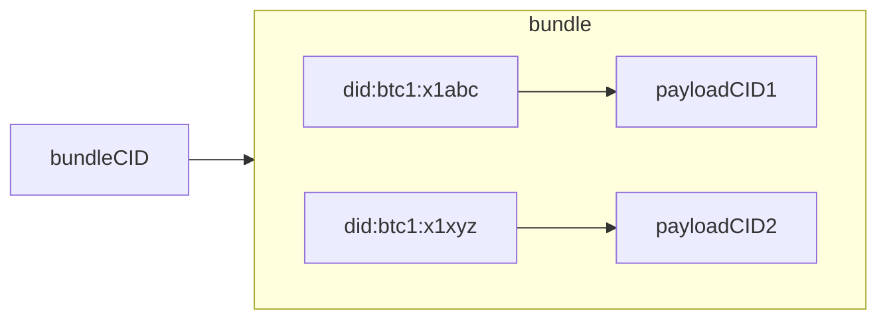
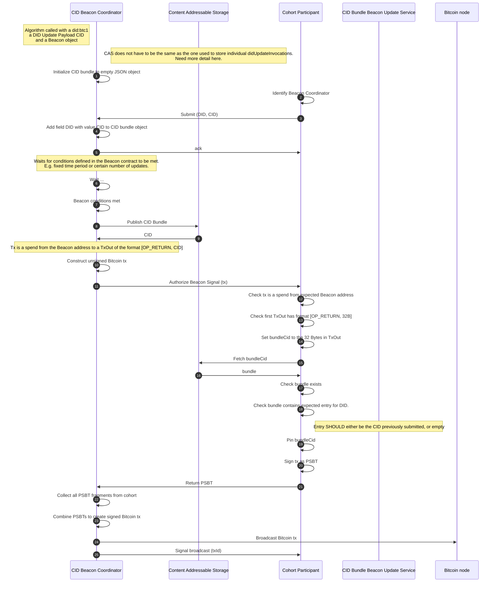
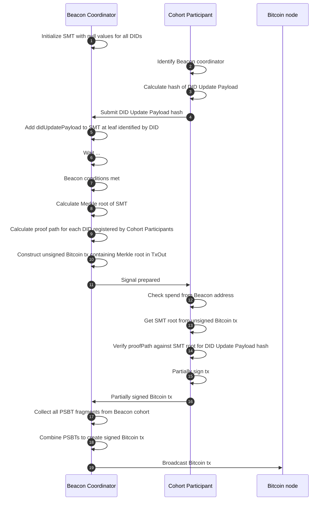

# did:btc1 DID Method Specification

### Authors:

- Ryan Grant <rgrant@contract.design> [Digital Contract Design](https://contract.design/)
- Will Abramson <will@legreq.com> [Legendary Requirements](legreq.com)
- Joe Andrieu <joe@legreq.com> [Legendary Requirements](legreq.com)
- Kevin Dean <kevin@legreq.com> [Legendary Requirements](legreq.com)
- Dan Pape <dpape@contract.design> [Digital Contract Design](https://contract.design/)
- Jennie Meier <jennie@contract.design> [Digital Contract Design](https://contract.design/)

### Contributors:

- Kate Sills <katelynsills@gmail.com>

### Publication Date: 20th September 2024

### Copyright &copy; 2024 Digital Contract Design

### Licence Statement: TODO

# Abstract

**did:btc1** is a censorship resistant DID Method using the Bitcoin blockchain
as a Verifiable Data Registry to announce changes to the DID document.
It improves on prior work by allowing: zero-cost off-chain DID creation;
aggregated updates for scalable on-chain update costs; long-term identifiers
that can support frequent updates; private communication of the DID document;
private DID resolution; and non-repudiation appropriate for serious contracts.

# Table of Contents

1. [Introduction](#1-introduction)
2. [Terminology](#2-terminology)
3. [Syntax](#3-syntax)
4. [CRUD Operations](#4-crud-operations)
5. [Update Beacons](#5-update-beacons)
6. [Security Considerations](#6-security-considerations)
7. [Privacy Considerations](#7-privacy-considerations)

# 1. Introduction and Motivation

Public digital identity was introduced to the Internet through PGP's foundational
legal work in the 1990s. Since the late 2010s, with Decentralized Identifiers,
digital identity can be preserved through a rotation of key material, without
relying on a centralized party. The first DID Method anchoring on the Bitcoin
blockchain, did:btcr, focused on censorship resistance. However, self-sovereign
identity is not complete without options for privacy as well, and the initial
promise of privacy in the DID ecosystem was dubious, with heavy reliance on
public DID documents.

There is a mitigation available even where some knowledge is public.
Application designers can focus on mitigating correlation using "Pairwise DIDs",
which are DIDs created for every different special purpose that MAY occur. This
includes not only a new DID created for every new person one starts a conversation
with, but also every business that one transacts with, every group that one
joins, and every online task that requires managing identity or key material.

In order to tackle reliance on public DID documents head-on, this DID Method
introduces private DID Documents. However, if "private" or "pairwise" DID
documents leak every time the DID is used then these DIDs do not accomplish
much, either.DIDs that are shared with a relying party can be seen by not only
that party but also by any third party resolver that the relying party contracts
with. The next step in trust-minimization is a DID document transferred directly
from the DID controller to the relying party.We call this transfer "Sidecar"
delivery.When a relying party *who is willing to cooperate with privacy concerns*
has the capacity to act as their own resolver, then privacy has a chance.

Lastly, many DID Methods do not anchor DID documents temporally, to create a
chain-of-custody. Instead, they leave them on media that can be used to rewrite
history. Bitcoin's blockchain is the premiere global database for immutably
anchoring information to a specific time. This DID Method takes care to only
allow resolution to succeed when the resolver can clearly state that all data is
available to present only one canonical history for a DID. This is a necessary
feature when key material is used to sign serious contracts. We call this feature "Non-Repudiation", and point out how an anti-feature called "Late Publishing"
affects some other DID Methods.


**did:btc1** is created for those who wish to have it all:
* resistance to censorship;
* non-correlation through pairwise DIDs;
* private communication of the DID document;
* a closed loop on private DID resolution;
* efficiency (in cost and energy usage), via offline DID creation and aggregatable
  updates;
* long-term identifiers that can support frequent updates; and
* non-repudiation appropriate for serious contracts.


### Comparison with Other DID Methods that Rely on Bitcoin's Blockchain for Anchoring

#### did:btcr

BTCR is the original Bitcoin DID Method.  It kept its focus on censorship
resistance. It has the following limitations:
* It is prohibitively expensive to maintain many DIDs, because both creation and
  every update require a separate on-chain transaction.
* It requires storing the data for the DID document somewhere public and exposed
  via OP_RETURN: either at a URL, or accessible via content-addressed storage such
  as IPFS.
* Once a DID document has been revealed as connected to a transaction, it could
  be possible for colluding miners to target the controlling funds for censorship,
  which might block updates (although this is currently highly unlikely since no
  valid transaction has ever been successfully censored from the blockchain by
  miners).
* When all the prior updates were kept online, BTCR provided non-repudiation,
  however it is possible to take prior updates offline and still resolve the
  current BTCR update as a valid DID Document, so it cannot guarantee non-repudiation.

#### did:ion

ION anchors on the Bitcoin blockchain following a Sidetree approach. It has the
following limitations:
* Although in the normal case where data is available this DID Method performs
  fine, it does not fully address the Late Publishing problem, and thus attackers
  may manipulate edge cases to create doubt about signatures used for attestation.
* It stores DID documents on IPFS, and thus does not allow keeping the DID document
  private between the DID controller and a relying party, even if they are capable of
  their own did:ion resolution.

#### did:btco

This DID Method stores the entire DID document on-chain in transactions using
"inscriptions".  Because of this, its main feature of totally on-chain data is
also its main structural limitation:
* Those transactions are very expensive.
* They cannot be kept private.

#### did:btc

This DID Method is like did:btco in that it also uses inscriptions. It adds a
batching mechanism that reduces overhead but still stores all data on-chain.
Its documentation lists "subject keys" as a feature, but they are just talking
about defining additional keys in a DID document, which all of these DID Methods
provide. In summary its main limitations are:
* Creation and update require expensive transactions.
* did:btc does not contemplate a way to keep DID documents private.

#### did:btc1

### Features

* There is no proprietary blockchain, only the Bitcoin blockchain.
* Offline creation allows creating DIDs without any on-chain transactions.
* Aggregator Beacons can aggregate any number of updates from any number of DID
  controllers in one Bitcoin transaction.
* Non-repudiation is provided by - and *"Late Publishing"* is avoided by - ensuring
  100% valid coverage of the entire update history without gaps or ambiguity.
* Public disclosure of DID documents can be avoided by using Sidecar delivery
  of the necessary DID history along with the DID itself.
* Public disclosure of updates to DID documents can also be avoided by only
  recording a Sparse Merkle Tree (SMT) of proofs of DID updates on-chain.
* Resolvers need only filter transactions likely to contain updates for those
  DIDs of interest.
* Any kind of key can be included in a DID Document, using an update.
* Simple deterministic DIDs can be recovered from typical Bitcoin seed words.

### Limitations
* Resolvers require read-only view of all blocks arriving at the Bitcoin blockchain.
* DID controllers are responsible for providing the data referenced in their
  Beacons' updates (although many Beacons are expected to provide an archival
  service making Bundles publicly available).  If this data is not available, the
  DID will not verify.
* Because of the data availability responsibility, and the threat of a rogue
  Beacon publishing an invalid reference, the most secure Beacons will choose
  Bitcoin scripts that allow every DID controller a veto, although given current
  UTXO-sharing technology, this impedes availability.

### Future Directions

* ZCAPs delegation of the right to update only part of a DID Document;
* More scalable Aggregator Beacons will be possible with a "transaction introspection"
  upgrade to Bitcoin, such as OP_CTV or OP_CAT; and
* Beacons do not have to reuse their addresses if, in the controller's DID document,
  a descriptor is used instead of an address.

# 2. Terminology

**Beacon**

A Beacon is the mechanism by which updates to DID documents are announced and
discovered. Beacons are identified by a Bitcoin address which is included as a
service endpoint in a DID document along with a specific Beacon Type. By spending
from a Beacon address, DID controllers announce that an update to their DID has
occurred (in the case of a SingletonBeacon) or may have occurred (in the case
of a CIDAggregator or SMTAggregator Beacons).

**Singleton Beacon**

A Singleton Beacon enables a single entity to independently post a DID Update
Payload in a Beacon Signal.

**Aggregate Beacon**

An Aggregate Beacon enables multiple entities (possibly controlling multiple
DIDs and possibly posting multiple updates) to collectively announce a set of
DID Update Payloads in a Beacon Signal. There can only ever be one DID Update
Payload per **did:btc1** in a Beacon Signal from an Aggregate Beacon.

**Beacon Type**

This document describes three specific Beacon Types: a SingletonBeacon, and two
Aggregate Beacons, a CIDAggregateBeacon and a SMTAggregateBeacon.

**Beacon Signal**

Beacon Signals are Bitcoin transactions that spend from a Beacon address and
include a transaction output of the format `[OP_RETURN, <32_bytes>]`. Beacon
Signals announce one or more DID Update Payloads and provide a means for these
payloads to be verified as part of the Beacon Signal. The type of the Beacon
determines how these Beacon Signals SHOULD be constructed and processed to
validate a set of DID Update Payloads against the 32 bytes contained within
the Beacon Signal.

**Authorized Beacon Signal**

An Authorized Beacon Signal is a Beacon Signal from a Beacon with a Beacon
address in a then-current DID document.

**DID Update Payload**

A capability invocation secured using Data Integrity that invokes the root
capability to update a specific **did:btc1**. The signed payload includes a
JSON Patch object defining a set of mutations to the DID document being updated.

**DID Update Bundle**

A JSON object that maps **did:btc1** identifiers to Content Identifiers (CIDs)
that identify DID Update Payloads for the identified DID. DID Update Bundles
are announced by CIDAggregator Beacons.

**Merkle Tree**

A tree data structure in which the leaves are a hash of a data block and every
node that is not a leaf is a hash of its child node values. The root of a Merkle
tree is a single hash that is produced by recursively hashing the child nodes
down to the leaves of the tree. Given the root of a Merkle tree it is possible
to provide a Merkle path that proves the inclusion of some data in the tree.

**Sparse Merkle Tree (SMT)**

A Sparse Merkle Tree (SMT) is a Merkle tree where each data point included at
the leaf of the tree is indexed. This data structure enables proofs of both
inclusion and non-inclusion of data at a given index. The instantiation in this
specification has 2^256 leaves that are indexed by the SHA256 hash of a **did:btc1**
identifier. The data attested to at the leaves of the tree is the DID Update Payload
for that **did:btc1** identifier that indexed to the leaf.

**Invocation**

See https://w3c-ccg.github.io/zcap-spec/#terminology

**Schnorr Signatures**

An alternative to ECDSA signatures with some major advantages, such as being able
to combine digital signatures from multiple parties to form a single digital
signature for the composite public key. Bitcoin Schnorr signatures are still
over the secp256k1 curve, so the same keypairs can be used to produce both
Schnorr signatures and ECDSA signatures.

**Taproot**

Taproot is an upgrade to the Bitcoin blockchain implemented in November 2021.
This upgrade enabled Bitcoin transactions to be secured using Schnorr signatures
through the introduction of a new address, a Taproot address.

**Unspent Transaction Output (UTXO)**

A Bitcoin transaction takes in transaction outputs as inputs and creates new
transaction outputs potentially controlled by different addresses. An Unspent
Transaction Output (UTXO) is a transaction output from a Bitcoin transaction
that has not yet been included as an input, and hence spent, within another
Bitcoin transaction.

**Content Identifier (CID)**

A Content Identifier (CID) is an identifier for some digital content (e.g., a
file) generated from the content itself such that for any given content and CID
generation algorithm there is a single, unique, collision-resistant identifier.
This is typically done through some hashing function.

**Content Addressable Storage (CAS)**

Content Addressable Storage (CAS) is a data storage system where content is
addressable using Content Identifiers (CIDs). The Interplanetary File System
(IPFS) is an example of CAS.

**Non-Repudiation**

Non-Repudiation is a feature of DID Methods that can clearly state that all data
is available to present one canonical history for a DID. If some data is needed
but not available, the DID Method MUST NOT allow DID resolution to complete.
Any changes to the history, such as may occur if a website edits a file, MUST be
detected and disallowed. The Late Publishing problem breaks Non-Repudiation.

**Late Publishing**

Late Publishing is the ability for DID updates to be revealed at a later point
in time, which alters the history of a DID document such that a state, that
appeared valid before the reveal, appears after Late Publishing to never have
been valid. Late Publishing breaks Non-Repudiation.

**Offline Creation**

Offline creation refers to when a **did:btc1** identifier and corresponding
initial DID document are created without requiring network interactions.

**did:btc1** supports offline creation in two modes:
* Key Pair Deterministic Creation; and
* DID Document Initiated Creation.

**Sidecar**

A mechanism by which data necessary for resolving a DID is provided alongside
the **did:btc1** identifier being resolved, rather than being retrieved through
open and standardized means (e.g., by retrieving from IPFS).

To explain the metaphor, a sidecar on a motorcycle brings along a second passenger
in a transformed vehicle, the same way the DID controller MUST bring along the
DID Document history to transform the situation into one that is verifiable.

**Sidecar Data**

Data transmitted via Sidecar.

**Signal Blockheight**

The blockheight of the Bitcoin block that included a specific Beacon Signal.
Blockheight is used as the internal time of the resolution algorithm.

**Resolution Time**

A UTC timestamp of when the client makes a resolution request of the controller.

**Target Time**

A UTC timestamp that specifies a target time provided by a client in a resolution
request to the resolver. If none is provided the target time is set to the
resolution time.

**Contemporary Blockheight**

The blockheight of consideration when walking the provenance of a series of DID
updates. A DID documents contemporary time is the Signal Time of the Beacon Signal
that announced the last DID Update Payload applied to the DID document.

# 3. Syntax

A **did:btc1** DID consists of a `did:btc1` prefix, followed by an OPTIONAL
`version` number, an OPTIONAL Bitcoin `network` identifier, and, finally, a
`id-bech32` value. The `id-bech32` is a Bech32 encoding of either a `key-value`
representing a secp256k1 public key, or a `hash-value` of an initiating DID
document. When the encoding is of a `key-value` the Human Readable Part (HRP) of
the Bech32 encoding is set to `k`. When the encoding is of a `hash-value` the
HRP is set to `x`. The HRP is followed by a separator which is always `1`, this
is then followed by the `bech32-encoding`.

The ABNF for a **did:btc1** DID follows:

```abnf
did-btc1 = "did:btc1:" [ version ":" ] [ network ":" ] id-bech32
version	= 1*DIGIT
network =  "mainnet" / "signet" / "testnet" / "regnet"
id-bech32 = key-value / hash-value
hash-value = "x1" bech32-encoding
key-value = "k1" bech32-encoding
bech32-encoding = *bech32char
bech32char = "0" / "2" / "3" / "4" / "5" / "6" / "7" / "8" / "9" / "a" / "c" / 
"d" / "e" / "f" / "g" / "h" / "j" / "k" / "l" / "m" / "n" / "p" / "q" / "r" / 
"s" / "t" / "u" / "v" / "w" / "x" / "y" / "z" 
```

ABNF is defined by the [IETF RFC5234](https://datatracker.ietf.org/doc/html/rfc5234).

## 3.1 Examples

All four following DIDs are equivalent:

* did:btc1:k1q2ddta4gt5n7u6d3xwhdyua57t6awrk55ut82qvurfm0qnrxx5nw7vnsy65 - MOST COMMON
* did:btc1:<u>1:</u>k1q2ddta4gt5n7u6d3xwhdyua57t6awrk55ut82qvurfm0qnrxx5nw7vnsy65
* did:btc1:<u>mainnet:</u>k1q2ddta4gt5n7u6d3xwhdyua57t6awrk55ut82qvurfm0qnrxx5nw7vnsy65
* did:btc1:<u>1:mainnet:</u>k1q2ddta4gt5n7u6d3xwhdyua57t6awrk55ut82qvurfm0qnrxx5nw7vnsy65

# 4. CRUD Operations

This section defines the Create, Read, Update, and Deactivate (CRUD) operations
for the **did:btc1** method.

## 4.1 Create

A **did:btc1** identifier and associated DID document can either be created
deterministically from a cryptographic seed, or it can be created from an arbitrary
genesis intermediate DID document representation. In both cases, DID creation can
be undertaken in an offline manner, i.e., the DID controller does not need to
interact with the Bitcoin network to create their DID.

### 4.1.1 Deterministic Key-based Creation

For deterministic creation, the **did:btc1** identifier encodes a secp256k1 public key.
The key is then used to deterministically generate the initial DID document.

The algorithm takes in `pubKeyBytes`, a compressed SEC encoded secp256k1
public key and optional `version` and `network` values. The algorithm returns a
**did:btc1** identifier and corresponding initial DID document.


1. Set `genesisBytes` to `pubKeyBytes`.
1. Set `idType` to "key".
1. Set `did` to the result of
   [did:btc1 Identifier Construction](#413-didbtc1-identifier-construction)
   passing `idType` and `genesisBytes` and passing `version` and `network` if set.
1. Set `initialDocument` to the result of passing `did` into the [4.2 Read](#42-read) algorithm.
1. Return `did` and `initialDocument`.

### 4.1.2 External Initial Document Creation

It is possible to create a **did:btc1** from some initiating arbitrary DID document.
This allows for more complex initial DID documents, including the ability to include
Service Endpoints and Beacons that support aggregation.

The algorithm takes in an `intermediateDocument` struct, an OPTIONAL `version`,
and an OPTIONAL `network`. The `intermediateDocument` SHOULD be a valid DID document
except all places where the DID document requires the use of the identifier
(e.g. the id field), this identifier SHOULD be the placeholder value
`did:btc1:xxxxxxxxxxxxxxxxxxxxxxxxxxxxxxxxxxxxxxxxxxxxxxxxxxxxxxxxxxxx`.
The DID document SHOULD include at least one verificationMethod and service of
the type SingletonBeacon.

1. Set `idType` to "external".
1. Set `genesisBytes` to the result of passing `intermediateDocument` into the
   [9.2. JSON Canonicalization and Hash](#92-json-canonicalization-and-hash) algorithm.
1. Set `did` to the result of [did:btc1 Identifier Construction](#413-didbtc1-identifier-construction) passing `idType` and `genesisBytes` and
   passing `version` and `network` if set.
1. Set `initialDocument` to a copy of the `intermediateDocument`.
1. Replace all `did:btc1:xxxxxxxxxxxxxxxxxxxxxxxxxxxxxxxxxxxxxxxxxxxxxxxxxxxxxxxxxxxx`
   values in the `initialDocument` with the `did`.
1.  Optionally store `canonicalBytes` on a Content Addressable Storage (CAS)
    system like IPFS. If doing so, implementations MUST use CIDs generated following
    the IPFS v1 algorithm.
1. Return `did` and `initialDocument`.

### 4.1.3 did:btc1 Identifier Construction

A macro or convenience function can be used to construct **did:btc1** identifiers.
The algorithm takes two REQUIRED inputs: `idType` and `genesisBytes`, and
two OPTIONAL inputs: `version` and `network`. If `idType` is "key", then `genesisBytes`
is a compressed SEC encoded secp256k1 public key. If `idType` is "external",
then `genesisBytes` is the byte representation of a SHA256 hash of a genesis
intermediate DID document.

1. Initialize `result` to the **did:btc1** prefix string `"did:btc1:"`.
1. If `version` is not null, append `version` and `":"` to `result`.
1. If `network` is not null, append `network` and `":"` to `result`.
1. If `idType` is "key", append the result of the
   [Bech32 encoding a key-value](#913-bech32-encoding-a-secp256k1-public-key)
   algorithm, passing `genesisBytes`.
1. Else if `idType` is "external",  append the result of the
   [Bech32 encoding a hash-value](#914-bech32-encoding-a-hash-value) algorithm,
   passing `genesisBytes`.
1. Else, MUST raise "InvalidDID" exception.
1. Return `result`.


## 4.2 Read

The read operation is executed by a resolver after a resolution request identifying
a specific **did:btc1** `identifier` is received from a client at Resolution Time.
The request MAY contain a `resolutionOptions` object containing additional information
to be used in resolution. The resolver then attempts to resolve the DID document
of the `identifier` at a specific Target Time. The Target Time is either provided
in `resolutionOptions` or is set to the Resolution Time of the request.

To do so it executes the following algorithm:


1. Let `identifierComponents` be the result of running the algorithm in
   [Section 4.2.1 Parse **did:btc1** identifier](#421-parse-didbtc1-identifier),
   passing in the `identifier`.
1. Set `initialDocument` to the result of running the algorithm in
   [Section 4.2.2 Resolve Initial Document](#422-resolve-initial-document) passing
   in the `identifier`, `identifierComponents` and `resolutionOptions`.
1. Set `targetDocument` to the result of running the algorithm in
   [Section 4.2.3 Resolve Target Document](#423-resolve-target-document) passing
   in `initialDocument` and `resolutionOptions`.
1. Return `targetDocument`.

### 4.2.1 Parse **did:btc1 Identifier**

The following algorithm specifies how to parse a **did:btc1** identifier according
to the syntax defined in [Section 3](#3-syntax). REQUIRED input is a DID identifier.
This algorithm returns an `identifierComponents` structure whose items are:

- network
- version
- hrp
- genesisBytes

1. Set `identifierComponents` to an empty object.
1. Using a colon (`:`) as the delimiter, split the `identifier` into an array of
   `components`.
1. Set `scheme` to `components[0]`.
1. Set `methodId` to `components[1]`.
1. If the length of `components` equals `3`, set `identifierComponents.version`
   to `1` and `identifierComponents.network` to `mainnet`. Set `idBech32` to
   `components[2]`.
1. Else if length of `components` equals `4`, check if `components[2]` can be cast
   to an integer. If so, set `identifierComponents.version` to `components[2]` and
   `identifierComponents.network` to `mainnet`. Otherwise, set
   `identifierComponents.network` to `components[2]` and `identifierComponents.version`
   to `1`. Set `idBech32` to `components[3]`.
1. Else if the length of `components` equals `5`, set `identifierComponents.version`
   to `components[2]`, `identifierComponents.network` to `components[3]` and `idBech32`
   to the `components[4]`.
1. Else MUST raise `InvalidDID` error. There are an incorrect number of components
   to the `identifier`.
1. Check the validity of the identifier components. The `scheme` MUST be the value
   `did`. The `methodId` MUST be the value `btc1`. The `identifierComponents.version`
   MUST be convertible to a positive integer value. The `identifierComponents.network`
   MUST be one of `mainnet`, ` signet`, `testnet`, or `regnet`. If any of these
   requirements fail then an `InvalidDID` error MUST be raised.
1. Decode `idBech32` using the Bech32 algorithm to get `decodeResult`.
1. Set `identifierComponents.hrp` to `decodeResult.hrp`.
1. Set `identifierComponents.genesisBytes` to `decodeResult.value`.
1. Return `identifierComponents`.

### 4.2.2 Resolve Initial Document

This algorithm specifies how to resolve an initial DID document and validate
it against the `identifier` for a specific **did:btc1**. The algorithm takes as
inputs a **did:btc1** `identifier`, `identifierComponents` object and a
`resolutionsOptions` object. This algorithm returns a valid `initialDocument`
for that identifier.

1. If `identifierComponents.hrp` value is `k`, then set the `initialDocument`
   to the result of running the algorithm in [4.2.2.1 Deterministic Resolution](#4221-deterministically-generate-initial-did-document)
   passing in the `identifier`, `identifierComponents` values.
1. Else If `decodeResult.hrp` value is `x`, then set the `initialDocument` to
   the result of running [4.2.2.2 External Resolution](#4222-external-resolution)
   passing in the `identifier`, `identifierComponents` and `resolutionOptions` values.
1. Else MUST raise `invalidHRPValue` error.
1. Return `initialDocument`.

#### 4.2.2.1 Deterministically Generate Initial DID Document

This algorithm deterministically generates an initial DID Document from a secp256k1
public key.
It takes in a **did:btc1** `identifier` and a `identifierComponents` object and
returns a `initialDocument`.

1. Set `keyBytes` to `identifierComponents.genesisBytes`.
1. Initialize a `initialDocument` variable as an empty object.
1. Set `initialDocument.id` to the `identifier`.
1. Initialize a `contextArray` to empty array:
    1. Append the DID Core context "https://www.w3.org/ns/did/v1".
    1. Append the Data Integrity context "https://w3id.org/security/data-integrity/v2".
    1. Append a **did:btc1** context.
    1. Set `initialDocument['@context]' to contextArray`.
1. Create an initial verification method:
    1. Initialize `verificationMethod` to an empty object.
    1. Set `verificationMethod.id` to "#initialKey".
    1. Set `verificationMethod.type` to "Multikey".
    1. Set `verificationMethod.controller` to `identifier`.
    1. Set `verificationMethod.publicKeyMultibase` to the result of the TODO:
       Multikey encoding algorithm passing in `keyBytes`.
1. Set `initialDocument.verificationMethod` to an array containing
   `verificationMethod`.
1. Initialize a `tempArray` variable to an array with the single element
   `verificationMethod.id`.
1. Set the `authentication`, `assertionMethod`, `capabilityInvocation`, and the
   `capabilityDelegation` properties in `initialDocument` to a copy of the `tempArray`
   variable.
1. Set the `initialDocument.services` property in `initialDocument` to the
   result of passing the `keyBytes` and `identifierComponents.network` to the
   [4.2.2.1.1 Deterministically Generate Beacon Services]
   (#42211-deterministically-generate-beacon-services) Algorithm.
1. Return `initialDocument`.

##### 4.2.2.1.1 Deterministically Generate Beacon Services

This algorithm deterministically generates three Beacons from the single
`keyBytes` value used to generate the deterministic **did:btc1**, one for each
of the following three Bitcoin address types for the Bitcoin `network` specified
by the DID: Pay-to-Public-Key-Hash (P2PKH), Pay-to-Witness-Public-Key-Hash (P2WPKH),
and Pay-to-Taproot (P2TR). Spends from these three addresses can be produced only
through signatures from the `keyBytes`'s associated private key.
Each Beacon is of the type SingletonBeacon. The algorithm returns a `services` array.

1. Initialize a `services` variable to an empty array.
1. Set `beaconType` to `SingletonBeacon`.
1. Set `serviceId` to `#initialP2PKH`.
1. Set `beaconAddress` to the result of generating a Pay-to-Public-Key-Hash Bitcoin
   address from the `keyBytes` for the appropriate `network`.
1. Set `p2pkhBeacon` to the result of passing `serviceId`, `beaconType`, and
   `beaconAddress` to [4.2.2.1.2 Create Beacon Service](#42212-create-beacon-service).
1. Push `p2pkhBeacon` to `services`.
1. Set `serviceId` to `#initialP2WPKH`.
1. Set `beaconAddress` to the result of generating a Pay-to-Witness-Public-Key-Hash
   Bitcoin address from the `keyBytes` for the appropriate `network`.
1. Set `p2wpkhBeacon` to the result of passing `serviceId`, `beaconType`, and
   `beaconAddress` to [4.2.2.1.2 Create Beacon Service](#42212-create-beacon-service).
1. Push `p2wpkhBeacon` to `services`.
1. Set `serviceId` to `#initialP2TR`.
1. Set `beaconAddress` to the result of generating a Pay-to-Taproot Bitcoin address
   from the `keyBytes` for the appropriate `network`.
1. Set `p2trBeacon` to the result of passing `serviceId`, `beaconType`, and
   `beaconAddress` to [4.2.2.1.2 Create Beacon Service](#42212-create-beacon-service).
1. Push `p2trBeacon` to `services`.
1. Return the `services` array.

##### 4.2.2.1.2 Create Beacon Service

// TODO: This is a generic algorithm. Perhaps move to appendix.

This algorithm creates a Beacon service that can be included into the services
array of a DID document.
The algorithm takes in a `serviceId`, a Beacon Type, `beaconType`, and a
`bitcoinAddress`. It returns a `service` object.

1. Initialize a `beacon` variable to an empty object.
1. Set `beacon.id` to `serviceId`.
1. Set `beacon.type` to `beaconType`.
1. Set `beacon.serviceEndpoint` to the result of converting `bitcoinAddress` to
   a URI as per **[BIP21](https://github.com/bitcoin/bips/blob/master/bip-0021.mediawiki)**
1. Return `beacon`.


#### 4.2.2.2 External Resolution

This algorithm externally retrieves an `intermediateDocumentRepresentation`,
either by retrieving it from Content Addressable Storage (CAS) or from the Sidecar
data provided as part of the resolution request. The algorithm takes in a
**did:btc1** `identifier`, a `identifierComponents` object and a
`resolutionOptions` object.
It returns an `initialDocument`, which is a conformant DID document validated
against the `identifier`.

1. If `resolutionOptions.sidecarData.genesisDocument` is not null, set
   `initialDocument` to the result of passing `identifier`, `identifierComponents`
   and `resolutionOptions.sidecarData.initialDocument` into algorithm
   [4.2.2.2.1 Sidecar Initial Document Validation](#42221-sidecar-initial-document-validation).
1. Else set `initialDocument` to the result of passing `identifier` and
   `identifierComponents` to the [4.2.2.2.2 CAS Retrieval](#42222-cas-retrieval)
   algorithm.
1. Validate `initialDocument` is a conformant DID document according to the
   DID Core 1.1 specification.
1. Return `initialDocument`.

##### 4.2.2.2.1 Sidecar Initial Document Validation

This algorithm validates an `initialDocument` against its `identifier`,
by first constructing the `intermediateDocumentRepresentation` and verifying
the hash of this document matches the bytes encoded within the `identifier`.
The algorithm takes in a **did:btc1** `identifier`, `identifierComponents`
and a `initialDocument`. The algorithm returns the `initialDocument` if validated,
otherwise it throws an error.

1. Set `intermediateDocumentRepresentation` to a copy of the `initialDocument`.
1. Find and replace all values of `identifier` contained within the
   `intermediateDocumentRepresentation` with the string
   (`did:btc1:xxxxxxxxxxxxxxxxxxxxxxxxxxxxxxxxxxxxxxxxxxxxxxxxxxxxxxxxxxxx`).
1. Set `hashBytes` to the SHA256 hash of the `intermediateDocumentRepresentation`.
1. If `hashBytes` does not equal `identifierComponents.genesisBytes` MUST throw an `invalidDID` error.
1. Return `initialDocument`.

##### 4.2.2.2.2 CAS Retrieval

This algorithm attempts to retrieve an `initialDocument` from a Content
Addressable Storage (CAS) system by converting the bytes in the `identifier`
into a Content Identifier (CID). The algorithm takes in an `identifier` and an
`identifierComponents` object and returns an `initialDocument`.

1. Set `hashBytes` to `identifierComponents.genesisBytes`.
1. Set `cid` to the result of converting `hashBytes` to a IPFS v1 CID.
1. Set `intermediateDocumentRepresentation` to the result of fetching the `cid`
   against a Content Addressable Storage (CAS) system such as IPFS.
1. Set `initialDocument` to the copy of the `intermediateDocumentRepresentation`.
1. Replace the string
   (`did:btc1:xxxxxxxxxxxxxxxxxxxxxxxxxxxxxxxxxxxxxxxxxxxxxxxxxxxxxxxxxxxx`) with
   the `identifier` throughout the `initialDocument`.
1. Return `initialDocument`.

### 4.2.3 Resolve Target Document

This algorithm resolves a DID document from an initial document by walking the
Bitcoin blockchain to identify Beacon Signals that announce DID Update Payloads
applicable to the **did:btc1** identifier being resolved. The algorithm takes
in an `initialDocument` and a set of `resolutionOptions`. The algorithm returns
a valid `targetDocument` or throws an error.

1. If `resolutionOptions.versionId` is not null, set `targetVersionId` to
   `resolutionOptions.versionId`.
1. Else if `resolutionOptions.versionTime` is not null, set `targetTime` to
   `resolutionOptions.versionTime`.
1. Set `targetBlockheight` to the result of passing `targetTime` to the algorithm
   [4.2.3.1 Determine Target Blockheight](#4231-determine-target-blockheight).
1. Set `sidecarData` to `resolutionOptions.sidecarData`.
1. Set `currentVersionId` to 1.
1. If `currentVersionId` equals `targetVersionId` return `initialDocument`.
1. Set `updateHashHistory` to an empty array.
1. Set `contemporaryBlockheight` to 0.
1. Set `contemporaryDIDDocument` to the `initialDocument`.
1. Set `targetDocument` to the result of calling the
   [4.2.3.2 Traverse Blockchain History](#4232-traverse-blockchain-history) algorithm
   passing in `contemporaryDIDDocument`, `contemporaryBlockheight`, `currentVersionId`,
   `targetVersionId`, `targetBlockheight`, `updateHashHistory`, and `sidecarData`.
1. Return `targetDocument`.

#### 4.2.3.1 Determine Target Blockheight

This algorithm takes in an OPTIONAL Unix `targetTime` and returns a Bitcoin
`blockheight`.

1. If `targetTime`, find the Bitcoin `block` with greatest `blockheight` whose
   `timestamp` is less than the `targetTime`.
1. Else find the Bitcoin `block` with the greatest `blockheight` that has at
   least X conformations. TODO: what is X. Is it variable?
1. Set `blockheight` to `block.blockheight`.
1. Return `blockheight`.

#### 4.2.3.2 Traverse Blockchain History

This algorithm traverse Bitcoin blocks, starting from the block with the
`contemporaryBlockheight`, to find `beaconSignals` emitted by Beacons within
the `contemporaryDIDDocument`. Each `beaconSignal` is processed to retrieve a
didUpdatePayload to the DID document. Each update is applied to the document and
duplicates are ignored. If the algorithm reaches the block with the blockheight
specified by a `targetBlockheight`, the `contemporaryDIDDocument` at that blockheight
is returned assuming a single canonical history of the DID document has been
constructed up to that point.

The algorithm takes as inputs a `contemporaryDIDDocument`, a `contemporaryBlockheight`,
a `currentVersionId`, a `targetVersionId`, a `targetBlockheight`, an array of
`updateHashHistory`, and a set of `sidecarData`.

The algorithm returns a DID document.

1. Set `contemporaryHash` to the SHA256 hash of the `contemporaryDIDDocument`.
   TODO: NEED TO DEAL WITH CANONICALIZATION
1. Find all `beacons` in `contemporaryDIDDocument`: All `service` in
   `contemporaryDIDDocument.services` where `service.type` equals one of
   `SingletonBeacon`, `CIDAggregateBeacon` and `SMTAggregateBeacon` Beacon.
1. For each `beacon` in `beacons` convert the `beacon.serviceEndpoint` to a Bitcoin
   address following
   **[BIP21](https://github.com/bitcoin/bips/blob/master/bip-0021.mediawiki)**.
   Set `beacon.address` to the Bitcoin address.
1. Set `nextSignals` to the result of calling algorithm
   [4.2.3.3 Find Next Signals](#4233-find-next-signals) passing in
   `contemporaryBlockheight` and `beacons`.
1. If `nextSignals.blockheight` is greater than `targetBlockheight` return
   `contemporaryDIDDocument`.
1. Set `signals` to `nextSignals.signals`.
1. Set `updates` to the result of calling algorithm
   [4.2.3.4 Process Beacon Signals](#4234-process-beacon-signals) passing in
   `signals` and `sidecarData`.
1. Set `orderedUpdates` to the list of `updates` ordered by the `targetVersionId`
   property.
1. For `update` in `orderedUpdates`:
    1. If `update.targetVersionId` is less than or equal to `currentVersionId`,
       run Algorithm [4.2.3.5. Confirm Duplicate Update](#4235-confirm-duplicate-update)
       passing in `update`, `documentHistory`, and `contemporaryHash`.
    1. If `update.targetVersionId` equals `currentVersionId + 1`:
        1.  Check that `update.sourceHash` equals `contemporaryHash`, else MUST
            raise LatePublishing error.
        1.  Set `contemporaryDIDDocument` to the result of calling
            [4.2.3.6 Apply DID Update](#4236-apply-did-update) algorithm passing in
            `contemporaryDIDDocument`, `update`.
        1.  Increment `currentVersionId`
        1.  If `currentVersionId` equals `targetVersionId` return
            `contemporaryDIDDocument`.
        1.  Set `updateHash` to the sha256 hash of the `update`.
        1.  Push `updateHash` onto `updateHashHistory`.
        1.  Set `contemporaryHash` to the SHA256 hash of the
            `contemporaryDIDDocument`.
    1.  If `update.targetVersionId` is greater than `currentVersionId + 1`, MUST
        throw a LatePublishing error.
1. Increment `contemporaryBlockheight`.
1. Set `targetDocument` to the result of calling the
   [4.2.3.2 Traverse Blockchain History](#4232-traverse-blockchain-history)
   algorithm passing in `contemporaryDIDDocument`, `contemporaryBlockheight`,
   `currentVersionId`, `targetVersionId`, `targetBlockheight`, `documentHistory`,
   and `sidecarData`.
1. Return `targetDocument`.


#### 4.2.3.3 Find Next Signals

This algorithm takes in a `contemporaryBlockheight` and a set of `beacons` and
finds the next Bitcoin block containing Beacon Signals from one or more of the
`beacons`.

This algorithm takes as inputs a Bitcoin blockheight specified by
`contemporaryBlockheight` and an array of `beacons`.

This algorithm returns a `nextSignals` struct, containing a `blockheight`
the signals were found in and an array of `signals`. Each `signal` is a struct
containing `beaconId`, `beaconType`, and `tx` properties.


1. Get Bitcoin `block` at `contemporaryBlockheight`.
1. Set `beaconSignals` to an empty array.
1. For all `tx` in `block.txs`:
   check to see if any transaction inputs are spends from one of the Beacon addresses.
   If they are, create a `signal` object containing the following fields and push
   `signal` to `beaconSignals`:
```
{
    "beaconId": `beaconService.id`,
    "beaconType": `beaconService.type`,
    "tx": `tx`
}
```
4. If no `beaconSignals`, set `nextSignals` to the result of algorithm
   [4.2.3.3 Find Next Signals](#4233-find-next-signals) passing in
   `contemporaryBlockheight + 1` and `beacons`.
5. Else initialize a `nextSignals` object to the following:
```
{
  "blockheight": `block.blockheight`,
  "signals": `beaconSignals`
}
```
6. Return `nextSignals`.

#### 4.2.3.4 Process Beacon Signals

This algorithm takes in an array of struct `beaconSignals` and attempts
to process these signals according the type of the Beacon they were produced by.
Each `beaconSignal` struct contains the properties `beaconId`, `beaconType`, and
a `tx`. Additionally, this algorithm takes in `sidecarData` passed into the
resolver through the `resolutionOptions`. If `sidecarData` is present it is used
to process the Beacon Signals.

1. Set `updates` to an empty array.
1. For `beaconSignal` in `beaconSignals`:
    1. Set `type` to `beaconSignal.beaconType`.
    1. Set `signalTx` to `beaconSignal.tx`.
    1. Set `signalId` to `signalTx.id`.
    1. Set `signalSidecarData` to `sidecarData[signalId]`. TODO: formalize
       structure of sidecarData
    1. Set `didUpdatePayload` to the result of passing `signalTx` and
       `signalSidecarData` to the Process Beacon Signal algorithm defined by the
       corresponding Beacon `type`. See [Section 5 Beacons](#5-update-beacons).
    1. If `didUpdatePayload` is not null, push `didUpdatePayload` to `updates`.
1. Return `updates`.


#### 4.2.3.5 Confirm Duplicate Update

This algorithm takes in a DID Update Payload and verifies that the update is a
duplicate against the hash history of previously applied updates.
The algorithm takes in an `update` and an array of hashes, `updateHashHistory`.
It throws an error if the `update` is not a duplicate, otherwise it returns.
TODO: does this algorithm need  `contemporaryHash` passed in?

1. Let `updateHash` equal the SHA256 hash of the `update`.
1. Let `updateHashIndex` equal `update.targetVersionId - 2`.
1. Let `historicalUpdateHash` equal `updateHashHistory[updateHashIndex]`.
1. Assert `historicalUpdateHash` equals `updateHash`, if not MUST throw a
   LatePublishing error.
1. Return

#### 4.2.3.6 Apply DID Update

This algorithm attempts to apply a DID Update to a DID document, it first
verifies the proof on the update is a valid capabilityInvocation of the root
authority over the DID being resolved. Then it applies the JSON patch
transformation to the DID document, checks the transformed DID document
matches the targetHash specified by the update and validates it is a conformant
DID document before returning it. This algorithm takes inputs
`contemporaryDIDDocument` and an `update`.

1. Instantiate a `schnorr-secp256k1-2025` `cryptosuite` instance.
1. Set `expectedProofPurpose` to `capabilityInvocation`.
1. Set `mediaType` to ???? TODO
1. Set `documentBytes` to the bytes representation of `update`.
1. Set `verificationResult` to the result of passing `mediaType`, `documentBytes`,
   `cryptosuite`, and `expectedProofPurpose` into the
   [Verify Proof algorithm](https://w3c.github.io/vc-data-integrity/#verify-proof)
   defined in the VC Data Integrity specification.
1. TODO: HOW DO WE ENSURE THAT THE PROOF IS A VALID INVOCATION OF THE ROOT
   CAPABILITY derived using algorithm [4.3.1.1 Derive Root Capability]
1. Set `targetDIDDocument` to a copy of `contemporaryDIDDocument`.
1. Use JSON Patch to apply the `update.patch` to the `targetDIDDOcument`.
1. Verify that `targetDIDDocument` is conformant with the data model specified
   by the DID Core specification.
1. Set `targetHash` to the SHA256 hash of `targetDIDDocument`.
1. Check that `targetHash` equals `update.targetHash`, else raise InvalidDIDUpdate
   error.
1. Return `targetDIDDocument`.


## 4.3 Update

An update to a **did:btc1** document is an invoked capability using the ZCAP-LD
data format, signed by a verificationMethod that has the authority to make the
update as specified in the previous DID document. Capability invocations for
updates MUST be authorized using Data Integrity following the schnorr-secp256k1-jcs-2025
cryptosuite with a proofPurpose of `capabilityInvocation`.

This algorithm takes as inputs a `btc1Identifier`, `sourceDocument`,
`sourceVersionId`, `documentPatch`, a `verificationMethodId`, and an array
of `beaconIds`. The `sourceDocument` is the DID document being updated. The
`documentPatch` is a JSON Patch object containing a set of transformations to
be applied to the `sourceDocument`. The result of these transformations MUST
produce a DID document conformant to the DID Core specification. The
`verificationMethodId` is an identifier for a verificationMethod within the
`sourceDocument`. The verificationMethod identified MUST be a Schnorr secp256k1
Multikey. The `beaconIds` MUST identify service endpoints with one of the
three Beacon Types: `SingletonBeacon`, `CIDAggregateBeacon`, and
`SMTAggregateBeacon`.

1. Set `unsignedUpdate` to the result of passing `btc1Identifier`, `sourceDocument`,
   `sourceVersionId`, and `documentPatch`
   into the [4.3.1 Construct DID Update Payload](#431-construct-did-update-payload)
   algorithm.
1. Set `verificationMethod` to the result of retrieving the verificationMethod from
   `sourceDocument` using the `verificationMethodId`.
1. Validate the `verificationMethod` is a Schnorr secp256k1 Multikey:
    1. `verificationMethod.type` == `Multikey`
    1. `verificationMethod.publicKeyMultibase[4]` == `z66P`
1. Set `didUpdateInvocation` to the result of passing `btc1Identifier`,
   `unsignedUpdate` as `didUpdatePayload, `and `verificationMethod` to the
   [4.3.2 Invoke DID Update Payload](#432-invoke-did-update-payload) algorithm.
1. Set `signalsMetadata` to the result of passing `sourceDocument`, `beaconIds` and
   `didUpdateInvocation` to the
   [4.3.4 Announce DID Update Payload](#434-announce-did-update-payload) algorithm.
1. Return `signalsMetadata`. It is up to implementations to ensure that the
   `signalsMetadata` is persisted.

### 4.3.1 Construct DID Update Payload

This algorithm takes in a `btc1Identifier`, `sourceDocument`, `sourceVersionId`,
and `documentPatch` objects. It applies the `documentPatch` to the `sourceDocument`
and verifies the resulting `targetDocument` is a conformant DID document. Then
it constructs and returns an unsigned DID Update Payload.

1. Check that `sourceDocument.id` equals `btc1Identifier` else MUST raise
   `invalidDIDUpdate` error.
1. Initialize `didUpdatePayload` to an empty object.
1. Set `didUpdatePayload.@context` to the following list // TODO: Need to add btc1 context.
   `["https://w3id.org/zcap/v1", "https://w3id.org/security/data-integrity/v2", 
   "https://w3id.org/json-ld-patch/v1"]`
1. Set `didUpdatePayload.patch` to `documentPatch`.
1. Set `targetDocument` to the result of applying the `documentPatch` to the
   `sourceDocument`, following the JSON Patch specification.
1. Validate `targetDocument` is a conformant DID document, else MUST raise
   `invalidDIDUpdate` error.
1. Set `sourceHashBytes` to the result of passing `sourceDocument` into
   the [9.2 JSON Canonicalization and Hash](#92-json-canonicalization-and-hash)
   algorithm.
1. Set `didUpdatePayload.sourceHash` to the base58-btc Multibase encoding
   of `sourceHashBytes`. // Question: is base58btc the correct encoding scheme?
1. Set `targetHashBytes` to the result of passing `targetDocument` into
   the [9.2 JSON Canonicalization and Hash](#92-json-canonicalization-and-hash)
   algorithm.
1. Set `didUpdatePayload.targetHash` to the base58-btc Multibase encoding
   of `targetHashBytes`.
1. Set `didUpdatePayload.targetVersionId` to `sourceVersionId + 1`
1. Return `didUpdatePayload`.

### 4.3.2 Invoke DID Update Payload

This algorithm takes in a `btc1Identifier`, an unsigned `didUpdatePayload`, and a
`verificationMethod`. The algorithm retrieves the `privateKeyBytes` for the
`verificationMethod` and adds a capability invocation in the form of a Data
Integrity proof following the Authorization Capabilities (ZCAP-LD) and
VC Data Integrity specifications.

The algorithm returns the invoked DID Update Payload.

1. Set `privateKeyBytes` to the result of retrieving the private key bytes
   associated with the `verificationMethod` value. How this is achieved is left to
   the implementation.
1. Set `rootCapability` to the result of passing `btc1Identifier` into the
   [4.3.3.1 Derive Root Capability](#4331-derive-root-capability-from-didbtc1-identifier)
   algorithm.
1. Initialize `proofOptions` to an empty object.
1. Set `proofOptions.type` to `DataIntegrityProof`.
1. Set `proofOptions.cryptosuite` to `schnorr-secp256k1-jcs-2025`.
1. Set `proofOptions.verificationMethod` to `verificationMethod.id`.
1. Set `proofOptions.proofPurpose` to `capabilityInvocation`.
1. Set `proofOptions.capability` to `rootCapability.id`.
1. Set `proofOptions.capabilityAction` to `Write`. // Wonder if we actually need this.
   Aren't we always writing.
1. Set `cryptosuite` to the result of executing the Cryptosuite Instantiation
   algorithm from the Schnorr secp256k1 Data Integrity specification passing in
   `proofOptions`.
1. // TODO: need to setup a the proof instantiation such that it can resolve
   / dereference the root capability. This is deterministic from the DID.
1. Set `didUpdateInvocation` to the result of executing the
   [Add Proof](https://www.w3.org/TR/vc-data-integrity/#add-proof)
   algorithm from VC Data Integrity passing `didUpdatePayload` as the input document,
   `cryptosuite`, and the set of `proofOptions`.
1. Return `didUpdateInvocation`.


### 4.3.3 Root did:btc1 Update Capabilities

Note: Not sure if these algorithms should go here or in the appendix?

#### 4.3.3.1 Derive Root Capability from **did:btc1** Identifier

This algorithm deterministically generates a ZCAP-LD root capabilitiy from a
given **did:btc1** identifier. Each root capability is unique to the identifier.
This root capability is defined and understood by the **did:btc1** specification
as the root capability to authorize updates to the specific **did:btc1** identifiers
DID document.

The algorithm takes in a **did:btc1** identifier and returns a `rootCapability` object.

1. Define `rootCapability` as an empty object.
1. Set `rootCapability.@context` to 'https://w3id.org/zcap/v1'.
1. Set `encodedIdentifier` to result of calling algorithm
   `encodeURIComponent(identifier)`.
1. Set `rootCapability.id` to `urn:zcap:root:${encodedIdentifier}`.
1. Set `rootCapability.controller` to `identifier`.
1. Set `rootCapability.invocationTarget` to `identifier`.
1. Return `rootCapability`.

Below is an example root capability for updating the DID document for **did:btc1:k1q0rnnwf657vuu8trztlczvlmphjgc6q598h79cm6sp7c4fgqh0fkc0vzd9u**:

```json
{
  "@context": "https://w3id.org/zcap/v1",
  "id": "urn:zcap:root:did:btc1:k1q0rnnwf657vuu8trztlczvlmphjgc6q598h79cm6sp7c4fgqh0fkc0vzd9u",
  "controller": "did:btc1:k1q0rnnwf657vuu8trztlczvlmphjgc6q598h79cm6sp7c4fgqh0fkc0vzd9u",
  "invocationTarget": "did:btc1:k1q0rnnwf657vuu8trztlczvlmphjgc6q598h79cm6sp7c4fgqh0fkc0vzd9u"
}
```

#### 4.3.3.2 Dereference Root Capability Identifier

This algorithm takes in a root capability identifier and dereferences it to the
root capability object.

This algorithm takes in a `capabilityId` and returns a `rootCapability` object.

1. Set `rootCapability` to an empty object.
1. Set `components` to the result of `capabilityId.split(":")`.
1. Validate `components`:
    1. Assert length of `components` is 4.
    1. `components[0] == urn`.
    1. `components[1] == zcap`.
    1. `components[2] == root`.
1. Set `uriEncodedId` to `components[3]`.
1. Set `bct1Identifier` the result of `decodeURIComponent(uriEncodedId)`.
1. Set `rootCapability.id` to `capabilityId`.
1. Set `rootCapability.controller` to `btc1Identifier`.
1. Set `rootCapability.invocationTarget` to `btc1Identifier`.
1. Return `rootCapability`.


Below is an example of a `didUpdatePayload`. An invoked ZCAP-LD capability
containing a `patch` defining how the DID document for
**did:btc1:k1q0rnnwf657vuu8trztlczvlmphjgc6q598h79cm6sp7c4fgqh0fkc0vzd9u** SHOULD
be mutated.

```jsonld
{'@context': [
  'https://w3id.org/zcap/v1',
  'https://w3id.org/security/data-integrity/v2',
  'https://w3id.org/json-ld-patch/v1'
  ],
 'patch': [
  {'op': 'add',
   'path': '/service/4',
   'value': {
    'id': '#linked-domain',
    'type': 'LinkedDomains',
    'serviceEndpoint': 'https://contact-me.com'
    }}
  ],
 'proof': {
  'type': 'DataIntegrityProof',
  'cryptosuite': 'secp-schnorr-2024',
  'verificationMethod':'did:btc1:k1q0rnnwf657vuu8trztlczvlmphjgc6q598h79cm6sp7c4fgqh0fkc0vzd9u#initialKey',
  'invocationTarget':'did:btc1:k1q0rnnwf657vuu8trztlczvlmphjgc6q598h79cm6sp7c4fgqh0fkc0vzd9u',
  'capability': 'urn:zcap:root:did%3Abtc1%3Ak1q0rnnwf657vuu8trztlczvlmphjgc6q598h79cm6sp7c4fgqh0fkc0vzd9u',
  'capabilityAction': 'Write',
  'proofPurpose': 'assertionMethod',
  'proofValue':'z381yXYmxU8NudZ4HXY56DfMN6zfD8syvWcRXzT9xD9uYoQToo8QsXD7ahM3gXTzuay5WJbqTswt2BKaGWYn2hHhVFKJLXaDz'
  }
}
```

### 4.3.4 Announce DID Update Payload

This algorithm takes in a `sourceDocument`, an array of `beaconIds`, and a
`didUpdateInvocation`. It retrieves `beaconServices` from the `sourceDocument`
and calls the Broadcast DID Update Payload algorithm corresponding the type of
the Beacon. The algorithm returns an array of `signalsMetadata`, containing the
necessary data to validate the Beacon Signal against the `didUpdateInvocation`.

1. Set `beaconServices` to an empty array.
1. Set `signalMetadata` to an empty array.
1. For `beaconId` in `beaconIds`:
    1. Find `beaconService` in `sourceDocument.service` with an `id` property
       equal to `beaconId`.
    1. If no `beaconService` MUST throw `beaconNotFound` error.
    1. Push `beaconService` to `beaconServices`.
1. For `beaconService` in `beaconServices`:
    1. If `beaconService.type` == `SingletonBeacon`:
        1. Set `signalMetadata` to the result of
           passing `beaconService` and `didUpdateInvocation` to the
           [5.1.2 Broadcast DID Update Payload](#512-broadcast-did-update-attestation)
           algorithm.
        1. Push `signalMetadata` to `signalsMetadata`.
    1. Else If `beaconService.type` == `CIDAggregateBeacon`:
        1. Set `signalId` to the result of
           passing `beaconService` and `didUpdateInvocation` to the
           [5.2.2 Broadcast DID Update Payload](#522-broadcast-did-update-attestation)
           algorithm.
        1. Push `signalMetadata` to `signalsMetadata`.
    1. Else If `beaconService.type` == `SMTAggregateBeacon`:
        1. Push `signalMetadata` to `signalsMetadata`
           passing `beaconService` and `didUpdateInvocation` to the
           [5.3.2 Broadcast DID Update Payload](#532-broadcast-did-update-attestation)
           algorithm.
        1. Push `signalMetadata` to `signalsMetadata`.
    1. Else:
        1. MUST throw `invalidBeacon` error.
1. Return `signalsMetadata`.

// Note: need to update the Beacon Signal algorithms to reflect returning the `signalsMetadata`.
Idea is this data object contains all the info necessary to be stored by the DID
controller. So that they can prove a Beacon Signal announces an update. This might
just be, the Signal txid and the update itself. But in the SMT case we need additional
merkleProofs.

## 4.4 Deactivate

To deactivate a **did:btc1**, the DID controller MUST add the property `deactivated`
with the value `true` on the DID document. To do this, the DID controller constructs
a valid DID Update payload with a JSON patch that adds this propery and announces
the payload through a Beacon in their current DID document following the algorithm
in [Section 4.3 Update](#43-update). Once a **did:btc1** has been deactivated this
state is considered permanent and resolution MUST terminate.


<a id="beacons"></a>

# 5. Update Beacons

Beacons are the mechanism by which a DID controller announces an update to their
DID document by broadcasting an attestation to this update onto the public Bitcoin
network. Beacons are identified by a Bitcoin address and emit Beacon Signals by
broadcasting a valid Bitcoin transaction that spends from this Beacon address.
These transactions include attestations to a set of `didUpdatePayload`s, either
in the form of Content Addressable Identifiers (CIDs) or Sparse Merkle Tree (SMT)
roots. Beacons are included as a service in DID documents, with the Service Endpoint
identifying a Bitcoin address to watch for Beacon Signals. All Beacon Signals
broadcast from this Beacon MUST be processed as part of resolution
(see [4.2 Read](#42-read)). The type of the Beacon service in the DID document
defines how Beacon Signals SHOULD be processed.

**did:btc1** supports different Beacon Types, with each type defining a set of
algorithms for:

1. How a Beacon can be established and added as a service to a DID document.
1. How attestations to DID updates are broadcast within Beacon Signals.
1. How a resolver processes a Beacon Signal, identifying, verifying, and applying the authorized mutations to a DID document for a specific DID.

This is an extendable mechanism, such that in the future new Beacon Types could
be added. It would be up to the resolver to determine if the Beacon Type is a
mechanism they support and are willing to trust. If they are unable to support
a Beacon Type and a DID they are resolving uses that type then the DID MUST be
treated as invalid.

The current, active Beacons of a DID document are specified in the document's
`service` property. By updating the DID document, a DID controller can change
the set of Beacons they can use to broadcast updates to their DID document over
time. Resolution of a DID MUST process signals from all Beacons identified in the
latest DID document and apply them in order determined by the version specified
by the `didUpdatePayload`.

All resolvers of **did:btc1** DIDs MUST support the core Beacon Types defined in
this specification.


## 5.1 Singleton Beacon

### 5.1.1 Establish Beacon

A Singleton Beacon is a Beacon that can be used to publish a single DID Update
Payload targeting a single DID document. The serviceEndpoint for this Beacon Type
is a Bitcoin address represented as a URI following the
[BIP21 scheme](https://github.com/bitcoin/bips/blob/master/bip-0021.mediawiki).
It is RECOMMENDED that this Bitcoin address be under the sole control of the
DID controller.

The algorithm is as follows:

1. Generate a secp256k1 keypair.
1. Use the public key to generate a Bitcoin address. It is RECOMMENDED to use
   either P2PKH, P2WPKH, P2TR. However, other custom Bitcoin addresses are still
   valid. It is up to the DID controller to ensure the address is spendable by them alone.
    1. It is possible to use an existing Bitcoin address.
    1. Before the Beacon can be used to publish an update it MUST be funded.
1. Set `beaconUri` to the URI for the address following BIP21.
1. Initialize `beaconService` to the JSON string (interpolating values as needed):
```json
{
    "id": "#singletonBeacon", 
    "type": "SingletonBeacon", 
    "serviceEndpoint": "${beaconUri}",
    "casType": "IPFS" // Optional hint at the CAS storage used 
}
```
5. Add `beaconService` to the DID document through an update following the algorithm
   defined in [4.3 Update](#43-update).


### 5.1.2 Broadcast DID Update Attestation

This algorithm is called from [Section 4.3 Update](#43-update), step 8, if the
Beacon being used is of the type SingletonBeacon. A Content Identifier, `cid`,
for the DID Update Payload the DID controller wishes to broadcast and a `beacon`
object are passed into the algorithm. The Beacon constructs a Bitcoin transaction
that spends from the Beacon address to a transaction output of the format
`[OP_RETURN, OP_PUSH32, cid]` and broadcasts this to the Bitcoin network.

1. Initialize an `addressURI` variable to `beacon.serviceEndpoint`.
1. Set `bitcoinAddress` to the decoding of `addressURI` following BIP21.
1. Ensure `bitcoinAddress` is funded, if not, fund this address.
1. Initialize `spendTx` to a Bitcoin transaction that spends from the `bitcoinAddress`
   to a single transaction output. The output SHOULD have the following format
   `[OP_RETURN, OP_PUSH32, cid]`.
1. Sign the `spendTx` using appropriate key.
1. Broadcast `spendTx` to the Bitcoin network.

### 5.1.3 Process Beacon Signal

This algorithm is called as part of the resolution (See 4.2.4 Process Beacon
Updates) with `tx` passed in.

1. Initialize a `txOut` variable to `tx.txOuts[0]`.
1. Check `txOut` is of the format `[OP_RETURN, OP_PUSH32, 32BYTE_CID]`, if not,
   then return. Bitcoin transaction is not a Beacon signal.
1. Set `cid` to the 32 bytes in `txOut`.
1. Set `didUpdatePayload` to the result of retrieving `cid` from Content Addressable
   Storage (CAS) or Sidecar data. If not found MUST raise a `latePublishError`.
1. Return `didUpdatePayload`.

## 5.2 CIDAggregator Beacon

A Beacon of the type CIDAggregatorBeacon is a Beacon that publishes Bitcoin
transactions containing a Content Identifier (CID) announcing an Aggregated
DID Update Bundle. An Aggregated DID Update Bundle is a JSON object that maps
**did:btc1** identifiers to CID values for the individual DID Update Payloads.
The aggregated DID Update Bundle CID (bundleCID) SHOULD be resolvable against a
Content Addressable Storage (CAS) system such as IPFS, while the CID for the DID
Update payload (payloadCID) MAY be resolvable against a CAS or provided through
a Sidecar mechanism. It is RECOMMENDED that this type of Beacon is only included
in a DID document if the DID controller is REQUIRED to participate in authorizing
Bitcoin transactions from this Beacon. In other words, this Beacon SHOULD identify
an n-of-n P2TR Bitcoin address where n is the number of unique DID controllers
submitting updates through the Beacon.



### 5.2.1 Establish CIDAggregatorBeacon

To establish a CIDAggregatorBeacon, a cohort of cooperating parties SHOULD
generate an n-of-n P2TR Bitcoin address where each party contributes a public key.
Furthermore, each party SHOULD verify that their key is part of the address and
all other keys that are part of the address are keys with controllers able to
produce valid signatures.

To establish a Beacon there are two roles. One is the cohort participant, they
want to join a Beacon cohort and submit a request to do so with a key and proof
of control over that key. The other is the Beacon coordinator, they advertise
and curate Beacon cohorts by combining Beacon participants into cohorts, verifying
proofs of control, and producing Beacon addresses.


#### 5.2.1.1 Create CIDAggregatorBeacon Advertisement

Any entity MAY act in the role of Beacon coordinator, creating a Beacon advertisement
that they can broadcast across any medium. A Beacon advertisement specifies the
properties of the Beacon that the coordinator intends to establish, including the
Beacon Type, cohort size, update frequency, and response latency. Once the
advertisement has been created and broadcast, the coordinator waits for enough
participants to opt in before establishing the Beacon.


#### 5.2.1.2 CIDAggregatorBeacon Opt-in

DID controllers who wish to participate in a Beacon cohort first find potential
Beacon advertisements that meet their needs. This includes checking the Beacon
terms and update frequency, etc. If satisfied, they create a secp256k1 cohort
keypair and send an Opt-In request to the endpoint specified in the advertisement.


#### 5.2.1.3 Cohort Set

Once a Beacon Aggregator has received enough opt-in responses from participants
to satisfy the Beacon properties, they generate the n-of-n P2TR Bitcoin address
for the Beacon. The address and all the cohort public keys the address is constructed
from are then sent to all participants in a CohortSet message.


#### 5.2.1.4 Add Beacon Service Endpoint to DID Document

A participant receiving a CohortSet message first verifies their cohort key is
included in the cohort, then calculates the P2TR Beacon address for themselves
and verifies it matches the address provided. They MAY wait until the Beacon
address is funded before adding the Beacon as a service in the DID document.
The following is an example of the Beacon service endpoint the DID controller
adds into their DID document, the Beacon address is converted into a URI following
BIP21:

```json
{
    "id": "#cidAggregateBeacon",
    "type": "CIDAggregateBeacon",
    "serviceEndpoint": "bitcoin:tb1pfdnyc8vxeca2zpsg365sn308dmrpka4e0n9c5axmp2nptdf7j6ts7eqhr8"
}
```

### 5.2.2 Broadcast DID Update Attestation

This is an algorithm involving two roles: a set of cohort participants and a
Beacon coordinator. The Beacon coordinator collects individual DID Update Payload
Content Identifiers (CIDs) for specific **did:btc1**s and aggregates them into a
DID Update Bundle, which is then published to a Content Addressable Storage (CAS).
The CID for the DID Update Bundle is included in a Partially Signed Bitcoin
Transaction (PSBT) transaction output spent from the Beacon's `n-of-n` address.
Each of the `n` cohort participants in the Beacon MUST sign the transaction before
it can be broadcast to the network. It is RECOMMENDED that cohort participants
keep a copy of the DID Update Bundle and separately pin it to the CAS.



#### 5.2.2.1 Submit DID Update

A cohort participant submits a CID for a DID Update Payload along with the DID
the update is for to the Beacon coordinator for a Beacon identified in their
DID document.

#### 5.2.2.2 Aggregate DID Updates

A set of DID updates are aggregated together to create an update bundle. This
bundle is published to the CAS (e.g. IPFS) and the CID for the bundle is included
in a Partially Signed Bitcoin Transaction (PSBT). This PSBT is the broadcast to all
Beacon cohort participants for authorization.

#### 5.2.2.3 Authorize Beacon Signal

On receiving an Authorize Beacon Signal request, DID controllers MUST verify
that the DID Update Bundle either includes the CID for the DID Update Payload
they submitted, or includes no entry for their DID. Once satisfied, the
DID controller signs the PSBT following the MuSig2 protocol using the key they
generated when establishing the Beacon.

#### 5.2.2.4 Broadcast Beacon Signal

Once all Beacon cohort participants have authorized the Beacon Signal by
signing the PSBT, a valid, spendable Bitcoin transaction can be created by
aggregating the signatures following Schnorr. This Bitcoin transaction can then
be broadcast to the network.

### 5.2.3 Process Beacon Signal

A Beacon Signal from a CIDAggregator Beacon is a Bitcoin transaction that contains
a `bundleCID` referencing a DID Update Bundle in its first transaction output.
The bundle MUST be retrieved and then the relevant `payloadCID` for the DID Update
payload of the specific DID being resolved MUST be identified and the content
is retrieved. If the content identified by either CID cannot be retrieved, either
from the CAS or through Sidecar at any point, a LatePublishing error MUST be
raised. If the DID Update Bundle contains no CID for the relevant DID, then the
Beacon Signal is ignored.

1. Initialize a `txOut` variable to `tx.txOuts[0]`.
1. Check `txOut` is of the format `[OP_RETURN, OP_PUSH32, 32BYTE_CID]`, if not,
   Bitcoin transaction is not a Beacon Signal, return.
1. Set `cid` to the 32 byte CID in `txOut`.
1. Initialize a `didUpdateBundle` variable to the result of retrieving the `cid`
   from the CAS. If unable to retrieve `cid`, MUST throw a `latePublishError` and
   treat the DID being resolved as invalid.
1. Set `didUpdateCID` to the value of `didUpdateBundle[document.id]`.
1. If `didUpdateCID` is empty return null (this Beacon Signal contains no update
   for the DID being resolved).
1. Set `didUpdatePayload` to the result of retrieving `didUpdateCID` from Content
   Addressable Storage (CAS) or Sidecar data. If `didUpdateCID` not found MUST throw
   a `latePublishError`.
1. Return `didUpdatePayload`.


## 5.3 SMTAggregator Beacon

A SMTAggregator Beacon is a Beacon whose Beacon Signals are Bitcoin transactions
containing the root of a Sparse Merkle Tree (SMT). The SMT root attests to a
set of DID Update Payloads, however, the updates themselves MUST be provided
along with a proof of inclusion against the SMT root through a Sidecar mechanism
during resolution. Using the SMT root a resolver can then verify the inclusion
proof for the given DID Update Payload. If a DID document includes a SMTAggregator
Beacon in their set of Beacon services, then they MUST provide proofs for each
signal that the Beacon broadcasts. If they did not submit an update to their DID
in a signal, then they MUST provide a proof of non-inclusion for that signal.

### 5.3.1 Establish Beacon

This algorithm is essentially the same as for the CIDAggregator Beacon in
[Section 5.2.1](#521-establish-cidaggregatorbeacon). A cohort of DID controllers
need to coordinate to produce a Bitcoin address that will act as the Beacon.
It is RECOMMENDED this is an n-of-n P2TR address, with n being the set of DID
controllers in the cohort. Once the address has been created, and all parties in
the cohort acknowledge their intention to participate in that Beacon, each DID
controller SHOULD add the Beacon as a service to their DID document.

Additionally, the SMTAggregator Beacon cohort participants MUST register the
**did:btc1** identifiers they intend use this Beacon with. This is so the Beacon
coordinator can generate the necessary proofs of both inclusion and non-inclusion
for each DID.

### 5.3.2 Broadcast DID Update Attestation

To publish a DID Update Payload, the DID controller MUST get a hash of the DID
Update Payload included at the leaf of the Sparse Merkle Tree (SMT) identified by
their **did:btc1** identifier and receive an inclusion proof for this data. If
a member of the Beacon cohort does not wish to announce an update in a Beacon
Signal, they MUST receive and verify a proof of non-inclusion for their DID.
Upon verifying the non-inclusion proof against the SMT root contained in the
Beacon signal, they SHOULD accept and authorize the signal following the MuSig2
protocol. Once all members of the cohort have authorized the signal, it can be
broadcast as a transaction to the Bitcoin network. DID controllers are responsible
for persisting their DID updates and proofs, these will need to be provided through
a Sidecar mechanism during a resolution process.



### 5.3.3 Process Beacon Signal

Beacon Signals broadcast from SMTAggregator Beacons are expected to be a Bitcoin
transaction with the first transaction output of the format
`[OP_RETURN, OP_PUSH32, 32Bytes]`, where the 32 bytes are interpreted as a root
to a Sparse Merkle Tree (SMT) that aggregates a set of hashes of DID Update
Payloads. To retrieve and validate a DID Update Payload for a specific DID, the
resolver MUST receive (out of band) the SMT proof and DID Update Payload for a
specific DID. This is typically provided by the DID controller. Using the SMT
root from the Beacon Signal, the resolver can check the proof, gaining confidence
that the payload provided is the same payload announced in the Beacon Signal.
The payload MAY be empty, in which case the proof is a proof of non-inclusion and
this Beacon Signal has no valid information for the specific DID being resolved.


# 6. Security Considerations

## 6.1 did:btc1 Design Considerations

### 6.1.1 Late Publishing

**did:btc1** was designed to avoid Late Publishing such that, independent of when
a resolution occurs, the DID document history and provenance is guaranteed to
be invariant. This is achieved through requiring strict ordering of DID updates
and complete coverage of all relevant Beacon Signals. Resolvers MUST process all
relevant Beacon Signals and enforce strict ordering.

### 6.1.2 Invalidation Attacks

Invalidation attacks are where adversaries are able to publish Beacon Signals
that claim to contain updates for DIDs they do not control. Due to the requirement
for complete coverage, if these updates can not be retrieved by a resolver, the
DID MUST be considered invalid. To prevent these attacks, all Beacon Signals SHOULD
be authorized by all cohort participants using an n-of-n multi-signature. That
way DID controllers can verify the updates announced within a Beacon Signal
before authorizing it.


## 6.2 Considerations Deploying did:btc1

### 6.2.1 Data Retention

**did:btc1** requires resolvers to have complete coverage of all relevant Beacon
Signals and the associated updates for a specific **did:btc1** to prevent Late
Publishing. This means that the updates MUST be available to resolver at the
time of resolution. It is the responsibility of DID controllers to persist this
data, otherwise the consequence is that the DID MAY not be resolvable (depending
on data accessibility from the perspective of the resolver).  DID controllers
MAY store DID Update Payloads on a Content Addressable Storage (CAS) system. DID
controllers SHOULD consider that in some constrained environments it is preferable
to discard a DID and replace it with a newly issued DID, rather than rotating
a key.

### 6.2.2 Aggregator Beacon Address Verification

An Aggregator Beacon Address SHOULD be an n-of-n Pay-to-Taproot (P2TR) address,
with a cohort key contributed to the n by each of the cohort participants. DID
controllers participating in aggregation cohorts SHOULD verify the Beacon address
is an n-of-n and that one of the n keys is the cohort key provided to the Beacon
coordinator. This can be achieved only by constructing the address for themselves
from the set of cohort keys which the coordinator SHOULD provide.


### 6.2.3 Aggregator Beacon Signal Verification

Beacon Signals from Aggregators that a DID controller is a participant of will
either announce an update for their DID or will contain no update for their DID.
The DID controller SHOULD verify that the Beacon Signal announces the update they
expect (or no update) for all Beacon Signals broadcast by Aggregators before
authorizing them. If they do not, then invalidation attacks become possible where
a Beacon Signal announces an update for a DID that cannot be retrieved, causing
the DID to be invalidated.

### 6.2.4 Key Compromise

In **did:btc1**, cryptographic keys authorize both DID updates and Beacon Signals.
Should these keys get compromised without the DID controller's knowledge, it
would be possible for an adversary to take control of a DID by submitting a DID
Update Payload to a Beacon that replaces key material and Beacons in the DID
document for ones under the adversary's control. Such an attack would be detectable
by the DID controller, as they would see a valid spend from a Beacon that they
did not authorize. Additionally, if the DID relied on Sidecar data, without access
to this data the DID would be useless to the adversary as they would be unable
to demonstrate a valid complete history of the DID during resolution.

### 6.2.5 Cryptographic Compromise

The security of **did:btc1** identifiers depends on the security of Schnorr
signatures over the secp256k1 curve. It is this signature scheme that is used
to secure both the Beacon Signals and DID Update Payloads. Should vulnerabilities
be discovered in this scheme or if advancements in quantum computing compromise
its cryptographic foundations, the **did:btc1** method would become obsolete.

### 6.2.6 Bitcoin Blockchain Compromise

The security of **did:btc1** identifiers depends on the security of the Bitcoin
blockchain. Should the Bitcoin blockchain become compromised such that its history
could be rewritten, for example through a 51% attack, then Beacon Signals that
were once part of the blockchain could be removed or replaced--although the longer
these Signals have been included in the blockchain the more difficult this becomes.
A 51% attack could prevent future Beacon Signals from being included within the
network, however this would require the 51% attack to remain indefinitely enforced.
Furthermore, without Key Compromise related to a specific DID, the compromise
of the Bitcoin blockchain would not enable adversarial parties to take control
of a DID.

# 7. Privacy Considerations

## 7.1 did:btc1 Design Considerations

### 7.1.1 Updates Need not be Public

**did:btc1** was designed such that updates to DID documents are NOT REQUIRED
to be public. Bitcoin is used to publicly announce and anchor updates to DID
documents, however the updates themselves can be kept private by DID controllers
and provided through a Sidecar mechanism at resolution time.

### 7.1.2 DID Documents Need not be Public

Since updates to DID documents are NOT REQUIRED to be public, neither are
**did:btc1** DID documents. A **did:btc1** DID document is an initial document
plus a series of updates to that DID document. To keep the DID document fully
private, the DID controller can choose to use an externally resolved initial
**did:btc1** and not place the initial DID document on a Content Addressable
Storage (CAS) system such as IPFS. The initial DID document can be provided
at resolution time through a Sidecar mechanism along with the collection of
updates that can be verified against the relevant Beacon Signals for the DID
being resolved.

### 7.1.3 Offline DID Generation

**did:btc1** was designed to support offline DID generation, that is, the
creation of a **did:btc1** identifier and associated DID document without any
network calls to the Bitcoin blockchain. This is possible in both deterministic
and externally resolvable DIDs.

### 7.1.4 Beacon Coordinators do not Need to View or Validate DID Documents or Document Updates

Beacon coordinators in **did:btc1** are entities that coordinate Aggregator
Beacons and the corresponding Beacon Signals that announce and anchor an aggregated
set of DID Update Payloads. However, in **did:btc1,** Aggregators are able to
coordinate Beacon Signals without needing to view or validate DID documents or
the updates. Instead, they are provided with a hash or CID of the update for a
specific DID which they include in the Beacon Signal according to the type of
the Beacon.

### 7.1.5 Consensus Splits in Implementation can Destroy Non-Repudiation

Because non-repudiation requires following a complete stream of updates to a
DID, any consensus forks in which DID updates to apply can be used to permanently
diverge the history for a DID, and thus the key material, creating alternate
attestation histories.  As a concrete example, a seemingly small difference
between two clients in interpretation of the specification could be used
fraudently to sign a loan in one history and claim that it was never signed in
another history.

In order to prevent consensus splits, **did:btc1** needs a particularly good
test suite. It MUST be designed to challenge all the foreseeable edge cases as
well as maintained to find new ones.

## 7.2 Considerations Deploying did:btc1

### 7.2.1 Update Payloads Stored in Content Addressable Storage (CAS) Systems are Publicly Accessible

Update payloads stored in Content Addressable Storage (CAS) such as IPFS SHOULD
be considered public. Anyone MAY retrieve this information (assuming they have
the CID) and use it to track the DID over time. IPFS node operators would have
access to all content stored on IPFS and could choose to index certain data like
DID Update Payloads, including the updates posted by that DID's Beacon. This MAY
advertise information about the DID that the controller wishes to remain private.

Those parties most concerned about privacy SHOULD maintain their DID Update
Payloads in a Sidecar manner and provide them to necessary parties during
resolution. It is RECOMMENDED not to include any sensitive data other than the
necessary DID update data.

### 7.2.2 Beacon Coordinators Know the DIDs Being Aggregated by a Cohort

Within Sparse Merkle Tree (SMT) Beacons, the DID is used as a path to a leaf
node in the SMT. The coordinator MUST know these paths for them to be able to
construct the tree and generate the correct proof paths. Within Content Identifier
(CID) based Beacons, the coordinator MUST construct an aggregated bundle that
includes all DIDs aggregated as a key to the CID for that DID's Update Payload.
This means that for both types of Aggregator Beacons, the coordinator necessarily
MUST know all DIDs being aggregated by a cohort.

### 7.2.3 CID Aggregation Cohort Members Know All DIDs that are Updated

Cohort members participating in a CID Aggregator Beacon learn all DIDs that are
updated in each Beacon Signal. This is because they SHOULD verify the contents
of the Beacon Signal before authorizing it and a CID Aggregator's Beacon Signal
contains a CID to an Update Bundle. An Update Bundle is a JSON object mapping
**did:btc1** identifiers to CID values for individual DID Update Payloads. Each
DID controller SHOULD independently retrieve and verify the contents of the
Update Bundle to ensure it contains the expected update for their DID.

### 7.2.4 In a System with Non-Repudiation, DID Document History is Revealed

Although it might seem obvious, one of the side effects of using a DID is that
a DID controller's relying party will see their DID Document. In addition,
resolving a DID document requires making available to the resolver all the prior
DID document updates.

# 8. References

[BIP-0173] "Base32 address format for native v0-16 witness outputs"
https://github.com/bitcoin/bips/blob/master/bip-0173.mediawiki

[BIP-0350] "Bech32m format for v1+ witness addresses"
https://github.com/bitcoin/bips/blob/master/bip-0350.mediawiki

# 9. Appendix

## 9.1 Bech32 Encoding and Decoding

**did:btc1** uses the Bech32 algorithm to encode and decode several data values.
The Bech32 algorithm is documented in
[BIP-0173](https://github.com/bitcoin/bips/blob/master/bip-0173.mediawiki).
Additionally, **did:btc1** uses an updated Bech32 algorithm known as "bech32m"
that is documented in
[BIP-0350](https://github.com/bitcoin/bips/blob/master/bip-0350.mediawiki).
For this specification we define two functions: `bech32-encode` and `bech32-decode`.

### 9.1.1 bech32-encode

This algorithm takes two REQUIRED inputs: a string, `hrp` which is the human
readable part of the encoding and a array of bytes to be encoded called the
`dataPart`.

1. Initialize `result` to the output of Bech32 encoding the `hrp` and the
   `dataPart` as described in
   [BIP-0173](https://github.com/bitcoin/bips/blob/master/bip-0173.mediawiki).
1. Return `result`.

### 9.1.2 bech32-decode

This algorithm takes one REQUIRED input: a string `bech32Str` representing a Bech32
encoding data value.

1. Initialize `hrp` and `dataPart` to the result of Bech32 decoding the `bech32Str`
   as described in
   [BIP-0173](https://github.com/bitcoin/bips/blob/master/bip-0173.mediawiki).
1. Return a tuple (`hrp`, `dataPart`).

### 9.1.3 Bech32 Encoding a secp256k1 Public Key

A macro or convenience function can be used to encode a `keyBytes` representing
a compressed SEC encoded secp256k1 public key. The algorithm takes one REQUIRED
input, `keyBytes`.

1. Initialize `hrp` to `"k"`.
1. Initialize `dataPart` to `keyBytes`.
1. Return the result of the [`bech32-encode`](#911-bech32-encode) algorithm,
   passing `hrp` and `dataPart`.

### 9.1.4 Bech32 Encoding a hash-value

A macro or convenience function can be used to encode a `hashBytes` representing
the sha256 hash of an initiating DID document. The algorithm takes one REQUIRED
input, `hashBytes`.

1. Initialize `hrp` to `"x"`.
1. Initialize `dataPart` to `hashBytes`.
1. Return the result of the [`bech32-encode`](#911-bech32-encode) algorithm,
   passing `hrp` and `dataPart`.


### 9.2 JSON Canonicalization and Hash

A macro function that takes in a JSON document, `document`, and canonicalizes it
following the [JSON Canonicalization Scheme](https://www.rfc-editor.org/rfc/rfc8785).
The function returns the `canonicalizedBytes`.

1. Set `canonicalBytes` to the result of applying the JSON Canonicalziation Scheme
   to the `document`.
1. Set `hashBytes` to the result of applying the SHA256 cryptographic hashing
   algorithm to the `canonicalBytes`.
1. Return `hashBytes`.