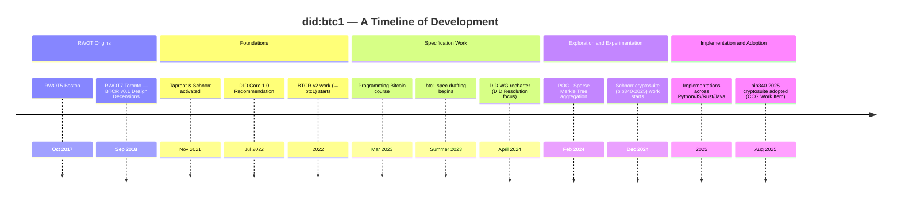

# did:btc1 DID Method Specification

**did:btc1** is a censorship resistant DID Method using the Bitcoin blockchain
as a Verifiable Data Registry to announce changes to the DID document.
It improves on prior work by allowing: zero-cost off-chain DID creation;
aggregated updates for scalable on-chain update costs; long-term identifiers
that can support frequent updates; private communication of the DID document;
private DID resolution; and non-repudiation appropriate for serious contracts.

The full specification may be viewed at http://dcdpr.github.io/did-btc1/.

## Compiling the Specification Locally

1. Install 'pandoc' locally - https://pandoc.org/getting-started.html.
2. Install 'npm' locally - http://docs.npmjs.com/downloading-and-installing-node-js-and-npm

* Note: Mac users can get both with homebrew: ```brew install npm pandoc``` 

3. Run the following commands

* ```cd did-btc1```
* ```npm install```
* ```npm run pandoc-spec```

The specification will be compiled and available in the `_site/index.html` file.

After editing the markdown files for the specification, see the `chapters` folder, 
you will need to rerun the script `npm run pandoc-spec-local` to see the changes.

# History and Evolution of the did:btc1 DID method




## Jupyter Notebooks

Included under the `notebooks` folder are a set of Jupyter notebooks that implement the
various features of the **did:btc1** specification. These are included as helpful reference
material for those intending to implement the specification. To run the notebooks locally see
the `notebooks/README.md`.
