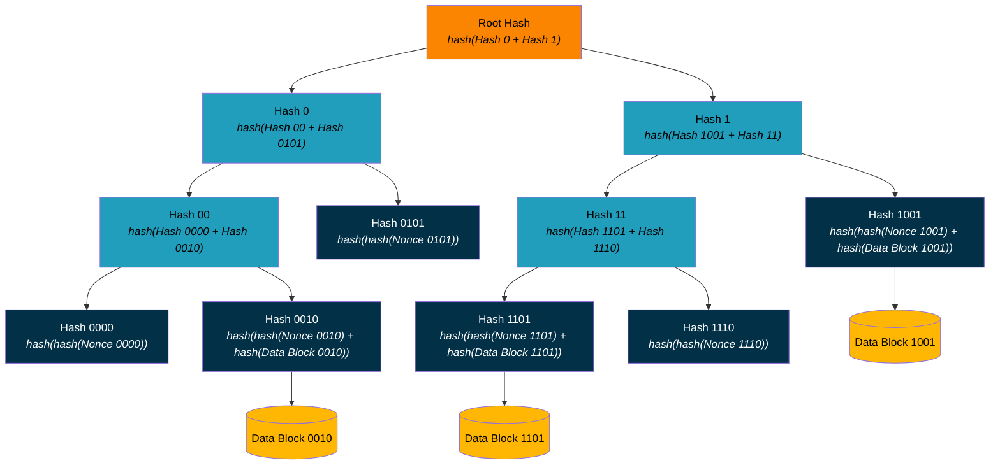

## Appendix - Optimized Sparse Merkle Tree Implementation

### Overview

From [Wikipedia](https://en.wikipedia.org/wiki/Merkle_tree):

> In cryptography and computer science, a hash tree or Merkle tree is a tree in which every "leaf" node is labelled with the cryptographic hash of a data block, and every node that is not a leaf (called a branch, inner node, or inode) is labeled with the cryptographic hash of the labels of its child nodes. A hash tree allows efficient and secure verification of the contents of a large data structure. A hash tree is a generalization of a hash list and a hash chain.

```mermaid
flowchart TD
    classDef rootHash color:#000000,fill:#fb8500
    classDef nodeHash color:#000000,fill:#219ebc
    classDef leafHash color:#ffffff,fill:#023047
    classDef dataBlock color:#000000,fill:#ffb703

    RootHash["`Root Hash
    *hash(Hash 0 + Hash 1)*`"]:::rootHash

    RootHash --> Hash0["`Hash 0
    *hash(Hash 00 + Hash 01)*`"]:::nodeHash
    RootHash --> Hash1["`Hash 1
    *hash(Hash 10 + Hash 11)*`"]:::nodeHash

    Hash0 --> Hash00["`Hash 00
    *hash(Hash 000 + Hash 001)*`"]:::nodeHash
    Hash0 --> Hash01["`Hash 01
    *hash(Hash 010 + Hash 011)*`"]:::nodeHash

    Hash1 --> Hash10["`Hash 10
    *hash(Hash 100 + Hash 101)*`"]:::nodeHash
    Hash1 --> Hash11["`Hash 11
    *hash(Hash 110 + Hash 111)*`"]:::nodeHash

    Hash00 --> Hash000["`Hash 000
    *hash(Hash 0000 + Hash 0001)*`"]:::nodeHash
    Hash00 --> Hash001["`Hash 001
    *hash(Hash 0010 + Hash 0011)*`"]:::nodeHash

    Hash01 --> Hash010["`Hash 010
    *hash(Hash 0100 + Hash 0101)*`"]:::nodeHash
    Hash01 --> Hash011["`Hash 011
    *hash(Hash 0110 + Hash 0111)*`"]:::nodeHash

    Hash10 --> Hash100["`Hash 100
    *hash(Hash 1000 + Hash 1001)*`"]:::nodeHash
    Hash10 --> Hash101["`Hash 101
    *hash(Hash 1010 + Hash 1011)*`"]:::nodeHash

    Hash11 --> Hash110["`Hash 110
    *hash(Hash 1100 + Hash 1101)*`"]:::nodeHash
    Hash11 --> Hash111["`Hash 111
    *hash(Hash 1110 + Hash 1111)*`"]:::nodeHash

    Hash000 --> Hash0000["`Hash 0000
    *hash(Data Block 0000)*`"]:::leafHash
    Hash000 --> Hash0001["`Hash 0001
    *hash(Data Block 0001)*`"]:::leafHash

    Hash001 --> Hash0010["`Hash 0010
    *hash(Data Block 0010)*`"]:::leafHash
    Hash001 --> Hash0011["`Hash 0011
    *hash(Data Block 0011)*`"]:::leafHash

    Hash010 --> Hash0100["`Hash 0100
    *hash(Data Block 0100)*`"]:::leafHash
    Hash010 --> Hash0101["`Hash 0101
    *hash(Data Block 0101)*`"]:::leafHash

    Hash011 --> Hash0110["`Hash 0110
    *hash(Data Block 0110)*`"]:::leafHash
    Hash011 --> Hash0111["`Hash 0111
    *hash(Data Block 0111)*`"]:::leafHash

    Hash100 --> Hash1000["`Hash 1000
    *hash(Data Block 1000)*`"]:::leafHash
    Hash100 --> Hash1001["`Hash 1001
    *hash(Data Block 1001)*`"]:::leafHash

    Hash101 --> Hash1010["`Hash 1010
    *hash(Data Block 1010)*`"]:::leafHash
    Hash101 --> Hash1011["`Hash 1011
    *hash(Data Block 1011)*`"]:::leafHash

    Hash110 --> Hash1100["`Hash 1100
    *hash(Data Block 1100)*`"]:::leafHash
    Hash110 --> Hash1101["`Hash 1101
    *hash(Data Block 1101)*`"]:::leafHash

    Hash111 --> Hash1110["`Hash 1110
    *hash(Data Block 1110)*`"]:::leafHash
    Hash111 --> Hash1111["`Hash 1111
    *hash(Data Block 1111)*`"]:::leafHash

    Hash0000 --> DataBlock0000[("Data Block 0000")]:::dataBlock
    Hash0001 --> DataBlock0001[("Data Block 0001")]:::dataBlock
    Hash0010 --> DataBlock0010[("Data Block 0010")]:::dataBlock
    Hash0011 --> DataBlock0011[("Data Block 0011")]:::dataBlock
    Hash0100 --> DataBlock0100[("Data Block 0100")]:::dataBlock
    Hash0101 --> DataBlock0101[("Data Block 0101")]:::dataBlock
    Hash0110 --> DataBlock0110[("Data Block 0110")]:::dataBlock
    Hash0111 --> DataBlock0111[("Data Block 0111")]:::dataBlock
    Hash1000 --> DataBlock1000[("Data Block 1000")]:::dataBlock
    Hash1001 --> DataBlock1001[("Data Block 1001")]:::dataBlock
    Hash1010 --> DataBlock1010[("Data Block 1010")]:::dataBlock
    Hash1011 --> DataBlock1011[("Data Block 1011")]:::dataBlock
    Hash1100 --> DataBlock1100[("Data Block 1100")]:::dataBlock
    Hash1101 --> DataBlock1101[("Data Block 1101")]:::dataBlock
    Hash1110 --> DataBlock1110[("Data Block 1110")]:::dataBlock
    Hash1111 --> DataBlock1111[("Data Block 1111")]:::dataBlock
```



To use Merkle trees to signal commitments in ::Beacons:::

* The index (the identification of the leaf node) is the hash of the DID with the hash byte stream converted to an integer using big-endian conversion, i.e., `index = int(hash(did))`.
    * Each DID is therefore associated with one and only one leaf node.
    * Binding the index to the DID ensures that no other index can be used by a nefarious actor to post an update to the DID.
    * This leaves a lot of unused leaves, which makes this a sparse Merkle tree.
* The value stored at a leaf node is the hash of a 256-bit nonce, concatenated with the hash of the ::BTC1 Update:: (the ::BTC1 Update Announcement::) if available, with the resulting stream hashed again, i.e., `value = hash(hash(nonce) + hash(btc1Update))` if there is a ::BTC1 Update:: or `value = hash(hash(nonce))` if there is not.
    * Provided that it is unique per DID and per signal, the use of a nonce ensures that updates and non-updates are indistinguishable to outside parties (aggregators, other DID controllers, verifiers) unless explicitly informed by the DID controller.
    * The hashing of the nonce ensures that verifiers with limited input validation deal only with a 256-bit result.
* A parent with two empty children is itself empty.
* The value of a parent with one empty child and one non-empty child is the value of the non-empty child.
    * This limits work to only those points in the tree where non-empty indexes diverge.
* The value of a parent with two non-empty children is the hash of the concatenation of the left value (bit 0) and the right value (bit 1), i.e., `parent_value = hash(left_value + right_value)`.
* The only thing published in the ::Beacon Signal:: is the root hash (the Merkle root).

Let's assume that:

* indexes 0 (0000), 2 (0010), 5 (0101), 9 (1001), 13 (1101), and 14 (1110) have DIDs associated with them; and
* a signal includes updates for DIDs 2, 9, and 13 and non-updates for all others.

The collapsed tree, where empty branches have been trimmed and single-child parents have been removed, looks like this (note that the positions of nodes Hash1001 and Hash11 are reversed due to the Mermaid layout algorithm):



The DID controller has to prove that there is either an update or a non-update in the ::Beacon Signal::. To prove an update, the DID controller provides the nonce and either the ::BTC1 Update:: (from which the verifier must calculate the hash) or the hash (which the verifier can use to retrieve the ::BTC1 Update:: from ::Sidecar Data:: or ::CAS::); to prove a non-update, the DID controller provides only the nonce. In addition, the DID controller must provide the verifier with hashes of each peer in the tree as the verifier walks up it to calculate the root hash against which to compare with the root hash in the ::Beacon Signal::.

Assuming that the DID of interest is at index 13 (`int(hash(did)) == int(1101) == 13`), the aggregator (the party responsible for constructing the sparse Merkle tree) must provide the DID controller with:

* a list of collapsed (trimmed and removed) parents above leaf node 13; and
* a list of hashes of the peers at the parents that have not been collapsed.

With the additional information from the aggregator, the DID controller can now provide a verifier with the following proof:

```json
{
  "id": "<< Hexadecimal of Root Hash >>",
  "nonce": "<< Hexadecimal of Nonce 1101 >>",
  "updateId": "<< Hexadecimal of hash(Data Block 1101) >>",
  "compressed": "<< Hexadecimal of 0001 >>",
  "hashes": [
      "<< Hexadecimal of Hash 1110 >>",
      "<< Hexadecimal of Hash 1001 >>",
      "<< Hexadecimal of Hash 0 >>"
  ]
}
```

The verifier has everything necessary to process the ::BTC1 Signal::. Assuming that the verifier can match the root hash in the ::BTC Signal:: to `proof.id` and the ::BTC1 Update:: to `proof.updateId`, the proof is verified as follows:

```javascript
index = int(hash(did)) // 1101

candidateHash = hash(hash(proof.nonce) + proof.updateId)

// First compressed bit from right is 1, so index bit doesn't apply.
// Skip first index bit.
// Candidate hash is unchanged.

// Next compressed bit from right is 0, so index bit applies.
// Next index bit from right is 0.
// Candidate hash goes to the left against the next listed hash.
candidateHash = hash(candidateHash, "Hash 1110")

// Next compressed bit from right is 0, so index bit applies.
// Next index bit from right is 1.
// Candidate hash goes to the right against the next listed hash.
candidateHash = hash("Hash 1001", candidateHash)

// Next compressed bit from right is 0, so index bit applies.
// Next index bit from right is 1.
// Candidate hash goes to the right against the next listed hash.
candidateHash = hash("Hash 0", candidateHash)

// Hashes exhausted.
// Candidate hash must equal root hash.
assert(candidateHash === proof.id)
```
