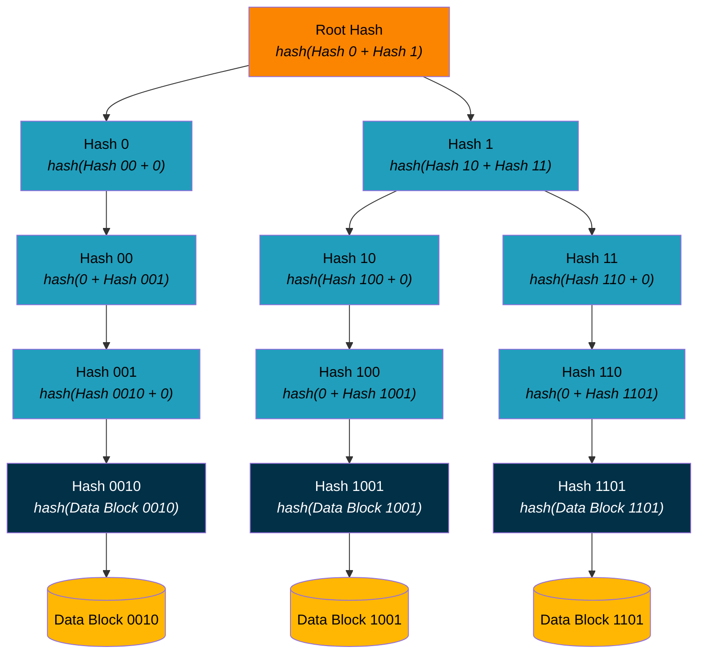
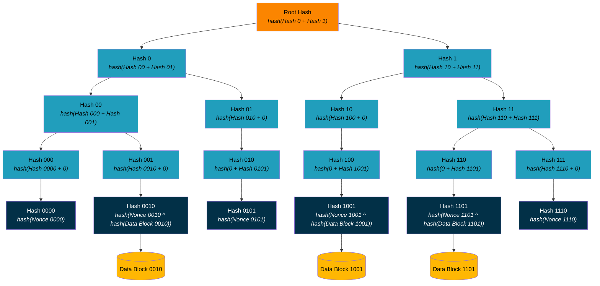
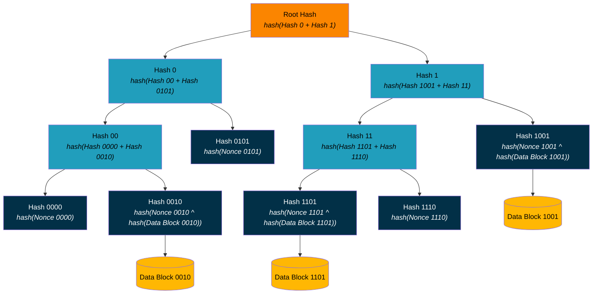

## Appendix - Optimized Sparse Merkle Tree Implementation

### Overview

From [Wikipedia](https://en.wikipedia.org/wiki/Merkle_tree):

> In cryptography and computer science, a hash tree or Merkle tree is a tree in which every "leaf" node is labelled with the cryptographic hash of a data block, and every node that is not a leaf (called a branch, inner node, or inode) is labeled with the cryptographic hash of the labels of its child nodes. A hash tree allows efficient and secure verification of the contents of a large data structure. A hash tree is a generalization of a hash list and a hash chain.

```mermaid
flowchart TD
    classDef rootHash color:#000000,fill:#fb8500
    classDef nodeHash color:#000000,fill:#219ebc
    classDef leafHash color:#ffffff,fill:#023047
    classDef dataBlock color:#000000,fill:#ffb703

    RootHash["`Root Hash
    *hash(Hash 0 + Hash 1)*`"]:::rootHash

    RootHash --> Hash0["`Hash 0
    *hash(Hash 00 + Hash 01)*`"]:::nodeHash
    RootHash --> Hash1["`Hash 1
    *hash(Hash 10 + Hash 11)*`"]:::nodeHash

    Hash0 --> Hash00["`Hash 00
    *hash(Hash 000 + Hash 001)*`"]:::nodeHash
    Hash0 --> Hash01["`Hash 01
    *hash(Hash 010 + Hash 011)*`"]:::nodeHash

    Hash1 --> Hash10["`Hash 10
    *hash(Hash 100 + Hash 101)*`"]:::nodeHash
    Hash1 --> Hash11["`Hash 11
    *hash(Hash 110 + Hash 111)*`"]:::nodeHash

    Hash00 --> Hash000["`Hash 000
    *hash(Hash 0000 + Hash 0001)*`"]:::nodeHash
    Hash00 --> Hash001["`Hash 001
    *hash(Hash 0010 + Hash 0011)*`"]:::nodeHash

    Hash01 --> Hash010["`Hash 010
    *hash(Hash 0100 + Hash 0101)*`"]:::nodeHash
    Hash01 --> Hash011["`Hash 011
    *hash(Hash 0110 + Hash 0111)*`"]:::nodeHash

    Hash10 --> Hash100["`Hash 100
    *hash(Hash 1000 + Hash 1001)*`"]:::nodeHash
    Hash10 --> Hash101["`Hash 101
    *hash(Hash 1010 + Hash 1011)*`"]:::nodeHash

    Hash11 --> Hash110["`Hash 110
    *hash(Hash 1100 + Hash 1101)*`"]:::nodeHash
    Hash11 --> Hash111["`Hash 111
    *hash(Hash 1110 + Hash 1111)*`"]:::nodeHash

    Hash000 --> Hash0000["`Hash 0000
    *hash(Data Block 0000)*`"]:::leafHash
    Hash000 --> Hash0001["`Hash 0001
    *hash(Data Block 0001)*`"]:::leafHash

    Hash001 --> Hash0010["`Hash 0010
    *hash(Data Block 0010)*`"]:::leafHash
    Hash001 --> Hash0011["`Hash 0011
    *hash(Data Block 0011)*`"]:::leafHash

    Hash010 --> Hash0100["`Hash 0100
    *hash(Data Block 0100)*`"]:::leafHash
    Hash010 --> Hash0101["`Hash 0101
    *hash(Data Block 0101)*`"]:::leafHash

    Hash011 --> Hash0110["`Hash 0110
    *hash(Data Block 0110)*`"]:::leafHash
    Hash011 --> Hash0111["`Hash 0111
    *hash(Data Block 0111)*`"]:::leafHash

    Hash100 --> Hash1000["`Hash 1000
    *hash(Data Block 1000)*`"]:::leafHash
    Hash100 --> Hash1001["`Hash 1001
    *hash(Data Block 1001)*`"]:::leafHash

    Hash101 --> Hash1010["`Hash 1010
    *hash(Data Block 1010)*`"]:::leafHash
    Hash101 --> Hash1011["`Hash 1011
    *hash(Data Block 1011)*`"]:::leafHash

    Hash110 --> Hash1100["`Hash 1100
    *hash(Data Block 1100)*`"]:::leafHash
    Hash110 --> Hash1101["`Hash 1101
    *hash(Data Block 1101)*`"]:::leafHash

    Hash111 --> Hash1110["`Hash 1110
    *hash(Data Block 1110)*`"]:::leafHash
    Hash111 --> Hash1111["`Hash 1111
    *hash(Data Block 1111)*`"]:::leafHash

    Hash0000 --> DataBlock0000[("Data Block 0000")]:::dataBlock
    Hash0001 --> DataBlock0001[("Data Block 0001")]:::dataBlock
    Hash0010 --> DataBlock0010[("Data Block 0010")]:::dataBlock
    Hash0011 --> DataBlock0011[("Data Block 0011")]:::dataBlock
    Hash0100 --> DataBlock0100[("Data Block 0100")]:::dataBlock
    Hash0101 --> DataBlock0101[("Data Block 0101")]:::dataBlock
    Hash0110 --> DataBlock0110[("Data Block 0110")]:::dataBlock
    Hash0111 --> DataBlock0111[("Data Block 0111")]:::dataBlock
    Hash1000 --> DataBlock1000[("Data Block 1000")]:::dataBlock
    Hash1001 --> DataBlock1001[("Data Block 1001")]:::dataBlock
    Hash1010 --> DataBlock1010[("Data Block 1010")]:::dataBlock
    Hash1011 --> DataBlock1011[("Data Block 1011")]:::dataBlock
    Hash1100 --> DataBlock1100[("Data Block 1100")]:::dataBlock
    Hash1101 --> DataBlock1101[("Data Block 1101")]:::dataBlock
    Hash1110 --> DataBlock1110[("Data Block 1110")]:::dataBlock
    Hash1111 --> DataBlock1111[("Data Block 1111")]:::dataBlock
```



These are the requirements for using Merkle trees to signal commitments in ::Beacons:::

* Each data block is either a ::BTC1 Update:: or null.
* No key may have more than one data block.
* The hash of a non-leaf node is the hash of the concatenation of its child nodes' hashes.
* The only thing published to Bitcoin is the root hash (the Merkle root).

The DID controller has to prove either inclusion or non-inclusion in the ::Beacon Signal::. To prove inclusion, the DID controller provides either the ::BTC1 Update:: (from which the verifier must calculate the hash) or the hash (which the verifier can use to retrieve the ::BTC1 Update:: from ::CAS::); to prove non-inclusion, the DID controller provides the null value (from which the verifier must calculate the hash). In addition, the DID controller must provide the verifier with hashes of each peer in the tree as the verifier walks up it to calculate the root hash against which to compare with the root hash from the ::Beacon Signal::).

Let’s assume that a DID has been allocated index 13 (1101) through some unknown mechanism (e.g., randomly generated).

To prove that the DID is included in the signal, the DID controller provides the ::BTC1 Update:: to calculate *Hash 1101* and the values *Hash 1100*, *Hash 111*, *Hash 10*, and *Hash 0*. The verifier then calculates *Hash 110*, *Hash 11*, *Hash 1*, and *Root Hash*. If that last value matches the value in the signal, the verifier knows that the DID is included in the signal.

The logic is the same for non-inclusion, except that the DID controller provides the null value instead of the ::BTC1 Update:: to calculate *Hash 1101*.

In either case, the DID presentation must include the following:

```json
{
  "index": "<< Hexadecimal of 1101 >>",
  "hashes": [
    "<< Hexadecimal of Hash 1100 >>",
    "<< Hexadecimal of Hash 111 >>",
    "<< Hexadecimal of Hash 10 >>",
    "<< Hexadecimal of Hash 0 >>"
  ]
}
```

The `index` is the hexadecimal string of the index allocated to the DID. Each bit, working from right to left, indicates the direction from which to apply the candidate hash (the one to be verified) to the next one from the `hashes` array, yielding the next candidate hash. Together, the path up the tree (determined by the index) and the array of hashes are called the Merkle proof.

```javascript
candidateHash = "Hash 1101"

// First index bit from right is 1.
// Candidate hash goes to the right against the first listed hash.
candidateHash = hash("Hash 1100", candidateHash)

// Next index bit from right is 0.
// Candidate hash goes to the left against the next listed hash.
candidateHash = hash(candidateHash, "Hash 111")

// Next index bit from right is 1.
// Candidate hash goes to the right against the next listed hash.
candidateHash = hash("Hash 10", candidateHash)

// Next index bit from right is 1.
// Candidate hash goes to the right against the next listed hash.
candidateHash = hash("Hash 0", candidateHash)

// Hashes exhausted.
// Candidate hash must equal root hash.
assert(candidateHash === "Root Hash")
```

### Attacks

#### Misrepresented Proof of Inclusion/Non-Inclusion

Let’s assume that a nefarious actor (NA) joined the cohort in the beginning and was allocated index 6 (0110). Later, NA gains access to the cryptographic material and the entire DID history for the DID at index 13 (1101) belonging to a legitimate actor (LA). NA does not gain access to the cryptographic material LA uses to sign their part of the n-of-n P2TR Bitcoin address, which is unrelated to the DID. LA discovers the breach immediately and posts an update, rotating their keys or deactivating the DID.

NA makes a presentation with LA’s DID and, using the ::Sidecar:: method, provides all the legitimate DID updates except the most recent one. In its place, NA provides proof of inclusion (to change the DID document) or non-inclusion (to retain the prior version of the DID document), using the material provided by the aggregator for index 6 (0110), for which NA posted an update (for inclusion) or nothing (for non-inclusion). Assuming that, once allocated, the DID's index is fixed, comparison across presentations could detect a breach by a change in `index`, but only if both LA and NA post updates.

To mitigate this attack, a DID’s index must be fixed deterministically and the hashing operation most not be commutative, i.e., *hash(X + Y)* ≠ *hash(Y + X)*. The following algorithm meets these requirements:

1. A DID’s index is the SHA256 hash of the DID.
2. The value at the DID’s index for the signal is the ::BTC1 Update Announcement:: for that DID (0 if null).
3. For any parent node:
    1. If the values of both child nodes are 0, the value of the parent node is 0.
    2. Otherwise, the value of the parent node is the hash of the concatenation of the 256-bit left child value and the 256-bit right child value.

The consequence of step 1 is that the Merkle tree has up to 2<sup>256</sup> leaves, 2<sup>256</sup>-1 nodes, and a depth of 256+1=257. This is mitigated by step 3i, which limits the tree size to only those branches where at least one leaf has a non-null data block. The presentation of the hashes doesn't require `index`, as it is simply the hash of the DID, i.e., `index = hash(did)`.

#### Information Leakage

To prove inclusion or non-inclusion, it is necessary to present a list of peer hashes from bottom to top. A verifier then takes the hash of the ::BTC1 Update:: (inclusion) or the hash of null (non-inclusion) and applies the algorithm above to walk up to the root. Most of the peer hashes will be zero.

The list of peer hashes must be provided by the aggregator to the DID controller. Changes in the values (from zero to non-zero or from non-zero to zero) indicate frequency of changes to other DIDs in the peer branch. Furthermore, assuming that a verifier has a DID from a past presentation with the same aggregator Beacon address:

* a zero value in a node that encompasses the hash value of the DID is definitive proof that the DID document has not been updated; and
* a non-zero value in a node that encompasses the hash value of the DID is statistically significant proof that the DID document has been updated.

Let's assume that:

* indexes 0 (0000), 2 (0010), 5 (0101), 9 (1001), 13 (1101), and 14 (1110) have DIDs associated with them;
* a signal includes updates for DIDs 2, 9, and 13; and
* a verifier presented with DID 13 also knows, through prior presentations, about DIDs 5 and 14, but not about DIDs 0, 2, and 9.

The hash tree for the signal looks like this:



The presentation to the verifier for DID 13 now includes the following (note the removal of `index`, which is calculated by the verifier):

```json
{
  "hashes": [
    "0000...0000",
    "0000...0000",
    "<< Hexadecimal of Hash 10 >>",
    "<< Hexadecimal of Hash 0 >>"
  ]
}
```

From this, the verifier can infer that:

* index 12 (1100) is not allocated or has been allocated to an unknown DID that hasn't been updated;
* the DID at index 14 (1110) has not been updated;
* index 15 (1111) is not allocated or has been allocated to an unknown DID that hasn't been updated;
* one or more unknown DIDs at indexes 8-11 (1000-1011) have been updated; and
* the DID at index 5 (0101) may have been updated (probability ≥ 1/8).

To mitigate this, inclusion and non-inclusion should be indistinguishable, i.e., there should not be a reserved value of 0 indicating a null payload. It is still necessary to identify empty branches (otherwise the hash calculation time becomes impossibly large), so the reserved value of 0 is retained for that purpose. The following (revised) algorithm meets these requirements:

* A DID’s index is the SHA256 hash of the DID.
* A signal- and DID-specific 256-bit nonce shall be generated by the DID controller, regardless of update or non-update status.
* The value at the DID’s index for the signal is the nonce xored with the hash of the ::BTC1 Update:: for that signal (0 if null).
    * If the DID controller is responsible for providing the value, the nature of the signal (update or non-update) is hidden from the aggregator.
* The value of the parent node is the hash of the concatenation of the 256-bit left child value (0 if the left branch is empty) and the 256-bit right child value (0 if the right branch is empty).
    * One or both of the left and right branches is non-empty.

Using the example above, the hash tree for the signal looks like this:



Every DID is included, so there is no longer a proof of non-inclusion. Instead, what's being proved is the presence or absence of an update, where the absence of an update is a null document. To prove presence or absence of an update, the DID controller presents the nonce, the ::BTC1 Update:: or null, and the list of peer hashes from bottom to top.

Now, the presentation to the verifier for DID 13 includes the following:

```json
{
  "nonce": "<< Hexadecimal of Nonce 1101 >>",
  "hashes": [
    "0000...0000",
    "<< Hexadecimal of Hash 111 >>",
    "<< Hexadecimal of Hash 10 >>",
    "<< Hexadecimal of Hash 0 >>"
  ]
}
```

From this, the verifier can infer only that index 12 (1100) is not allocated. Having the nonce vary per signal ensures that the hash of the null value varies and so can't be tested for across signals. Having the nonce vary per DID ensures that the verifier can't test for non-update of other known DIDs. Peer hashes that are zero will always be zero and those that are non-zero will always be non-zero.

### Optimization

The tree can be further optimized as outlined in [The Libra Blockchain](https://diem-developers-components.netlify.app/papers/the-diem-blockchain/2020-05-26.pdf). The first optimization collapses empty nodes into a fixed value; this is already defined above where the hash of an empty node is zero. The second optimization is to replace subtrees containing exactly one leaf with a single node. This reduces the tree size significantly to a depth of approximately *log2(n)*, where *n* is the number of leaves.

Doing this violates the requirement that the path be trivially deterministic; the verifier would have to know every occupied index to infer the path to the root for the DID of interest. It also requires that non-updates be included, as it would otherwise be impossible to prove non-inclusion (there would be no path at all), and the nonce is still required so that updates are indistinguishable from non-updates.

Algorithmically, this is equivalent to the following:

* A DID’s index is the SHA256 hash of the DID.
* A signal- and DID-specific 256-bit nonce shall be generated by the DID controller, regardless of update or non-update status.
* The value at the DID’s index for the signal is the nonce xored with the hash of the ::BTC1 Update:: for that signal (0 if null).
* The value of a parent node is:
    * If either the left branch or the right branch is empty, the value of the non-empty branch.
    * Otherwise, the hash of the concatenation of the 256-bit left child value and the 256-bit right child value.
    * One or both of the left and right branches is non-empty.

To solve this, the aggregator provides the DID controller with the list of collapsed nodes, which the DID controller in turn supplies to the verifier. The verifier uses the list, implemented as a bitmap, to identify only those bits that are relevant to calculation. The end result is this (note that the positions of nodes Hash1001 and Hash11 are reversed due to the Mermaid layout algorithm):



Now, the presentation to the verifier for DID 13 includes the following (note the addition of `compressed`, which is the result of the optimization):

```json
{
  "nonce": "<< Hexadecimal of Nonce 1101 >>",
  "compressed": "<< Hexadecimal of 0001 >>",
  "hashes": [
      "<< Hexadecimal of Hash 1110 >>",
      "<< Hexadecimal of Hash 1001 >>",
      "<< Hexadecimal of Hash 0 >>"
  ]
}
```

The verifier then applies the hashes to the using only those bits in `index` where the equivalent bit in `compressed` is zero:

```javascript
candidateHash = "Hash 1101"

// First compressed bit from right is 1, so index bit doesn't apply.
// Skip first index bit.

// Next compressed bit from right is 0, so index bit applies.
// Next index bit from right is 0.
// Candidate hash goes to the left against the next listed hash.
candidateHash = hash(candidateHash, "Hash 1110")

// Next compressed bit from right is 0, so index bit applies.
// Next index bit from right is 1.
// Candidate hash goes to the right against the next listed hash.
candidateHash = hash("Hash 1001", candidateHash)

// Next compressed bit from right is 0, so index bit applies.
// Next index bit from right is 1.
// Candidate hash goes to the right against the next listed hash.
candidateHash = hash("Hash 0", candidateHash)

// Hashes exhausted.
// Candidate hash must equal root hash.
assert(candidateHash === "Root Hash")
```

The `hashes` array has three elements. The only thing the verifier can infer from any presentation is the depth of the tree and therefore an estimate of the number of DIDs using the Beacon.
