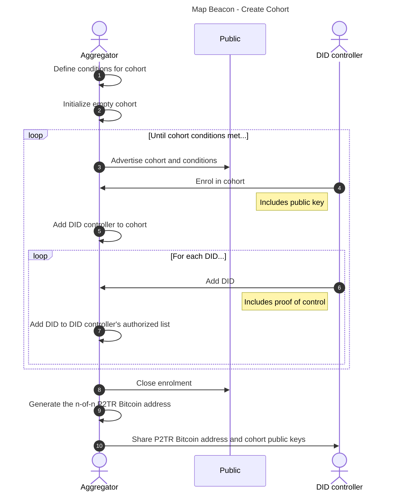
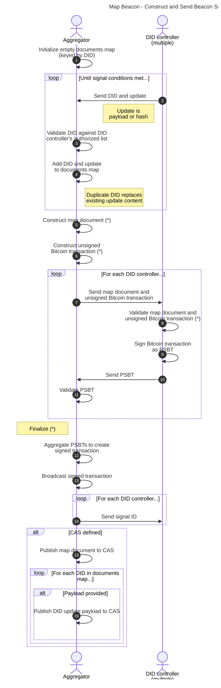
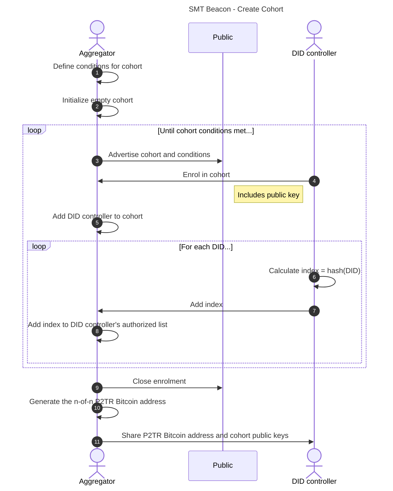

```mermaid
sequenceDiagram
    autonumber
    title SMT Beacon - Construct and Send Beacon Signal

    actor A as Aggregator
    actor C as DID controller<br/>(multiple)

    A ->> A: Initialize empty<br/>optimized SMT

    loop Until signal conditions met...
        C ->> C: Calculate index = hash(DID)
        C ->> C: Generate nonce
        C ->> C: Calculate update = hash(nonce ^<br/>hash(DID update payload))
        C ->> A: Send index and update
        A ->> A: Validate index against DID<br/>controller's authorized list
        A ->> A: Calculate value = hash(index +<br/>update)
        A ->> A: Set optimized SMT leaf<br/>for index to value
        note right of A: Duplicate index replaces<br/>existing value
    end

    loop For each DID controller...
        A ->> C: Request missing indexes
        C ->> C: Initialize empty updates array
        
        loop For each missing index...
            C ->> C: Validate that index is the<br/>hash of a DID expected to<br/>be in the signal and that<br/>DID has no update
            C ->> C: Generate nonce
            C ->> C: Calculate update = hash(nonce)
            C ->> C: Add update to updates array
        end
        
        C ->> A: Send updates
        note left of C: Updates must be in the<br/>same order as missing indexes
        
        loop For each missing index...
            A ->> A: Calculate value = hash(index +<br/>update)
            A ->> A: Set optimized SMT leaf<br/>for index to value
        end
    end

    A ->> A: Fill optimized SMT
    A ->> A: Construct unsigned<br/>Bitcoin transaction (*)

    loop For each DID controller...
        A ->> A: Initialize empty peers array<br/>map (keyed by index)

        loop For each index...
            A ->> A: Construct peers array (*)
            A ->> A: Add index and peers array<br/>to peers array map
        end
        
        A ->> C: Send peers array map and<br/>unsigned Bitcoin transaction
        C ->> C: Validate peers array map<br/>and unsigned Bitcoin transaction (*)
        C ->> C: Sign Bitcoin transaction<br/>as PSBT
        C ->> A: Send PSBT
        A ->> A: Validate PSBT
    end
    
    note left of A: Finalize (*)

    A ->> A: Aggregate PSBTs to create<br/>signed transaction
    A ->> A: Broadcast signed transaction

    loop For each DID controller...
        A ->> C: Send signal ID
    end
```

## Beacons

> **TODO**:
> 
> * Ensure that all `sidecarDocuments` and `smtProofs` have been used if
>   `targetVersionId` is not defined.
> * Review exception names.
> * Replace "Validate that..." with explicit test and exception.
> * Review need for anything more than signal ID to be shared after signaling.
> * Review format of `service` entry, determine if `cas` should be supported.
> * Review change from CIDAggregateBeacon to MapBeacon.

### Overview

::Beacons:: are the mechanism by which a commitment to zero or more DID update
payloads is made by broadcasting it on a Bitcoin network. A ::Beacon:: is
identified by a Bitcoin address and emits ::Beacon Signals:: by broadcasting
valid Bitcoin transactions that spend from this address.

A ::Beacon:: is included as a service in DID documents, with the Service
Endpoint identifying a Bitcoin address to watch for ::Beacon Signals::. All
::Beacon Signals:: broadcast from this ::Beacon:: MUST be processed as part of
resolution. The type of the ::Beacon:: service in the DID document defines how
::Beacon Signals:: MUST be processed.

**did:btc1** supports different ::Beacon Types::, with each type defining a set
of algorithms for:

1. How a ::Beacon:: can be established and added as a service to a DID document.
1. How attestations to DID updates are broadcast within ::Beacon Signals::.
1. How a resolver processes a ::Beacon Signal::, identifying, verifying, and
   applying the authorized mutations to a DID document for a specific DID.

This is an extensible mechanism, such that in the future new ::Beacon Types::
could be added.

The current, active ::Beacons:: of a DID document are specified in the document's
`service` property. By updating the DID document, a DID controller can change
the set of ::Beacons:: they use to broadcast updates to their DID document over
time. Resolution of a DID MUST process signals from all ::Beacons:: identified in the
latest DID document and apply them in the order determined by the version specified
by the `didUpdatePayload`.

All resolvers of **did:btc1** DIDs MUST support the Beacon Types defined in this
specification.

The commitment is a SHA256 hash that represents one of the following:

* the hash of a single DID update payload associated with a **did:btc1**
  identifier;
* the hash of a document of key-value pairs, where each key is a **did:btc1**
  identifier and the value is the hash of a DID update payload or null for that
  key; or
* the hash of a [Merkle tree](https://en.wikipedia.org/wiki/Merkle_tree) root,
  where each leaf node is deterministically selected by a **did:btc1**
  identifier and contains a hash associated with the **did:btc1** identifier.

When defining a service for a ::Beacon:::

* `type` is one of "SingletonBeacon", "MapBeacon", or "SMTBeacon"
* `serviceEndpoint` is a Bitcoin address represented as a URI following the
  [BIP21 scheme](https://github.com/bitcoin/bips/blob/master/bip-0021.mediawiki)

How the Bitcoin address and the cryptographic material that controls it are
generated is left to the implementation.

### Actors

Actors in signaling are as follows:

* DID controller - a party that controls one or more **did:btc1** identifiers
  participating in a ::Beacon::
* cohort - a set of DID controllers participating in a ::Beacon:: and in the
  construction of the n-of-n P2TR Bitcoin address for the ::Beacon::
* aggregator - the party responsible for aggregating updates from all DID
  controllers and creating the ::Beacon Signals::
* verifier - a party verifying a **did:btc1** identifier presentation

### Aggregation

Three types of ::Beacons:: are defined: SingletonBeacon, MapBeacon and SMTBeacon. 
Two of them, MapBeacon and SMTBeacon, support aggregation, i.e. the act of 
committing to multiple DID update payloads into a single transaction.
possible mechanism is outlined in “MuSig2 3-of-3 Multisig with Coordinator
Facilitation” at
[MuSig2 Sequence Diagrams](https://developer.blockchaincommons.com/musig/sequence/#musig2-3-of-3-multisig-with-coordinator-facilitation).

When defining a Beacon Cohort, the Beacon Aggregator may define the conditions for the
cohort, including but not limited to:

* Automatic publication to ::CAS:: (Map Beacon only)
* Minimum and/or maximum number of DID controllers
* Minimum and/or maximum number of DIDs per DID controller
* Cost of enrolment
* Cost per signal per DID or DID controller
* Minimum and/or maximum time between signals
* Number of pending updates that trigger a signal

### Singleton Beacon

A ::Singleton Beacon:: is a ::Beacon:: that can be used to commit to a single
::DID Update Payload:: targeting a single DID document. It creates a ::Beacon
Signal:: that commits to a single DID update payload. This is done directly by
the DID controller, and there is no cohort or aggregator.

If the DID update payload is not publicly discoverable (i.e., is not published
to a ::CAS:: under its hash), the only parties that are aware of it are the DID
controller and any parties provided it by the DID controller.

The `type` of the `service` for a Singleton Beacon is "SingletonBeacon".

#### Construct and Send Beacon Signal

Given:

* `network` - required, one of:
    * "bitcoin"
    * "signet"
    * "regtest"
    * "testnet3"
    * "testnet4"
    * "mutinynet"
    * number
* `serviceEndpoint` - required, a Bitcoin address represented as a URI
* One and only one of, required:
    * `didUpdatePayload` - the DID update payload whose SHA256 hash is to be
      broadcast in the ::Beacon Signal::
    * `didUpdateHashBytes` - the SHA256 hash in binary form of the DID update
      payload to be broadcast in the ::Beacon Signal::
* `cas` - optional, one of:
    * "ipfs"

Construct a Bitcoin transaction that spends from the Beacon address on the
selected network:

1. If `network` is not a valid value per above, raise InvalidParameter error.
1. if `network` is a number and is outside the range of 1-4, raise
   InvalidParameter error.
1. If `cas` is defined and is not a valid value per above, raise
   InvalidParameter error.
1. Set `bitcoinAddress` to the decoding of `serviceEndpoint` following BIP21.
1. Ensure `bitcoinAddress` is funded; if not, fund this address.
1. If `didUpdateHashBytes` is not defined, set `didUpdateHashBytes` to the
   result of passing `didUpdatePayload` to the [JSON Canonicalization and Hash]
   algorithm.
1. Initialize `spendTx` to a Bitcoin transaction that spends a transaction
   controlled by the `bitcoinAddress` and contains at least one transaction
   output. This signal output MUST have the format
   `[OP_RETURN, OP_PUSHBYTES32, <didUpdateHashBytes>]`. If the transaction
   contains multiple transaction outputs, the signal output MUST be the last
   transaction output.
1. Retrieve the cryptographic material, e.g., private key or signing capability,
   associated with the `bitcoinAddress`. How this is done is left to the
   implementer.
1. Sign the `spendTx`.
1. Broadcast `spendTx` on the Bitcoin network defined by `network`.
1. Set `signalId` to the Bitcoin transaction identifier of `spendTx`.
1. If `cas` and `didUpdatePayload` are defined, publish `didUpdatePayload` to
   the ::CAS:: network defined by `cas`.
1. Return `signalId`.

### Map Beacon

A Map Beacon creates a ::Beacon Signal:: that commits to multiple DID update
payloads, each identified by a **did:btc1** identifier. To do so, it constructs
a new document of key-value pairs, where the key is the **did:btc1** identifier
and the value is the hash of the corresponding DID update payload, and publishes
a hash of the consolidated document.

If a DID update payload is not publicly discoverable (i.e., is not published to
a ::CAS:: under its hash), the only parties that are aware of it are the DID
controller and any parties provided it by the DID controller. However, any party
that has access to or is provided the consolidated key-value pair document is at
least aware of the existence of all **did:btc1** identifiers in the document and
the existence of their DID update payloads.

For a Map Beacon, proof of non-inclusion of a **did:btc1** identifier is simply
its absence from the consolidated key-value pair document.

The `type` of the `service` for a Map Beacon is "MapBeacon".

#### Create Cohort

#### Construct and Send Beacon Signal

##### Construct Map Document

Given:

* `documentsMap` - required, a map of key-value pairs consisting of:
    * `did` - required, a unique **did:btc1** identifier (key)
    * One and only one of, required (value):
        * `didUpdatePayload` - the DID update payload whose SHA256 hash is to be
          included in the consolidated key-value pair document
        * `didUpdateHashBytes` - the SHA256 hash in binary form of the DID
          update payload to be included in the consolidated key-value pair
          document

Construct the map document as follows:

1. If `documentsMap` contains a duplicate `did`, raise InvalidParameter error.
1. Set `mapDocument` to the JSON representation of `documentsMap` in the form
   `{"<did1>": "<hashString1>", "<did2>": "<hashString2>",...}` where:
   1. `didN` is the *N*th `did` in `documentsMap`;
   1. `hashBytesN` is the *N*th `didUpdateHashBytes` in `documentsMap` if
      defined or the result of passing the *N*th `didUpdatePayload` in
      `documentsMap` to the [JSON Canonicalization and Hash] algorithm; and
   1. `hashStringN` is the hexadecimal string representation of `hashBytesN`.

##### Construct Unsigned Bitcoin Transaction

Given:

* `network` - required, one of:
    * "bitcoin"
    * "signet"
    * "regtest"
    * "testnet3"
    * "testnet4"
    * "mutinynet"
    * number
* `serviceEndpoint` - required, a Bitcoin address represented as a URI
* `mapDocument` - required, map document constructed as above

Construct a Bitcoin transaction that spends from the Beacon address on the
selected network:

1. If `network` is not a valid value per above, raise InvalidParameter error.
1. if `network` is a number and is outside the range of 1-4, raise
   InvalidParameter error.
1. Set `bitcoinAddress` to the decoding of `serviceEndpoint` following BIP21.
1. Ensure `bitcoinAddress` is funded; if not, fund this address.
1. Set `hashBytes` to the result of passing `mapDocument` to the
   [JSON Canonicalization and Hash] algorithm.
1. Initialize `unsignedSpendTx` to a Bitcoin transaction that spends a
   transaction controlled by the `bitcoinAddress` and contains at least one
   transaction output. This signal output MUST have the format
   `[OP_RETURN, OP_PUSHBYTES32, <hashBytes>]`. If the transaction contains
   multiple transaction outputs, the signal output MUST be the last transaction
   output.

##### Validate Document and Unsigned Bitcoin Transaction

Given:

* `mapDocument` - required, map document constructed as above
* `unsignedSpendTx` - required, unsigned Bitcoin transaction constructed as
  above

Validate the document and the unsigned Bitcoin transaction:

1. Validate that `mapDocument` contains each DID previously sent and that the
   value associated with each DID is either the hash previously sent or the hash
   of the payload previously sent.
1. Set `hashBytes` to the result of passing `mapDocument` to the
   [JSON Canonicalization and Hash] algorithm.
1. Validate that `unsignedSpendTx` is spending from the correct Bitcoin address.
1. Validate that the last transaction output of `unsignedSpendTx` is
   `[OP_RETURN, OP_PUSHBYTES32, <hashBytes>]`.

##### Finalize

Given:

* `mapDocument` - required, map document constructed as above
* `documentsMap` - required, as above
* `psbts` - required, partially signed Bitcoin transactions
* `cas` - optional, one of:
    * "ipfs"

Spend the transaction and publish to CAS:

1. If `cas` is defined and is not a valid value per above, raise
   InvalidParameter error.
1. Set `spendTx` to the aggregation of the partially signed Bitcoin transactions
   `psbts` into a single transaction.
1. Broadcast `spendTx` on the Bitcoin network.
1. Set `signalId` to the Bitcoin transaction identifier of `spendTx`.
1. If `cas` is defined:
   1. Publish `mapDocument` to the ::CAS:: network defined by `cas`.
   1. For each `did` with a `didUpdatePayload` in `documentsMap`, publish
      `didUpdatePayload` to the ::CAS:: network defined by `cas`.
1. Return `signalId`.

### SMT Beacon

An SMT Beacon creates a ::Beacon Signal:: that commits to multiple DID update
payloads, each identified by a **did:btc1** identifier. To do so, it constructs
an optimized Sparse Merkle Tree as defined in [Appendix - Optimized Sparse
Merkle Tree Implementation] and publishes the Merkle root.

An SMT Beacon provides maximum privacy for the DID controller, as the DID
controller never has to reveal their DIDs or DID update payloads to the
aggregator. This introduces a small risk, as the DID controller is not required
to prove control over a DID in order to participate.

The `type` of the `service` for an SMT Beacon is "SMTBeacon".

#### Create Cohort

#### Construct and Send Beacon Signal

##### Construct Unsigned Bitcoin Transaction

Given:

* `network` - required, one of:
    * "bitcoin"
    * "signet"
    * "regtest"
    * "testnet3"
    * "testnet4"
    * "mutinynet"
    * number
* `serviceEndpoint` - required, a Bitcoin address represented as a URI
* `hashBytes` - required, root hash of optimized SMT

Construct a Bitcoin transaction that spends from the Beacon address on the
selected network:

1. If `network` is not a valid value per above, raise InvalidParameter error.
1. if `network` is a number and is outside the range of 1-4, raise
   InvalidParameter error.
1. Set `bitcoinAddress` to the decoding of `serviceEndpoint` following BIP21.
1. Ensure `bitcoinAddress` is funded; if not, fund this address.
1. Initialize `unsignedSpendTx` to a Bitcoin transaction that spends a
   transaction controlled by the `bitcoinAddress` and contains at least one
   transaction output. This signal output MUST have the format
   `[OP_RETURN, OP_PUSHBYTES32, <hashBytes>]`. If the transaction contains
   multiple transaction outputs, the signal output MUST be the last transaction
   output.

##### Construct Peers Array

Given:

* `smt` - required, optimized SMT
* `index` - required, index provided by DID controller

Calculate the path to the root for the index:

1. Set `peers` to empty array.
1. Set `node` to leaf node for `index`.
1. While `node` is not root of `smt`:
   1. Set `parentNode` to parent of `node`.
   1. If `node` is left of `parentNode`, add `{right: <rightHashString>}`to
      `peers`, where `rightHashString` is the hexadecimal string representation
      of the value at `parentNode.rightNode`.
   1. If `node` is right of `parentNode`, add `{left: <leftHashString>}` to
      `peers`, where `leftHashString` is the hexadecimal string representation
      of the value at `parentNode.leftNode`.
1. Return `peers`. 

##### Validate Peers Array Map and Unsigned Bitcoin Transaction

Given:

* `peersMap` - required, peers array map constructed as above
* `unsignedSpendTx` - required, unsigned Bitcoin transaction constructed as
  above

Validate the peers array map and the unsigned Bitcoin transaction:

1. Validate that `unsignedSpendTx` is spending from the correct Bitcoin address.
1. For each `did` expected to be in the ::Beacon Signal:::
   1. Set `index` to `hash(did)`.
   1. Set `peers` to the value at `index` and remove it from the map.
   1. If `peers` is undefined, raise InvalidParameter error.
   1. Extract the current `nonce` and `didUpdatePayload` for `did` from local
      storage.
   1. If `didUpdatePayload` is defined, set `didUpdateHashBytes` to the result
      of passing `didUpdatePayload` to the [JSON Canonicalization and Hash]
      algorithm and set `hashBytes` to
      `hash(index + hash(nonce ^ didUpdateHashBytes))`, otherwise set
      `hashBytes` to `hash(index + hash(nonce))`.
   1. For each `peer` in `peers`:
      1. Validate that `peer` has a single key-value pair.
      1. Extract `key` and `value` from `peer`.
      1. If `key` is `"left"`, set `hashBytes` to `hash(value + hashBytes)`;
         otherwise, if `key` is `"right"`, set `hashBytes` to
         `hash(hashBytes + value)`; otherwise, raise InvalidParameter error.
   1. Validate that the last transaction output of `unsignedSpendTx` is
      `[OP_RETURN, OP_PUSHBYTES32, <hashBytes>]`.
   1. If `didUpdateHashBytes` is defined, construct as `smtProof` the object
      `{id: <hashString>, nonce: <nonce>, payloadId: <didUpdateHashString>, peers: <peers>}`,
      otherwise construct as `smtProof` the object
      `{id: <hashString>, nonce: <nonce>, peers: <peers>}`,
      where `hashString` is the hexadecimal string representation of `hashBytes`
      and `didUpdateHashString` is the hexadecimal string representation of
      `didUpdateHashBytes`.
   1. Store `smtProof` for later presentation to verifiers.
1. If `peersMap` is not empty, raise InvalidParameter error.

##### Finalize

Given:

* `psbts` - required, partially signed Bitcoin transactions

Spend the transaction:

1. Set `spendTx` to the aggregation of the partially signed Bitcoin transactions
   `psbts` into a single transaction.
1. Broadcast `spendTx` on the Bitcoin network.
1. Set `signalId` to the Bitcoin transaction identifier of `spendTx`.
1. Return `signalId`.

### Processing Signals

Given:

* `did` - required, the **did:btc1** identifier whose signals are to be
  processed
* `sidecarDocuments` - required, array of documents required for resolution not
  stored on a ::CAS::,including:
  * Initial DID document, if `did` was constructed with `idType` of "external"
    (`did` has the form "did:btc1:x1...")
  * Map documents for ::Beacons:: with services of `type` "MapBeacon".
  * DID update payloads for each ::Beacon Signal::
* `smtProofs` - required for services of `type` "SMTBeacon", array of SMT proofs
  of inclusion or non-inclusion
* `cas` - optional, one of:
    * "ipfs"
* `targetVersionId` - optional, DID document version ID required
* `targetVersionTime` - optional, DID document version time required

Process the ::Beacon Signals:: to reconstruct the DID document:

1. If `cas` is defined and is not a valid value per above, raise
   InvalidParameter error.
1. Set `sidecarDocumentsMap` to empty map.
1. For each `sidecarDocument` in `sidecarDocuments`:
   1. Set `hashBytes` to the result of passing `sidecarDocument` to the
      [JSON Canonicalization and Hash] algorithm.
   1. Set `id` to the hexadecimal string representation of `hashBytes`.
   1. Add `id` and `sidecarDocument` to `sidecarDocumentsMap`.
1. Set `smtProofsMap` to empty map.
1. For each `smtProof` in `smtProofs`:
    1. Add `smtProof.id` and `smtProof` to `smtProofsMap`.
1. If `did` was constructed with `idType` "key", set `didDocument` to the
   deterministically generated initial document.
1. If `did` was constructed with `idType` "external":
   1. Extract `genesisBytes` from `did`.
   1. Set `id` to the hexadecimal string representation of `genesisBytes`.
   1. Get `didDocument` from `sidecarDocumentsMap` by its `id` if available, or
      from ::CAS:: by its `id` if not and `cas` is defined.
   1. Update placeholder values in `didDocument` with `did` as required.
1. Until terminated:
   1. Set `didUpdatePayload` to null.
   1. For each `service` in `didDocument.service` where `service.type` is
      "SingletonBeacon", "Map Beacon", or "SMT Beacon":
      1. Get the next transaction from the Bitcoin address at
         `service.serviceEnpoint`.
      1. If `targetVersionTime` is defined and is less than the transaction
         time, skip to next `service`.
      1. If the last output transaction is not of the form
         `[OP_RETURN, OP_PUSHBYTES32, <hashBytes>]`, skip to next `service`.
      1. Extract `hashBytes` from the last output transaction.
      1. If `service.type` is "SingletonBeacon", set `tempDidUpdatePayload` to
         the result of [Process Singleton Beacon Signal]. 
      1. If `service.type` is "MapBeacon", set `tempDidUpdatePayload` to the
         result of [Process Map Beacon Signal].
      1. If `service.type` is "SMTBeacon", set `tempDidUpdatePayload` to the
         result of [Process SMT Beacon Signal].
      1. If `tempDidUpdatePayload` is null, skip to next `service`.
      1. Set `tempDidDocument` to transformation of `didDocument` with
         `tempDidUpdatePayload`.
      1. If `tempDidDocument.versionId` ≠ `didDocument.versionId + 1`, skip to
         next `service`.
      1. If `didUpdatePayload` is not null and `tempDidUpdatePayload` ≠
         `didUpdatePayload`, raise InvalidDidUpdate error.
      1. Set `didUpdatePayload` to `tempDidUpdatePayload`. 
   1. If `didUpdatePayload` is null, terminate.
   1. Set `didDocument` to transformation of `didDocument` with
      `didUpdatePayload`.
   1. If `targetVersionId` is defined and `didDocument.versionId` =
      `targetVersionId`, terminate.
1. If `targetVersionId` is defined and `didDocument.versionId` ≠
   `targetVersionId`, raise InvalidDidUpdate error.
1. If `targetVersionId` is not defined:
   1. For each `service` in `didDocument.service` where `service.type` is
      "SingletonBeacon", "Map Beacon", or "SMT Beacon":
      1. Get the next transaction from the Bitcoin address at
         `service.serviceEnpoint`.
      1. If `targetVersionTime` is defined and is less than the transaction
         time, skip to next `service`.
      1. If the last output transaction is of the form
         `[OP_RETURN, OP_PUSHBYTES32, <hashBytes>]`, raise InvalidDidUpdate
         error.
1. Return `didDocument`.

#### Process Singleton Beacon Signal

1. Set `id` to the hexadecimal string representation of `hashBytes`.
1. Get `didUpdatePayload` from `sidecarDocumentsMap` by its `id` if available,
   or from ::CAS:: by its `id` if not and `cas` is defined.
1. If `didUpdatePayload` is undefined, raise InvalidDidUpdate error.
1. Set `didUpdatePayload`
1. Return `didUpdatePayload`.

> **NOTE**: The act of retrieving from `sidecarDocumentsMap` or ::CAS::
> validates the document hash.

#### Process Map Beacon Signal

1. Set `id` to the hexadecimal string representation of `hashBytes`.
1. Get `mapDocument` from `sidecarDocumentsMap` by its `id` if available, or
   from ::CAS:: by its `id` if not and `cas` is defined.
1. If `mapDocument` is undefined, raise InvalidDidUpdate error.
1. Set `payloadId` to the value of `mapDocument.<did>`.
1. If `payloadId` is undefined, return null.
1. Get `didUpdatePayload` from `sidecarDocumentsMap` by its `payloadId` if
   available, or from ::CAS:: by its `payloadId` if not and `cas` is defined.
1. If `didUpdatePayload` is undefined, raise InvalidDidUpdate error.
1. Return `didUpdatePayload`.

> **NOTE**: The act of retrieving from `sidecarDocumentsMap` or ::CAS::
> validates the document hash.

#### Process SMT Beacon Signal

1. Set `id` to the hexadecimal string representation of `hashBytes`.
1. Get `smtProof` from `smtProofsMap` by its `id`.
1. If `smtProof` is undefined, raise InvalidDidUpdate error.
1. Set `index` to `hash(did)`.
1. Set `nonce` to the value of `smtProof.nonce`.
1. Set `payloadId` to the value of `smtProof.payloadId`.
1. If `payloadId` is defined, set `didUpdateHashBytes` to the binary
   representation of `payloadId` and set `verifyHashBytes` to
   `hash(index + hash(nonce ^ didUpdateHashBytes))`, otherwise set
   `verifyHashBytes` to `hash(index + hash(nonce))`.
1. For each `peer` in `smtProof.peers`:
   1. Validate that `peer` has a single key-value pair.
   1. Extract `key` and `value` from `peer`.
   1. If `key` is `"left"`, set `verifyHashBytes` to
      `hash(value + verifyHashBytes)`; otherwise, if `key` is `"right"`, set
      `verifyHashBytes` to `hash(verifyHashBytes + value)`; otherwise, raise
      InvalidDidUpdate error.
1. If `verifyHashBytes` ≠ `hashBytes`, raise InvalidDidUpdate error.
1. If `payloadId` is undefined, return null.
1. Get `didUpdatePayload` from `sidecarDocumentsMap` by its `payloadId` if
   available, or from ::CAS:: by its `payloadId` if not and `cas` is defined.
1. If `didUpdatePayload` is undefined, raise InvalidDidUpdate error.
1. Return `didUpdatePayload`.

> **NOTE**: The act of retrieving from `sidecarDocumentsMap` validates the
> document hash.
