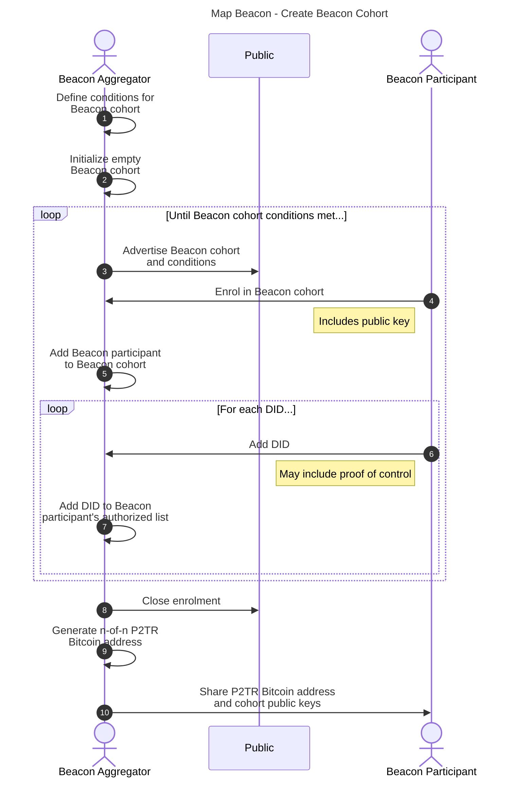
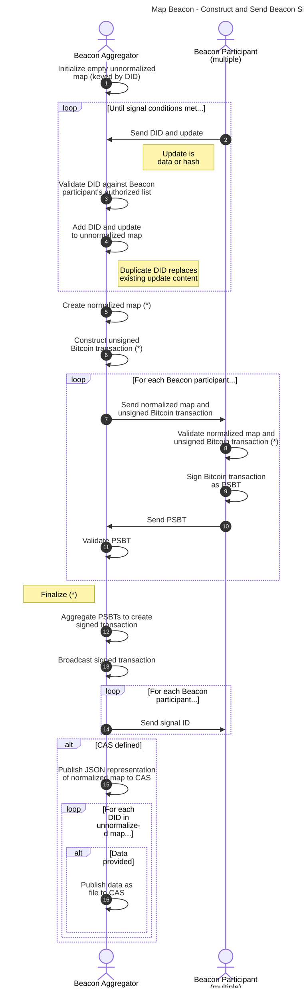
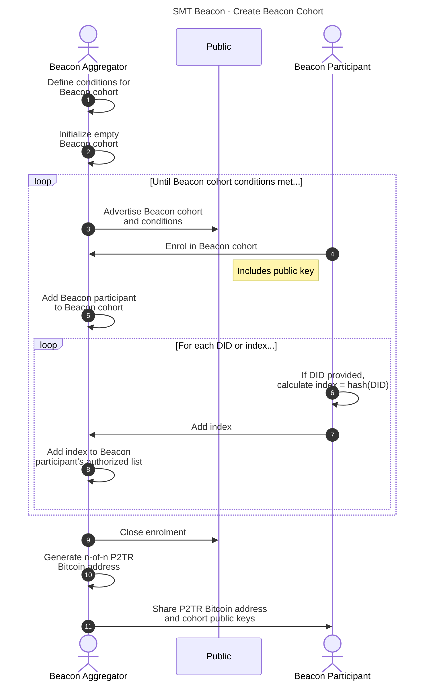

```mermaid
sequenceDiagram
    autonumber
    title SMT Beacon - Construct and Send Beacon Signal

    actor A as Beacon Aggregator
    actor R as Beacon Participant<br/>(multiple)

    A ->> A: Initialize empty<br/>optimized SMT

    loop Until signal conditions met...
        R ->> R: Calculate index = hash(DID)
        R ->> R: Generate nonce
        R ->> R: Calculate update = hash(nonce ^<br/>hash(BTC1 Update))
        R ->> A: Send index and update
        A ->> A: Validate index against Beacon<br/>participant's authorized list
        A ->> A: Calculate value = hash(index +<br/>update)
        A ->> A: Set optimized SMT leaf<br/>for index to value
        note right of A: Duplicate index replaces<br/>existing value
    end

    loop For each Beacon participant...
        A ->> R: Request missing indexes
        R ->> R: Initialize empty updates array
        
        loop For each missing index...
            R ->> R: Validate that index is the<br/>hash of a DID expected to<br/>be in the signal and that<br/>DID has no update
            R ->> R: Generate nonce
            R ->> R: Calculate update = hash(nonce)
            R ->> R: Add update to updates array
        end
        
        R ->> A: Send updates
        note left of R: Updates must be in the<br/>same order as missing indexes
        
        loop For each missing index...
            A ->> A: Calculate value = hash(index +<br/>update)
            A ->> A: Set optimized SMT leaf<br/>for index to value
        end
    end

    A ->> A: Fill optimized SMT
    A ->> A: Construct unsigned<br/>Bitcoin transaction (*)

    loop For each Beacon participant...
        A ->> A: Initialize empty peers array<br/>map (keyed by index)

        loop For each index...
            A ->> A: Construct peers array (*)
            A ->> A: Add index and peers array<br/>to peers array map
        end
        
        A ->> R: Send peers array map and<br/>unsigned Beacon signal
        R ->> R: Validate peers array map<br/>and unsigned Beacon signal (*)
        R ->> R: Sign Bitcoin transaction<br/>as PSBT
        R ->> A: Send PSBT
        A ->> A: Validate PSBT
    end
    
    note left of A: Finalize (*)

    A ->> A: Aggregate PSBTs to create<br/>signed transaction
    A ->> A: Broadcast signed transaction

    loop For each Beacon participant...
        A ->> R: Send signal ID
    end
```

## Beacons

### Overview

A ::BCT1 Beacon:: is an abstract mechanism, identified by a Bitcoin address, that is included as a service in a DID document to indicate to resolvers that spends from the address, called ::Beacon Signals::, should be checked for ::BTC1 Update Announcements::.

All ::Beacon Signals:: broadcast from a ::BTC1 Beacon:: MUST be processed as part of DID document resolution. The Beacon type in the service defines how ::Beacon Signals:: MUST be processed.

When defining a service for a ::BTC1 Beacon:::

* `type` is "BTC1Beacon"
* `beaconType` is one of "SingletonBeacon", "MapBeacon", or "SMTBeacon"
* `serviceEndpoint` is a Bitcoin address represented as a URI following the [BIP21 scheme](https://github.com/bitcoin/bips/blob/master/bip-0021.mediawiki)

How the Bitcoin address and the cryptographic material that controls it are generated is left to the implementation.

**did:btc1** supports different ::Beacon Types::, with each type defining a set of algorithms for:

1. How a ::BTC1 Beacon:: can be established and added as a service to a DID document.
1. How ::BTC1 Update Announcements:: are broadcast within ::Beacon Signals::.
1. How a resolver processes ::Beacon Signals::, identifying, verifying, and applying the authorized mutations to a DID document for a specific DID.

This is an extensible mechanism, such that in the future new ::Beacon Types:: could be added.

The current, active ::BTC1 Beacons:: of a DID document are specified in the document's `service` property. By updating the DID document, a DID controller can change the set of ::BTC1 Beacons:: they use to broadcast updates to their DID document over time. Resolution of a DID MUST process signals from all ::BTC1 Beacons:: identified in the latest DID document and apply them in the order determined by the version specified by the `btc1Update`.

All resolvers of **did:btc1** DIDs MUST support the ::Beacon Types:: defined in this specification.

The ::BTC1 Update Announcement:: is a SHA256 hash that represents one of the following:

* the hash of a single ::BTC1 Update:: associated with a **did:btc1** identifier;
* the hash of a set of key-value pairs, where each key is a **did:btc1** identifier and the value is the hash of a ::BTC1 Update::; or
* the hash of an optimized ::sparse Merkle tree:: root, where each leaf node is deterministically selected by a **did:btc1** identifier and contains a hash associated with the **did:btc1** identifier.

### Actors

Actors in signaling are as follows:

* DID controller - A party that controls one or more **did:btc1** identifiers participating in a ::BTC1 Beacon::.
* Beacon Cohort - The set of unique cryptographic keys participating in a ::BTC1 Beacon:: that make up its n-of-n MuSig2 Bitcoin address.
* Beacon Aggregator - The entity that coordinates the protocols of an aggregate ::BTC1 Beacon::, specifically the "Create Beacon Cohort" and "Announce Beacon Signal" protocols.
* Beacon Participant - A member of a Beacon Cohort, typically a DID controller, that controls cryptographic keys required to partially authorize the broadcasting of a Beacon Signal to the Bitcoin blockchain.
* Verifier - A party verifying a **did:btc1** identifier presentation.

### Aggregation

Three types of ::BTC1 Beacons:: are defined: SingletonBeacon, MapBeacon and SMTBeacon.  Two of them, MapBeacon and SMTBeacon, support aggregation, i.e. the act of  committing to multiple ::BTC1 Update Announcements:: in a single transaction.

How coordination between an aggregator and multiple ::Beacon participants:: is managed is out of scope, but one possible mechanism is outlined in “MuSig2 3-of-3 Multisig with Coordinator Facilitation” at [MuSig2 Sequence Diagrams](https://developer.blockchaincommons.com/musig/sequence/#musig2-3-of-3-multisig-with-coordinator-facilitation).

When defining a Beacon Cohort, the Beacon Aggregator may define the conditions for the cohort, including but not limited to:

* Automatic publication to ::CAS:: (Map Beacon only)
* Minimum and/or maximum number of ::Beacon participants::
* Minimum and/or maximum number of DIDs per ::Beacon participant::
* Cost of enrollment
* Cost per signal per DID or ::Beacon participant::
* Minimum and/or maximum time between signals
* Number of pending updates that trigger a signal

### Singleton Beacon

A ::Singleton Beacon:: is a ::BTC1 Beacon:: that can be used to announce commitments to a single ::BTC1 Update:: targeting a single DID document. It creates a ::Beacon Signal:: that commits to a single ::BTC1 Update Announcement::. This is typically done directly by the DID controller, as there is no ::Beacon cohort::.

If the ::BTC1 Update:: associated with the ::BTC1 Update Announcement:: is not publicly discoverable (i.e., is not published to a ::CAS:: under its hash), the only parties that are aware of it are the DID controller and any parties provided it by the DID controller.

The `beaconType` of the `service` for a Singleton Beacon is "SingletonBeacon".

```{.json include="json/Beacons/SingletonBeacon-service.json"}
```

#### Construct and Send Beacon Signal

Given:

* `network` - required, one of:
    * "bitcoin"
    * "signet"
    * "regtest"
    * "testnet3"
    * "testnet4"
    * "mutinynet"
    * number
* `serviceEndpoint` - required, a Bitcoin address represented as a URI
* One and only one of, required:
    * `btc1Update` - the ::BTC1 Update:: whose SHA256 hash is the ::BTC1 Update Announcement:: to be broadcast in the ::Beacon Signal::
    * `btc1UpdateHashBytes` - the ::BTC1 Update Announcement:: to be broadcast in the ::Beacon Signal::
* `cas` - optional, one of:
    * "ipfs"

Construct a Bitcoin transaction that spends from the Beacon address on the selected network:

1. If `network` is not a valid value per above, raise InvalidParameter error.
1. if `network` is a number and is outside the range of 1-4, raise InvalidParameter error.
1. If `cas` is defined and is not a valid value per above, raise InvalidParameter error.
1. Set `bitcoinAddress` to the decoding of `serviceEndpoint` following BIP21.
1. Ensure `bitcoinAddress` is funded; if not, fund this address.
1. If `btc1UpdateHashBytes` is not defined, set `btc1UpdateHashBytes` to the result of passing `btc1Update` to the [JSON Canonicalization and Hash] algorithm.
1. Initialize `spendTx` to a Bitcoin transaction that spends a transaction controlled by the `bitcoinAddress` and contains at least one transaction output. This signal output MUST have the format `[OP_RETURN, OP_PUSHBYTES32, <btc1UpdateHashBytes>]`. If the transaction contains multiple transaction outputs, the signal output MUST be the last transaction output.
1. Retrieve the cryptographic material, e.g., private key or signing capability, associated with the `bitcoinAddress`. How this is done is left to the implementer.
1. Sign the `spendTx`.
1. Broadcast `spendTx` on the Bitcoin network defined by `network`.
1. Set `signalId` to the Bitcoin transaction identifier of `spendTx`.
1. If `cas` and `btc1Update` are defined, publish `btc1Update` to the ::CAS:: network defined by `cas`.
1. Return `signalId`.

### Map Beacon

A Map Beacon creates a ::Beacon Signal:: that commits to multiple ::BTC1 Update Announcements::. To do so, it constructs a map where the key is the **did:btc1** identifier and the value is the hash of the corresponding ::BTC1 Update::, and publishes a hash of the map.

If a ::BTC1 Update:: is not publicly discoverable (i.e., is not published to a ::CAS:: under its hash), the only parties that are aware of it are the DID controller and any parties provided it by the DID controller. However, any party that has access to or is provided the map is at least aware of the existence of all **did:btc1** identifiers in the map and the existence of their ::BTC1 Update Announcements::.

For a Map Beacon, proof of non-inclusion of a **did:btc1** identifier is simply its absence from the map.

The `beaconType` of the `service` for a Map Beacon is "MapBeacon".

#### Create Beacon Cohort

Creating a ::Beacon Cohort:: requires that the ::Beacon Aggregator:: define the conditions for it, advertise it, and accept enrolment by ::Beacon Participants::. The process flow involves the exchange of data between the ::Beacon Aggregator:: and ::Beacon Participants::, most notably the DIDs involved and the public keys for creating the n-of-n MuSig2 Bitcoin address. A detailed specification is out of scope, but most implementations operate as shown below.



#### Construct and Send Beacon Signal

Constructing and sending a Map Beacon signal operates roughly as follows:

* ::Beacon Participants:: submit their updates to the ::Beacon Aggregator::.
* When the signal conditions are met, the ::Beacon Aggregator:: initiates the construction of the ::Beacon Signal:: and passes to the ::Beacon Participants:: for verification and signing.
* Once all ::Beacon Participants:: have approved and partially signed the transaction, the final signed transaction is constructed and broadcast on the Bitcoin network.
* If a ::CAS:: is defined for the ::Beacon::, the ::Beacon Aggregator:: publishes all files to the CAS.



##### Create Normalized Map

Given:

* `unnormalizedMap` - required, a map of key-value pairs consisting of:
    * `did` - required, a unique **did:btc1** identifier (key)
    * One and only one of, required (value):
        * `btc1Update` - a ::BTC1 Update::
        * `btc1UpdateHashBytes` - the SHA256 hash in binary form of a ::BTC1 Update::

Create a normalized map as follows:

1. If `unnormalizedMap` contains a duplicate `did`, raise InvalidParameter error.
1. For each `did` in `unnormalizedMap`:
   1. If the value is a ::BTC1 Update:::
      1. Set `hashBytes` to the result of passing `btc1Update` to the [JSON Canonicalization and Hash] algorithm.
      1. Set `hashString` to the hexadecimal string representation of `hashBytes`.
   1. If the value is a SHA256 hash in binary form:
       1. Set `hashString` to the hexadecimal string representation of `btc1UpdateHashBytes`.
   1. Add `did` (key) and `hashString` (value) to `normalizedMap`.

##### Construct Unsigned Beacon Signal

Given:

* `network` - required, one of:
    * "bitcoin"
    * "signet"
    * "regtest"
    * "testnet3"
    * "testnet4"
    * "mutinynet"
    * number
* `serviceEndpoint` - required, a Bitcoin address represented as a URI
* `normalizedMap` - required, normalized map created as above

Construct a Bitcoin transaction that spends from the Beacon address on the selected network:

1. If `network` is not a valid value per above, raise InvalidParameter error.
1. if `network` is a number and is outside the range of 1-4, raise InvalidParameter error.
1. Set `bitcoinAddress` to the decoding of `serviceEndpoint` following BIP21.
1. Ensure `bitcoinAddress` is funded; if not, fund this address.
1. Set `hashBytes` to the result of passing the JSON representation of `normalizedMap` to the [JSON Canonicalization and Hash] algorithm.
1. Initialize `unsignedSpendTx` to a Bitcoin transaction that spends a transaction controlled by the `bitcoinAddress` and contains at least one transaction output. This signal output MUST have the format `[OP_RETURN, OP_PUSHBYTES32, <hashBytes>]`. If the transaction contains multiple transaction outputs, the signal output MUST be the last transaction output.

##### Validate Normalized Map and Unsigned Beacon Signal

Given:

* `normalizedMap` - required, normalized map created as above
* `unsignedSpendTx` - required, unsigned Beacon signal constructed as above

Validate the normalized map and the unsigned Beacon signal:

1. Validate that `normalizedMap` contains each DID previously sent and that the value associated with each DID is either the hash previously sent or the hash of the data previously sent.
1. Set `hashBytes` to the result of passing the JSON representation of `normalizedMap` to the [JSON Canonicalization and Hash] algorithm.
1. Validate that `unsignedSpendTx` is spending from the correct Bitcoin address.
1. Validate that the last transaction output of `unsignedSpendTx` is `[OP_RETURN, OP_PUSHBYTES32, <hashBytes>]`.

##### Finalize

Given:

* `normalizedMap` - required, normalized map created as above
* `unnormalizedMap` - required, as above
* `psbts` - required, partially signed Bitcoin transactions
* `cas` - optional, one of:
    * "ipfs"

Spend the transaction and publish to CAS:

1. If `cas` is defined and is not a valid value per above, raise InvalidParameter error.
1. Set `spendTx` to the aggregation of the partially signed Bitcoin transactions `psbts` into a single transaction.
1. Broadcast `spendTx` on the Bitcoin network.
1. Set `signalId` to the Bitcoin transaction identifier of `spendTx`.
1. If `cas` is defined:
   1. Publish JSON representation of `normalizedMap` to the ::CAS:: network defined by `cas`.
   1. For each `did` with a `btc1Update` in `unnormalizedMap`, publish `btc1Update` to the ::CAS:: network defined by `cas`.
1. Return `signalId`.

### SMT Beacon

An SMT Beacon creates a ::Beacon Signal:: that commits to multiple ::BTC1 Update Announcements::, each identified by a **did:btc1** identifier. To do so, it constructs an optimized sparse Merkle tree as defined in [Appendix - Optimized Sparse Merkle Tree Implementation] and publishes the Merkle root.

An SMT Beacon provides maximum privacy for the DID controller, as the DID controller never has to reveal their DIDs or ::BTC1 Updates:: to the aggregator. This introduces a small risk, as the DID controller is not required to prove control over a DID in order to participate.

The `beaconType` of the `service` for an SMT Beacon is "SMTBeacon".

#### Create Beacon Cohort

Creating a ::Beacon Cohort:: requires that the ::Beacon Aggregator:: define the conditions for it, advertise it, and accept enrolment by ::Beacon Participants::. The process flow involves the exchange of data between the ::Beacon Aggregator:: and ::Beacon Participants::, most notably the DIDs or indexes (hashes of DIDs) involved and the public keys for creating the n-of-n MuSig2 Bitcoin address. A detailed specification is out of scope, but most implementations operate as shown below.



#### Construct and Send Beacon Signal

Constructing and sending an SMT Beacon signal operates roughly as follows:

* ::Beacon Participants:: submit their updates to the ::Beacon Aggregator::.
* When the signal conditions are met, the ::Beacon Aggregator:: requests missing entries from ::Beacon Participants::, initiates the construction of the ::Beacon Signal::, and passes data to the ::Beacon Participants:: for verification and signing.
* Once all ::Beacon Participants:: have approved and partially signed the transaction, the final signed transaction is constructed and broadcast on the Bitcoin network.



##### Construct Unsigned Beacon Signal

Given:

* `network` - required, one of:
    * "bitcoin"
    * "signet"
    * "regtest"
    * "testnet3"
    * "testnet4"
    * "mutinynet"
    * number
* `serviceEndpoint` - required, a Bitcoin address represented as a URI
* `hashBytes` - required, root hash of optimized SMT

Construct a Bitcoin transaction that spends from the Beacon address on the selected network:

1. If `network` is not a valid value per above, raise InvalidParameter error.
1. if `network` is a number and is outside the range of 1-4, raise InvalidParameter error.
1. Set `bitcoinAddress` to the decoding of `serviceEndpoint` following BIP21.
1. Ensure `bitcoinAddress` is funded; if not, fund this address.
1. Initialize `unsignedSpendTx` to a Bitcoin transaction that spends a transaction controlled by the `bitcoinAddress` and contains at least one transaction output. This signal output MUST have the format `[OP_RETURN, OP_PUSHBYTES32, <hashBytes>]`. If the transaction contains multiple transaction outputs, the signal output MUST be the last transaction output.

##### Construct Peers Array

Given:

* `smt` - required, optimized SMT
* `index` - required, index provided by DID controller

Calculate the path to the root for the index:

1. Set `peers` to empty array.
1. Set `node` to leaf node for `index`.
1. While `node` is not root of `smt`:
   1. Set `parentNode` to parent of `node`.
   1. If `node` is left of `parentNode`, add `{right: <rightHashString>}`to `peers`, where `rightHashString` is the hexadecimal string representation of the value at `parentNode.rightNode`.
   1. If `node` is right of `parentNode`, add `{left: <leftHashString>}` to `peers`, where `leftHashString` is the hexadecimal string representation of the value at `parentNode.leftNode`.
1. Return `peers`. 

##### Validate Peers Array Map and Unsigned Beacon Signal

Given:

* `peersMap` - required, peers array map constructed as above
* `unsignedSpendTx` - required, unsigned Beacon signal constructed as above

Validate the peers array map and the unsigned Beacon signal:

1. Validate that `unsignedSpendTx` is spending from the correct Bitcoin address.
1. For each `did` expected to be in the ::Beacon Signal:::
   1. Set `index` to `hash(did)`.
   1. Set `peers` to the value at `index` and remove it from the map.
   1. If `peers` is undefined, raise InvalidParameter error.
   1. Extract the current `nonce` and `btc1Update` for `did` from local storage.
   1. If `btc1Update` is defined, set `btc1UpdateHashBytes` to the result of passing `btc1Update` to the [JSON Canonicalization and Hash] algorithm and set `hashBytes` to `hash(index + hash(nonce ^ btc1UpdateHashBytes))`, otherwise set `hashBytes` to `hash(index + hash(nonce))`.
   1. For each `peer` in `peers`:
      1. Validate that `peer` has a single key-value pair.
      1. Extract `key` and `value` from `peer`.
      1. If `key` is `"left"`, set `hashBytes` to `hash(value + hashBytes)`; otherwise, if `key` is `"right"`, set `hashBytes` to `hash(hashBytes + value)`; otherwise, raise InvalidParameter error.
   1. Validate that the last transaction output of `unsignedSpendTx` is `[OP_RETURN, OP_PUSHBYTES32, <hashBytes>]`.
   1. If `btc1UpdateHashBytes` is defined, construct as `smtProof` the object `{id: <hashString>, nonce: <nonce>, updateId: <btc1UpdateHashString>, peers: <peers>}`, otherwise construct as `smtProof` the object `{id: <hashString>, nonce: <nonce>, peers: <peers>}`, where `hashString` is the hexadecimal string representation of `hashBytes` and `btc1UpdateHashString` is the hexadecimal string representation of `btc1UpdateHashBytes`.
   1. Store `smtProof` for later presentation to verifiers.
1. If `peersMap` is not empty, raise InvalidParameter error.

##### Finalize

Given:

* `psbts` - required, partially signed Bitcoin transactions

Spend the transaction:

1. Set `spendTx` to the aggregation of the partially signed Bitcoin transactions `psbts` into a single transaction.
1. Broadcast `spendTx` on the Bitcoin network.
1. Set `signalId` to the Bitcoin transaction identifier of `spendTx`.
1. Return `signalId`.

### Processing Signals

Given:

* `did` - required, the **did:btc1** identifier whose signals are to be processed
* `sidecarDocuments` - required, array of documents required for resolution not stored on a ::CAS::,including:
  * Initial DID document, if `did` was constructed with `idType` of "external" (`did` has the form "did:btc1:x1...")
  * Map documents for ::BTC1 Beacons:: with services of `beaconType` "MapBeacon".
  * ::BTC1 Updates:: for each ::BTC1 Update Announcement::
* `smtProofs` - required for services of `beaconType` "SMTBeacon", array of SMT proofs of inclusion or non-inclusion
* `cas` - optional, one of:
    * "ipfs"
* `targetVersionId` - optional, DID document version ID required
* `targetVersionTime` - optional, DID document version time required

Process the ::Beacon Signals:: to reconstruct the DID document:

1. If `cas` is defined and is not a valid value per above, raise InvalidParameter error.
1. Set `sidecarDocumentsMap` to empty map.
1. For each `sidecarDocument` in `sidecarDocuments`:
   1. Set `hashBytes` to the result of passing `sidecarDocument` to the [JSON Canonicalization and Hash] algorithm.
   1. Set `id` to the hexadecimal string representation of `hashBytes`.
   1. Add `id` and `sidecarDocument` to `sidecarDocumentsMap`.
1. Set `smtProofsMap` to empty map.
1. For each `smtProof` in `smtProofs`:
    1. Add `smtProof.id` and `smtProof` to `smtProofsMap`.
1. If `did` was constructed with `idType` "key", set `didDocument` to the deterministically generated initial document.
1. If `did` was constructed with `idType` "external":
   1. Extract `genesisBytes` from `did`.
   1. Set `id` to the hexadecimal string representation of `genesisBytes`.
   1. Get `didDocument` from `sidecarDocumentsMap` by its `id` if available, or from ::CAS:: by its `id` if not and `cas` is defined.
   1. Update placeholder values in `didDocument` with `did` as required.
1. Until terminated:
   1. Set `btc1Update` to null.
   1. For each `service` in `didDocument.service` where `service.type` is "BTC1Beacon":
      1. Get the next transaction from the Bitcoin address at `service.serviceEndpoint`.
      1. If `targetVersionTime` is defined and is less than the transaction time, skip to next `service`.
      1. If the last output transaction is not of the form `[OP_RETURN, OP_PUSHBYTES32, <hashBytes>]`, skip to next `service`.
      1. Extract `hashBytes` from the last output transaction.
      1. If `service.beaconType` is not "SingletonBeacon", "MapBeacon", or "SMTBeacon", raise InvalidParameter error.
      1. If `service.beaconType` is "SingletonBeacon", set `tempBtc1Update` to the result of [Process Singleton Beacon Signal].
      1. If `service.beaconType` is "MapBeacon", set `tempBtc1Update` to the result of [Process Map Beacon Signal].
      1. If `service.beaconType` is "SMTBeacon", set `tempBtc1Update` to the result of [Process SMT Beacon Signal].
      1. If `tempBtc1Update` is null, skip to next `service`.
      1. Set `tempDidDocument` to transformation of `didDocument` with `tempBtc1Update`.
      1. If `tempDidDocument.versionId` ≠ `didDocument.versionId + 1`, skip to next `service`.
      1. If `btc1Update` is not null and `tempBtc1Update` ≠ `btc1Update`, raise InvalidDidUpdate error.
      1. Set `btc1Update` to `tempBtc1Update`. 
   1. If `btc1Update` is null, terminate.
   1. Set `didDocument` to transformation of `didDocument` with `btc1Update`.
   1. If `didDocument` is not a valid DID document, raise InvalidDidUpdate error.
   1. If `didDocument.id` is not the same as the **did:btc1** identifier, raise InvalidDidUpdate error.
   1. If `targetVersionId` is defined and `didDocument.versionId` = `targetVersionId`, terminate.
1. If `targetVersionId` is defined and `didDocument.versionId` ≠ `targetVersionId`, raise InvalidDidUpdate error.
1. If `targetVersionId` is not defined:
   1. For each `service` in `didDocument.service` where `service.type` is "BTC1Beacon":
      1. Get the next transaction from the Bitcoin address at `service.serviceEndpoint`.
      1. If `targetVersionTime` is defined and is less than the transaction time, skip to next `service`.
      1. If the last output transaction is of the form `[OP_RETURN, OP_PUSHBYTES32, <hashBytes>]`, raise InvalidDidUpdate error.
1. Return `didDocument`.

#### Process Singleton Beacon Signal

1. Set `id` to the hexadecimal string representation of `hashBytes`.
1. Get `btc1Update` from `sidecarDocumentsMap` by its `id` if available, or from ::CAS:: by its `id` if not and `cas` is defined.
1. If `btc1Update` is undefined, raise InvalidDidUpdate error.
1. Set `btc1Update`
1. Return `btc1Update`.

> **NOTE**: The act of retrieving from `sidecarDocumentsMap` or ::CAS:: validates the document hash.

#### Process Map Beacon Signal

1. Set `id` to the hexadecimal string representation of `hashBytes`.
1. Get `map` from `sidecarDocumentsMap` by its `id` if available, or from ::CAS:: by its `id` if not and `cas` is defined.
1. If `map` is undefined, raise InvalidDidUpdate error.
1. Set `updateId` to the value of `map.<did>`.
1. If `updateId` is undefined, return null.
1. Get `btc1Update` from `sidecarDocumentsMap` by its `updateId` if available, or from ::CAS:: by its `updateId` if not and `cas` is defined.
1. If `btc1Update` is undefined, raise InvalidDidUpdate error.
1. Return `btc1Update`.

> **NOTE**: The act of retrieving from `sidecarDocumentsMap` or ::CAS:: validates the document hash.

#### Process SMT Beacon Signal

1. Set `id` to the hexadecimal string representation of `hashBytes`.
1. Get `smtProof` from `smtProofsMap` by its `id`.
1. If `smtProof` is undefined, raise InvalidDidUpdate error.
1. Set `index` to `hash(did)`.
1. Set `nonce` to the value of `smtProof.nonce`.
1. Set `updateId` to the value of `smtProof.updateId`.
1. If `updateId` is defined, set `btc1UpdateHashBytes` to the binary representation of `updateId` and set `verifyHashBytes` to `hash(index + hash(nonce ^ btc1UpdateHashBytes))`, otherwise set `verifyHashBytes` to `hash(index + hash(nonce))`.
1. For each `peer` in `smtProof.peers`:
   1. Validate that `peer` has a single key-value pair.
   1. Extract `key` and `value` from `peer`.
   1. If `key` is `"left"`, set `verifyHashBytes` to `hash(value + verifyHashBytes)`; otherwise, if `key` is `"right"`, set `verifyHashBytes` to `hash(verifyHashBytes + value)`; otherwise, raise InvalidDidUpdate error.
1. If `verifyHashBytes` ≠ `hashBytes`, raise InvalidDidUpdate error.
1. If `updateId` is undefined, return null.
1. Get `btc1Update` from `sidecarDocumentsMap` by its `updateId` if available, or from ::CAS:: by its `updateId` if not and `cas` is defined.
1. If `btc1Update` is undefined, raise InvalidDidUpdate error.
1. Return `btc1Update`.

> **NOTE**: The act of retrieving from `sidecarDocumentsMap` validates the document hash.
