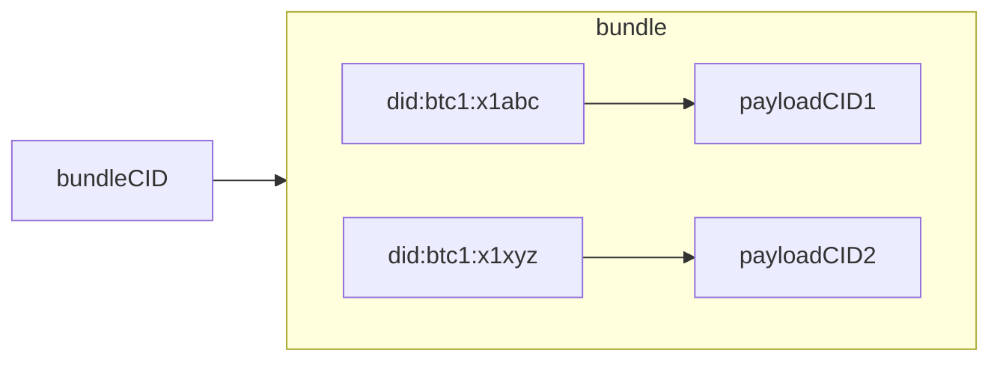
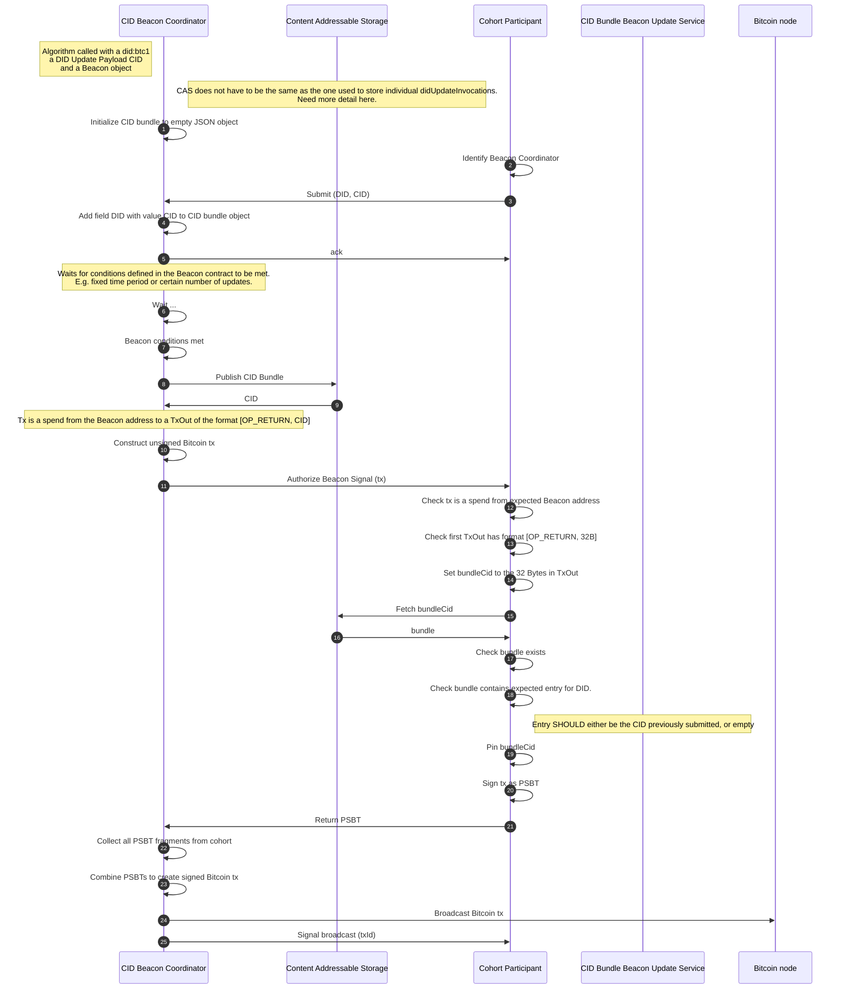
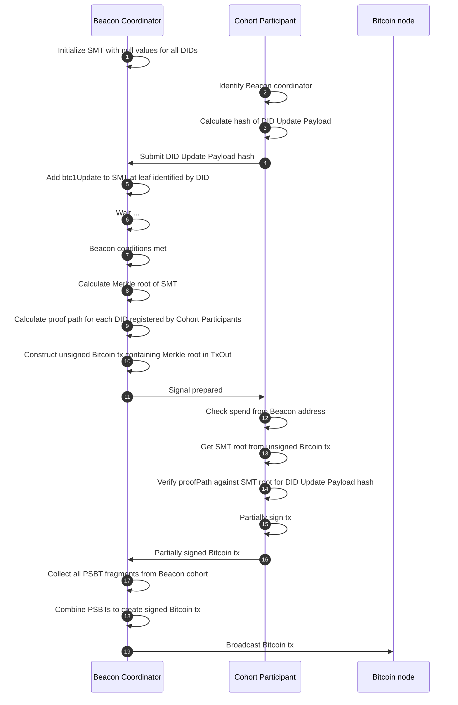

## Update Beacons

::BTC1 Beacons:: are the mechanism by which a DID controller announces an update to their
DID document by broadcasting an attestation to this update onto the public Bitcoin
network. ::BTC1 Beacons:: are identified by a Bitcoin address and emit ::Beacon Signals:: by
broadcasting a valid Bitcoin transaction that spends from this ::BTC1 Beacon:: address.
These transactions include attestations to a set of `btc1Update`s, either
in the form of ::Content Identifiers:: (CIDs) or ::Sparse Merkle Tree:: (SMT)
roots. ::BTC1 Beacons:: are included as a service in DID documents, with the Service Endpoint
identifying a Bitcoin address to watch for ::Beacon Signals::. All ::Beacon Signals::
broadcast from this ::BTC1 Beacon:: MUST be processed as part of resolution
(see [Read]). The type of the ::BTC1 Beacon:: service in the DID document
defines how ::Beacon Signals:: SHOULD be processed.

**did:btc1** supports different ::Beacon Types::, with each type defining a set of
algorithms for:

1. How a ::BTC1 Beacon:: can be established and added as a service to a DID document.
1. How attestations to DID updates are broadcast within ::Beacon Signals::.
1. How a resolver processes a ::Beacon Signal::, identifying, verifying, and applying the authorized mutations to a DID document for a specific DID.

This is an extendable mechanism, such that in the future new ::Beacon Types:: could
be added. It would be up to the resolver to determine if the ::Beacon Type:: is a
mechanism they support and are willing to trust. If they are unable to support
a ::Beacon Type:: and a DID they are resolving uses that type then the DID MUST be
treated as invalid.

The current, active ::BTC1 Beacons:: of a DID document are specified in the document's
`service` property. By updating the DID document, a DID controller can change
the set of ::BTC1 Beacons:: they use to broadcast updates to their DID document over
time. Resolution of a DID MUST process signals from all ::BTC1 Beacons:: identified in the
latest DID document and apply them in the order determined by the version specified
by the `btc1Update`.

All resolvers of **did:btc1** DIDs MUST support the core Beacon Types defined in
this specification.

### Singleton Beacon

#### Establish Singleton Beacon

A ::Singleton Beacon:: is a ::BTC1 Beacon:: that can be used to publish a single ::DID Update
Payload:: targeting a single DID document. The `serviceEndpoint` for this ::Beacon Type::
is a Bitcoin address represented as a URI following the
[BIP21 scheme](https://github.com/bitcoin/bips/blob/master/bip-0021.mediawiki).
It is RECOMMENDED that this Bitcoin address be under the sole control of the
DID controller. 
How the Bitcoin address and the cryptographic material that controls it are generated is left to 
the implementation.

This algorithm takes in a Bitcoin `address` and a `serviceId` and returns a ::Singleton Beacon:: `service`.

1. Initialize a `service` variable to an empty object.
1. Set `service.id` to `serviceId`.
1. Set `service.type` to "SingletonBeacon".
1. Set `service.serviceEndpoint` to the result of converting `address` to
   a URI as per **[BIP21](https://github.com/bitcoin/bips/blob/master/bip-0021.mediawiki)**
1. Return `service`.


// TODO: Style and link to examples.
```json
{
   "id": "#singletonBeacon", 
   "type": "SingletonBeacon", 
   "serviceEndpoint": "${beaconUri}"
}
```


#### Broadcast Singleton Beacon Signal

This algorithm is called by the [Announce DID Update] algorithm as part of the [Update] 
operation, if the ::BTC1 Beacon:: being used is of the type SingletonBeacon. It takes as 
input a Beacon `service` and a secured `btc1Update`. The algorithm constructs a
Bitcoin transaction that spends from the Beacon address identified in the `service` 
and contains a transaction output of the format `[OP_RETURN, OP_PUSHBYTES32, <hashBytes>]`,
where hashBytes is the SHA256 hash of the canonical `btc1Update`. The Bitcoin 
transaction is then signed and broadcast to the Bitcoin network, thereby publicly
announcing a DID update in a ::Beacon Signal::.

The algorithm returns a `signalMetadata` object mapping the Bitcoin transaction 
identifier of the ::Beacon Signal:: to the necessary data needed to verify the 
signal announces a specific ::BTC1 Update::.


1. Initialize an `addressURI` variable to `beacon.serviceEndpoint`.
1. Set `bitcoinAddress` to the decoding of `addressURI` following BIP21.
1. Ensure `bitcoinAddress` is funded, if not, fund this address.
1. Set `hashBytes` to the result of passing `btc1Update` to the 
   [JSON Canonicalization and Hash] algorithm.
1. Initialize `spendTx` to a Bitcoin transaction that spends a transaction controlled
   by the `bitcoinAddress` and contains at least one transaction output. This signal output
   MUST have the following format `[OP_RETURN, OP_PUSHBYTES32, hashBytes]`. 
   If the transaction contains multiple transaction outputs, the signal output MUST
   be the last transaction output of the transaction.
1. Retrieve the cryptographic material, e.g., private key or signing capability, 
   associated with the `bitcoinAddress` or `service`. How this is done is left
   to the implementer.
1. Sign the `spendTx`.
1. Broadcast `spendTx` to the Bitcoin network.
1. Set `signalId` to the Bitcoin transaction identifier of `spendTx`.
1. Initialize `signalMetadata` to an empty object.
1. Set `signalMetadata.updatePayload` to `btc1Update`.
1. Return the object {`<signalId>`: `signalMetadata`}.

#### Process Singleton Beacon Signal

This algorithm is called by the [Process Beacon Signals] algorithm as part of the
[Read] operation. It takes as inputs a Bitcoin transaction, `tx`, representing a ::Beacon Signal::
and an optional object, `signalSidecarData`, containing any sidecar data provided to the 
resolver for the ::Beacon Signal:: identified by the Bitcoin transaction identifier.

The algorithm returns the ::DID Update payload:: announced by the ::Beacon Signal:: or throws
an error.

1. Initialize a `txOut` variable to the last transaction output of the `tx`.
1. Set `btc1Update` to null.
1. Set `hashBytes` to the 32 bytes in the `txOut`.
1. If `signalSidecarData`:
   1. Set `btc1Update` to `signalSidecarData.updatePayload`
   1. Set `updateHashBytes` to the result of passing `btc1Update` to the 
      [JSON Canonicalization and Hash] algorithm.
   1. If `updateHashBytes` does not equal `hashBytes`, MUST throw an `invalidSidecarData` error.
   1. Return `btc1Update`
1. Else:
   1. Set `btc1Update` to the result of passing `hashBytes` into the 
      [Fetch Content from Addressable Storage] algorithm.
   1. If `btc1Update` is null, MUST raise a `latePublishingError`. MAY identify Beacon Signal
      to resolver and request additional ::Sidecar data:: be provided.
1. Return `btc1Update`.

### CIDAggregate Beacon

A ::BTC1 Beacon:: of the type CIDAggregateBeacon is a ::BTC1 Beacon:: that publishes Bitcoin
transactions containing a ::Content Identifier:: (CID) announcing an Aggregated
::DID Update Bundle::. An Aggregated ::DID Update Bundle:: is a JSON object that maps
**did:btc1** identifiers to CID values for the individual ::BTC1 Updates::.
The Aggregated ::DID Update Bundle:: ::CID:: (bundleCID) SHOULD be resolvable against a
::Content Addressable Storage:: (CAS) system such as IPFS, while the ::CID:: for the ::DID
Update Payload:: (payloadCID) MAY be resolvable against a ::CAS:: or provided through
a ::Sidecar:: mechanism. It is RECOMMENDED that this type of ::BTC1 Beacon:: is only included
in a DID document if the DID controller is REQUIRED to participate in authorizing
Bitcoin transactions from this ::BTC1 Beacon::. In other words, this ::BTC1 Beacon:: SHOULD identify
an n-of-n P2TR Bitcoin address where n is the number of unique DID controllers
submitting updates through the ::BTC1 Beacon::.



#### Establish CIDAggregate Beacon

To establish a CIDAggregate Beacon, a cohort of cooperating parties SHOULD
generate an n-of-n P2TR Bitcoin address where each party contributes a public key.
Furthermore, each party SHOULD verify that their key is part of the address and
all other keys that are part of the address are keys with controllers able to
produce valid signatures.

To establish a ::BTC1 Beacon:: there are two roles. One is the cohort participant, they
want to join a ::BTC1 Beacon:: cohort and submit a request to do so with a key and proof
of control over that key. The other is the Beacon coordinator, they advertise
and curate ::BTC1 Beacon:: cohorts by combining ::BTC1 Beacon:: participants into cohorts, verifying
proofs of control, and producing ::BTC1 Beacon:: addresses.

##### Create CIDAggregate Beacon Advertisement

Any entity MAY act in the role of ::BTC1 Beacon:: coordinator, creating a ::BTC1 Beacon:: advertisement
that they can broadcast across any medium. A ::BTC1 Beacon:: advertisement specifies the
properties of the ::BTC1 Beacon:: that the coordinator intends to establish, including the
::Beacon Type::, cohort size, update frequency, and response latency. Once the
advertisement has been created and broadcast, the coordinator waits for enough
participants to opt in before establishing the ::BTC1 Beacon::.

##### CIDAggregate Beacon Opt-in

DID controllers who wish to participate in a ::BTC1 Beacon:: cohort first find potential
::BTC1 Beacon:: advertisements that meet their needs. This includes checking the ::BTC1 Beacon::
terms and update frequency, etc. If satisfied, they create a secp256k1 cohort
keypair and send an Opt-In request to the endpoint specified in the advertisement.

##### Cohort Set

Once a ::BTC1 Beacon:: Aggregator has received enough opt-in responses from participants
to satisfy the ::BTC1 Beacon:: properties, they generate the n-of-n P2TR Bitcoin address
for the ::BTC1 Beacon::. The address and all the cohort public keys the address is constructed
from are then sent to all participants in a CohortSet message.

##### Add Beacon Service Endpoint to DID Document

A participant receiving a CohortSet message first verifies their cohort key is
included in the cohort, then calculates the P2TR ::BTC1 Beacon:: address for themselves
and verifies it matches the address provided. They MAY wait until the ::BTC1 Beacon::
address is funded before adding the ::BTC1 Beacon:: as a service in the DID document.
The following is an example of the ::BTC1 Beacon:: service endpoint the DID controller
adds into their DID document, the ::BTC1 Beacon:: address is converted into a URI following
BIP21:

```{.json include="json/Update-Beacons/CIDAggregator-add-beacon-service.json"}
```

#### Broadcast CIDAggregate Beacon Signal

This is an algorithm involving two roles: a set of cohort participants and a
::BTC1 Beacon:: coordinator. The ::BTC1 Beacon:: coordinator collects individual ::BTC1 Update::
::Content Identifiers:: (CIDs) for specific **did:btc1**s and aggregates them into a
::DID Update Bundle::, which is then published to a ::Content Addressable Storage:: (CAS).
The ::CID:: for the ::DID Update Bundle:: is included in a Partially Signed Bitcoin
Transaction (PSBT) transaction output spent from the ::Beacon's:: `n-of-n` address.
Each of the `n` cohort participants in the ::BTC1 Beacon:: MUST sign the transaction before
it can be broadcast to the network. It is RECOMMENDED that cohort participants
keep a copy of the ::DID Update Bundle:: and separately pin it to the ::CAS::.



##### Submit DID Update

A cohort participant submits a ::CID:: for a ::BTC1 Update:: along with the DID
the update is for to the ::BTC1 Beacon:: coordinator for a ::BTC1 Beacon:: identified in their
DID document.

##### Aggregate DID Updates

A set of DID updates are aggregated together to create an update bundle. This
bundle is published to the ::CAS:: (e.g., IPFS) and the CID for the bundle is included
in a Partially Signed Bitcoin Transaction (PSBT). This PSBT is the broadcast to all
::BTC1 Beacon:: cohort participants for authorization.

##### Authorize Beacon Signal

On receiving an ::Authorize Beacon Signal:: request, DID controllers MUST verify
that the ::DID Update Bundle:: either includes the ::CID:: for the ::BTC1 Update::
they submitted, or includes no entry for their DID. Once satisfied, the
DID controller signs the PSBT following the MuSig2 protocol using the key they
generated when opting in to the ::BTC1 Beacon:: cohort.

##### Broadcast Beacon Signal

Once all ::BTC1 Beacon:: cohort participants have authorized the ::Beacon Signal:: by
signing the PSBT, a valid, spendable Bitcoin transaction can be created by
aggregating the signatures following ::Schnorr::. This Bitcoin transaction can then
be broadcast to the network.

#### Process CIDAggregate Beacon Signal

A ::Beacon Signal:: from a CIDAggregate Beacon is a Bitcoin transaction that contains
the `hashBytes` of a ::DID Update Bundle:: in its first transaction output.
The corresponding ::DID Update Bundle:: MUST either be provided through ::Sidecar Data::
or by converting `hashBytes` into a IPFS v1 ::Content Identifier:: and attempting to 
retrieve it from ::Content Addressable Storage::. The ::DID Update Bundle:: maps from 
**did:btc1** identifiers to hashes of ::DID Update payloads:: applicable for that identifier.
Again this algorithm attempts to retrieve and validate the ::BTC1 Update:: identified 
for the identifier being resolved. If successful, the ::BTC1 Update:: is returned.

This algorithm is called by the [Process Beacon Signals] algorithm as part of the
[Read] operation. It takes as inputs a **did:btc1** identifier, `btc1Identifier`, a 
::Beacon Signal::, `tx`, and an optional object, `signalSidecarData`, containing any 
sidecar data provided to the resolver for the ::Beacon Signal:: identified by the 
Bitcoin transaction identifier.

The algorithm returns the ::DID Update payload:: announced by the ::Beacon Signal::
for the ::did:btc1:: identifier being resolved or throws an error.


1. Initialize a `txOut` variable to the last transaction output of the `tx`.
1. Set `btc1Update` to null.
1. Set `hashBytes` to the 32 bytes in the `txOut`.
1. If `signalSidecarData`:
   1. Set `didUpdateBundle` to `signalSidecarData.updateBundle`
   1. Set `bundleHashBytes` to the result of passing `didUpdateBundle` to the 
      [JSON Canonicalization and Hash] algorithm.
   1. If `bundleHashBytes` does not equal `hashBytes`, MUST raise an `invalidSidecarData` error. 
      MAY identify Beacon Signal to resolver and request additional ::Sidecar data:: be provided.
   1. Set `signalUpdateHashBytes` to `didUpdateBundle.get(btc1Identifier)`
   1. If `signalUpdateHashBytes` is null, MUST raise an `incompleteSidecarData` error. MAY identify Beacon Signal
      to resolver and request additional ::Sidecar data:: be provided.
   1. Set `btc1Update` to `signalSidecarData.updatePayload`.
   1. Set `updateHashBytes` to the result of passing `btc1Update` to the 
      [JSON Canonicalization and Hash] algorithm.
   1. If `signalUpdateHashBytes` does not equal `updateHashBytes`,  MUST raise an `invalidSidecarData` error. 
      MAY identify Beacon Signal to resolver and request additional ::Sidecar data:: be provided.
1. Else:
   1. Set `didUpdateBundle` to the result of calling the [Fetch From Content Addressable Storage] algorithm passing 
      in `hashBytes`.
   1. If `didUpdateBundle` is null, MUST raise a `latePublishingError`. MAY identify Beacon Signal
      to resolver and request additional ::Sidecar data:: be provided.
   1. Set `signalUpdateHashBytes` to the `didUpdateBundle.get(btc1Identifier)` 
   // TODO: Will need to decode this. Bundle is not going to store raw bytes
   1. Set `btc1Update` to the result of calling the [Fetch From Content Addressable Storage] algorithm 
      passing in `signalUpdateHashBytes`.
   1. If `btc1Update` is null, MUST raise a `latePublishingError`. MAY identify Beacon Signal
      to resolver and request additional ::Sidecar data:: be provided.
1. Return `btc1Update` 


### SMTAggregate Beacon

A SMTAggregate ::BTC1 Beacon:: is a ::BTC1 Beacon:: whose ::Beacon Signals:: are Bitcoin transactions
containing the root of a ::Sparse Merkle Tree:: (SMT). The ::SMT:: root attests to a
set of ::BTC1 Updates::, however, the updates themselves MUST be provided
along with a proof of inclusion against the ::SMT:: root through a ::Sidecar:: mechanism
during resolution. Using the ::SMT:: root a resolver can then verify the inclusion
proof for the given ::BTC1 Update::. If a DID document includes a SMTAggregate
::BTC1 Beacon:: in their set of ::BTC1 Beacon:: services, then they MUST provide proofs for each
signal that the ::BTC1 Beacon:: broadcasts. If they did not submit an update to their DID
in a signal, then they MUST provide a proof of non-inclusion for that signal.

#### Establish Beacon

This algorithm is essentially the same as for the CIDAggregate Beacon in
[Establish CIDAggregate Beacon]. A cohort of DID controllers
need to coordinate to produce a Bitcoin address that will act as the ::BTC1 Beacon::.
It is RECOMMENDED this is an n-of-n P2TR address, with n being the set of DID
controllers in the cohort. Once the address has been created, and all parties in
the cohort acknowledge their intention to participate in that ::BTC1 Beacon::, each DID
controller SHOULD add the ::BTC1 Beacon:: as a service to their DID document.

Additionally, the SMTAggregate ::BTC1 Beacon:: cohort participants MUST register the
**did:btc1** identifiers they intend use this ::BTC1 Beacon:: with. This is so the ::BTC1 Beacon::
coordinator can generate the necessary proofs of both inclusion and non-inclusion
for each DID.

#### Broadcast SMTAggregate Beacon Signal

To publish a ::BTC1 Update::, the DID controller MUST get a hash of the ::DID
Update Payload:: included at the leaf of the ::Sparse Merkle Tree:: (SMT) identified by
their **did:btc1** identifier and receive an inclusion proof for this data. If
a member of the ::BTC1 Beacon:: cohort does not wish to announce an update in a ::Beacon
Signal::, they MUST receive and verify a proof of non-inclusion for their DID.
Upon verifying the non-inclusion proof against the ::SMT:: root contained in the
::Beacon Signal::, they SHOULD accept and authorize the signal following the MuSig2
protocol. Once all members of the cohort have authorized the signal, it can be
broadcast as a transaction to the Bitcoin network. DID controllers are responsible
for persisting their DID updates and proofs, these will need to be provided through
a ::Sidecar:: mechanism during a resolution process.



#### Process SMTAggregate Beacon Signal

A ::Beacon Signal:: from a SMTAggregate Beacon is a Bitcoin transaction with the 
first transaction output of the format `[OP_RETURN, OP_PUSHBYTES32, <32bytes>]`. The 32 bytes
of data contained within this transaction output represent the root of a ::Sparse Merkle Tree::
(SMT). This SMT aggregates a set of hashes of ::DID Update payloads::. In order to process 
these ::Beacon Signals::, the resolver MUST have been passed ::Sidecar data:: for this signal
containing either the ::DID Update payload:: object and a ::SMT:: proof that the hash of
this object is in the ::SMT:: at the leaf indexed by the **did:btc1** identifier being resolved.
Or the ::Sidecar data:: MUST contain a proof that the leaf indexed by the **did:btc1** identifier 
is empty, thereby proving that the ::SMT:: does not contain an update for their identifier.

This algorithm is called by the [Process Beacon Signals] algorithm as part of the
[Read] operation. It takes as inputs a **did:btc1** identifier, `btc1Identifier`, a 
::Beacon Signal::, `tx`, and an optional object, `signalSidecarData`, containing any 
sidecar data provided to the resolver for the ::Beacon Signal:: identified by the 
Bitcoin transaction identifier.

The algorithm returns the ::DID Update payload:: announced by the ::Beacon Signal::
for the ::did:btc1:: identifier being resolved or throws an error.


1. Initialize a `txOut` variable to the last transaction output of the `tx`.
1. If no `signalSidecarData`, MUST raise an `incompleteSidecarData` error. MAY identify the Beacon Signal
   to resolver and request additional ::Sidecar data:: be provided. 
1. Set `smtProof` to `signalSidecarData.smtProof`.
1. If no `smtProof`, MUST raise a `latePublishing` error.
1. Set `smtRoot` to the 32 bytes of data in `txOut`.
1. Set `btc1Update` to `signalSidecarData.updatePayload`.
1. Set `updateHashBytes` to the result of passing `btc1Update` to the [JSON Canonicalization and Hash]
   algorithm.
1. Set `identifierBytes` to the result of converting `btc1Identifier` to bytes.
1. Verify the ::SMT:: proof against the `smtRoot` with the key as `identifierBytes` and the value `updateHashBytes. 
   // TODO: Need to define algorithm(s) for SMT properly.
1. Return `btc1Update`