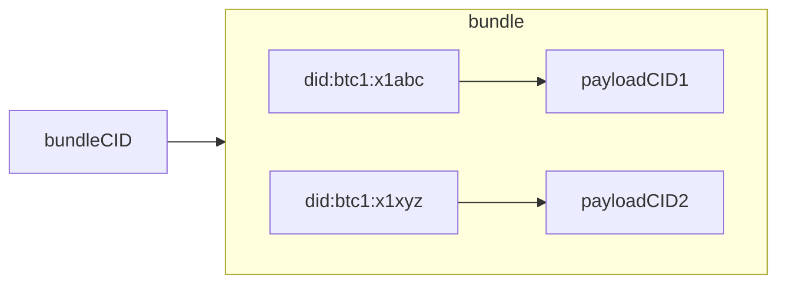
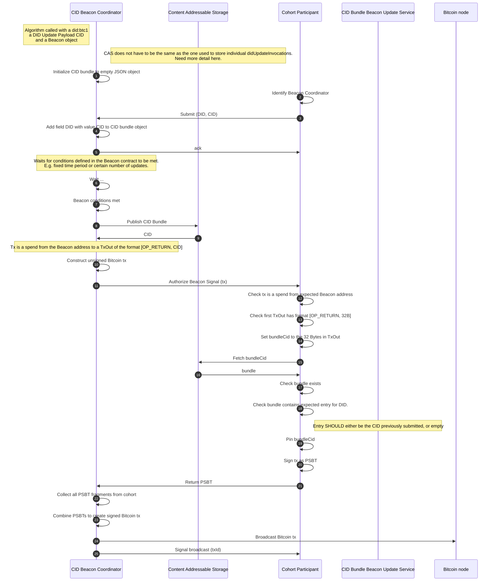
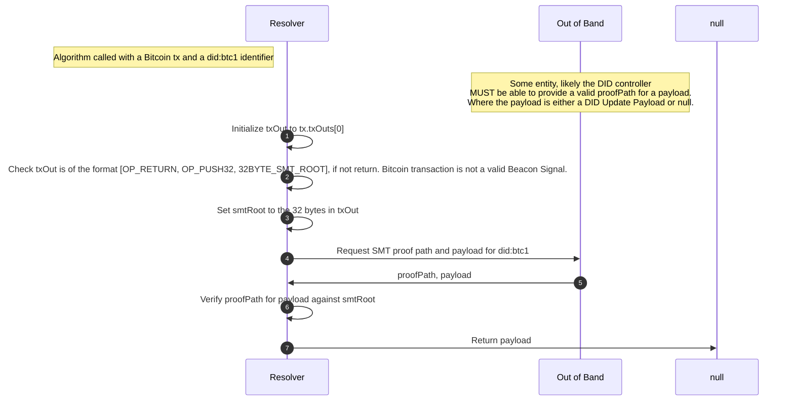

## Update Beacons

Beacons are the mechanism by which a DID controller announces an update to their
DID document by broadcasting an attestation to this update onto the public Bitcoin
network. Beacons are identified by a Bitcoin address and emit Beacon Signals by
broadcasting a valid Bitcoin transaction that spends from this Beacon address.
These transactions include attestations to a set of `didUpdatePayload`s, either
in the form of Content Addressable Identifiers (CIDs) or Sparse Merkle Tree (SMT)
roots. Beacons are included as a service in DID documents, with the Service Endpoint
identifying a Bitcoin address to watch for Beacon Signals. All Beacon Signals
broadcast from this Beacon MUST be processed as part of resolution
(see [Read]. The type of the Beacon service in the DID document
defines how Beacon Signals SHOULD be processed.

**did:btc1** supports different Beacon Types, with each type defining a set of
algorithms for:

1. How a Beacon can be established and added as a service to a DID document.
1. How attestations to DID updates are broadcast within Beacon Signals.
1. How a resolver processes a Beacon Signal, identifying, verifying, and applying the authorized mutations to a DID document for a specific DID.

This is an extendable mechanism, such that in the future new Beacon Types could
be added. It would be up to the resolver to determine if the Beacon Type is a
mechanism they support and are willing to trust. If they are unable to support
a Beacon Type and a DID they are resolving uses that type then the DID MUST be
treated as invalid.

The current, active Beacons of a DID document are specified in the document's
`service` property. By updating the DID document, a DID controller can change
the set of Beacons they can use to broadcast updates to their DID document over
time. Resolution of a DID MUST process signals from all Beacons identified in the
latest DID document and apply them in order determined by the version specified
by the `didUpdatePayload`.

All resolvers of **did:btc1** DIDs MUST support the core Beacon Types defined in
this specification.

### Singleton Beacon

#### Establish Beacon

A Singleton Beacon is a Beacon that can be used to publish a single DID Update
Payload targeting a single DID document. The serviceEndpoint for this Beacon Type
is a Bitcoin address represented as a URI following the
[BIP21 scheme](https://github.com/bitcoin/bips/blob/master/bip-0021.mediawiki).
It is RECOMMENDED that this Bitcoin address be under the sole control of the
DID controller.

The algorithm is as follows:

1. Generate a secp256k1 keypair.
1. Use the public key to generate a Bitcoin address. It is RECOMMENDED to use
   either P2PKH, P2WPKH, P2TR. However, other custom Bitcoin addresses are still
   valid. It is up to the DID controller to ensure the address is spendable by them alone.
    1. It is possible to use an existing Bitcoin address.
    1. Before the Beacon can be used to publish an update it MUST be funded.
1. Set `beaconUri` to the URI for the address following BIP21.
1. Initialize `beaconService` to the JSON string (interpolating values as needed):
   ```json
   {
       "id": "#singletonBeacon", 
       "type": "SingletonBeacon", 
       "serviceEndpoint": "${beaconUri}",
       "casType": "IPFS" // Optional hint at the CAS storage used 
   }
   ```
1. Add `beaconService` to the DID document through an update following the algorithm
   defined in [Update].

#### Broadcast DID Update Attestation

This algorithm is called from [Update], step 8, if the
Beacon being used is of the type SingletonBeacon. A Content Identifier, `cid`,
for the DID Update Payload the DID controller wishes to broadcast and a `beacon`
object are passed into the algorithm. The Beacon constructs a Bitcoin transaction
that spends from the Beacon address to a transaction output of the format
`[OP_RETURN, OP_PUSH32, cid]` and broadcasts this to the Bitcoin network.

1. Initialize an `addressURI` variable to `beacon.serviceEndpoint`.
1. Set `bitcoinAddress` to the decoding of `addressURI` following BIP21.
1. Ensure `bitcoinAddress` is funded, if not, fund this address.
1. Initialize `spendTx` to a Bitcoin transaction that spends from the `bitcoinAddress`
   to a single transaction output. The output SHOULD have the following format
   `[OP_RETURN, OP_PUSH32, cid]`.
1. Sign the `spendTx` using appropriate key.
1. Broadcast `spendTx` to the Bitcoin network.

#### Process Beacon Signal

This algorithm is called as part of the resolution (See 4.2.4 Process Beacon
Updates) with `tx` passed in.

1. Initialize a `txOut` variable to `tx.txOuts[0]`.
1. Check `txOut` is of the format `[OP_RETURN, OP_PUSH32, 32BYTE_CID]`, if not,
   then return. Bitcoin transaction is not a Beacon signal.
1. Set `cid` to the 32 bytes in `txOut`.
1. Set `didUpdatePayload` to the result of retrieving `cid` from Content Addressable
   Storage (CAS) or Sidecar data. If not found MUST raise a `latePublishError`.
1. Return `didUpdatePayload`.

### CIDAggregator Beacon

A Beacon of the type CIDAggregatorBeacon is a Beacon that publishes Bitcoin
transactions containing a Content Identifier (CID) announcing an Aggregated
DID Update Bundle. An Aggregated DID Update Bundle is a JSON object that maps
**did:btc1** identifiers to CID values for the individual DID Update Payloads.
The aggregated DID Update Bundle CID (bundleCID) SHOULD be resolvable against a
Content Addressable Storage (CAS) system such as IPFS, while the CID for the DID
Update payload (payloadCID) MAY be resolvable against a CAS or provided through
a Sidecar mechanism. It is RECOMMENDED that this type of Beacon is only included
in a DID document if the DID controller is REQUIRED to participate in authorizing
Bitcoin transactions from this Beacon. In other words, this Beacon SHOULD identify
an n-of-n P2TR Bitcoin address where n is the number of unique DID controllers
submitting updates through the Beacon.



#### Establish CIDAggregatorBeacon

To establish a CIDAggregatorBeacon, a cohort of cooperating parties SHOULD
generate an n-of-n P2TR Bitcoin address where each party contributes a public key.
Furthermore, each party SHOULD verify that their key is part of the address and
all other keys that are part of the address are keys with controllers able to
produce valid signatures.

To establish a Beacon there are two roles. One is the cohort participant, they
want to join a Beacon cohort and submit a request to do so with a key and proof
of control over that key. The other is the Beacon coordinator, they advertise
and curate Beacon cohorts by combining Beacon participants into cohorts, verifying
proofs of control, and producing Beacon addresses.

##### Create CIDAggregatorBeacon Advertisement

Any entity MAY act in the role of Beacon coordinator, creating a Beacon advertisement
that they can broadcast across any medium. A Beacon advertisement specifies the
properties of the Beacon that the coordinator intends to establish, including the
Beacon Type, cohort size, update frequency, and response latency. Once the
advertisement has been created and broadcast, the coordinator waits for enough
participants to opt in before establishing the Beacon.

##### CIDAggregatorBeacon Opt-in

DID controllers who wish to participate in a Beacon cohort first find potential
Beacon advertisements that meet their needs. This includes checking the Beacon
terms and update frequency, etc. If satisfied, they create a secp256k1 cohort
keypair and send an Opt-In request to the endpoint specified in the advertisement.

##### Cohort Set

Once a Beacon Aggregator has received enough opt-in responses from participants
to satisfy the Beacon properties, they generate the n-of-n P2TR Bitcoin address
for the Beacon. The address and all the cohort public keys the address is constructed
from are then sent to all participants in a CohortSet message.

##### Add Beacon Service Endpoint to DID Document

A participant receiving a CohortSet message first verifies their cohort key is
included in the cohort, then calculates the P2TR Beacon address for themselves
and verifies it matches the address provided. They MAY wait until the Beacon
address is funded before adding the Beacon as a service in the DID document.
The following is an example of the Beacon service endpoint the DID controller
adds into their DID document, the Beacon address is converted into a URI following
BIP21:

```json
{
    "id": "#cidAggregateBeacon",
    "type": "CIDAggregateBeacon",
    "serviceEndpoint": "bitcoin:tb1pfdnyc8vxeca2zpsg365sn308dmrpka4e0n9c5axmp2nptdf7j6ts7eqhr8"
}
```

#### Broadcast DID Update Attestation

This is an algorithm involving two roles: a set of cohort participants and a
Beacon coordinator. The Beacon coordinator collects individual DID Update Payload
Content Identifiers (CIDs) for specific **did:btc1**s and aggregates them into a
DID Update Bundle, which is then published to a Content Addressable Storage (CAS).
The CID for the DID Update Bundle is included in a Partially Signed Bitcoin
Transaction (PSBT) transaction output spent from the Beacon's `n-of-n` address.
Each of the `n` cohort participants in the Beacon MUST sign the transaction before
it can be broadcast to the network. It is RECOMMENDED that cohort participants
keep a copy of the DID Update Bundle and separately pin it to the CAS.



##### Submit DID Update

A cohort participant submits a CID for a DID Update Payload along with the DID
the update is for to the Beacon coordinator for a Beacon identified in their
DID document.

##### Aggregate DID Updates

A set of DID updates are aggregated together to create an update bundle. This
bundle is published to the CAS (e.g. IPFS) and the CID for the bundle is included
in a Partially Signed Bitcoin Transaction (PSBT). This PSBT is the broadcast to all
Beacon cohort participants for authorization.

##### Authorize Beacon Signal

On receiving an Authorize Beacon Signal request, DID controllers MUST verify
that the DID Update Bundle either includes the CID for the DID Update Payload
they submitted, or includes no entry for their DID. Once satisfied, the
DID controller signs the PSBT following the MuSig2 protocol using the key they
generated when establishing the Beacon.

##### Broadcast Beacon Signal

Once all Beacon cohort participants have authorized the Beacon Signal by
signing the PSBT, a valid, spendable Bitcoin transaction can be created by
aggregating the signatures following Schnorr. This Bitcoin transaction can then
be broadcast to the network.

#### Process Beacon Signal

A Beacon Signal from a CIDAggregator Beacon is a Bitcoin transaction that contains
a `bundleCID` referencing a DID Update Bundle in its first transaction output.
The bundle MUST be retrieved and then the relevant `payloadCID` for the DID Update
payload of the specific DID being resolved MUST be identified and the content
is retrieved. If the content identified by either CID cannot be retrieved, either
from the CAS or through Sidecar at any point, a LatePublishing error MUST be
raised. If the DID Update Bundle contains no CID for the relevant DID, then the
Beacon Signal is ignored.

1. Initialize a `txOut` variable to `tx.txOuts[0]`.
1. Check `txOut` is of the format `[OP_RETURN, OP_PUSH32, 32BYTE_CID]`, if not,
   Bitcoin transaction is not a Beacon Signal, return.
1. Set `cid` to the 32 byte CID in `txOut`.
1. Initialize a `didUpdateBundle` variable to the result of retrieving the `cid`
   from the CAS. If unable to retrieve `cid`, MUST throw a `latePublishError` and
   treat the DID being resolved as invalid.
1. Set `didUpdateCID` to the value of `didUpdateBundle[document.id]`.
1. If `didUpdateCID` is empty return null (this Beacon Signal contains no update
   for the DID being resolved).
1. Set `didUpdatePayload` to the result of retrieving `didUpdateCID` from Content
   Addressable Storage (CAS) or Sidecar data. If `didUpdateCID` not found MUST throw
   a `latePublishError`.
1. Return `didUpdatePayload`.


### SMTAggregator Beacon

A SMTAggregator Beacon is a Beacon whose Beacon Signals are Bitcoin transactions
containing the root of a Sparse Merkle Tree (SMT). The SMT root attests to a
set of DID Update Payloads, however, the updates themselves MUST be provided
along with a proof of inclusion against the SMT root through a Sidecar mechanism
during resolution. Using the SMT root a resolver can then verify the inclusion
proof for the given DID Update Payload. If a DID document includes a SMTAggregator
Beacon in their set of Beacon services, then they MUST provide proofs for each
signal that the Beacon broadcasts. If they did not submit an update to their DID
in a signal, then they MUST provide a proof of non-inclusion for that signal.

#### Establish Beacon

This algorithm is essentially the same as for the CIDAggregator Beacon in
[Establish CIDAggregatorBeacon]. A cohort of DID controllers
need to coordinate to produce a Bitcoin address that will act as the Beacon.
It is RECOMMENDED this is an n-of-n P2TR address, with n being the set of DID
controllers in the cohort. Once the address has been created, and all parties in
the cohort acknowledge their intention to participate in that Beacon, each DID
controller SHOULD add the Beacon as a service to their DID document.

Additionally, the SMTAggregator Beacon cohort participants MUST register the
**did:btc1** identifiers they intend use this Beacon with. This is so the Beacon
coordinator can generate the necessary proofs of both inclusion and non-inclusion
for each DID.

#### Broadcast DID Update Attestation

To publish a DID Update Payload, the DID controller MUST get a hash of the DID
Update Payload included at the leaf of the Sparse Merkle Tree (SMT) identified by
their **did:btc1** identifier and receive an inclusion proof for this data. If
a member of the Beacon cohort does not wish to announce an update in a Beacon
Signal, they MUST receive and verify a proof of non-inclusion for their DID.
Upon verifying the non-inclusion proof against the SMT root contained in the
Beacon signal, they SHOULD accept and authorize the signal following the MuSig2
protocol. Once all members of the cohort have authorized the signal, it can be
broadcast as a transaction to the Bitcoin network. DID controllers are responsible
for persisting their DID updates and proofs, these will need to be provided through
a Sidecar mechanism during a resolution process.


#### Process Beacon Signal

Beacon Signals broadcast from SMTAggregator Beacons are expected to be a Bitcoin
transaction with the first transaction output of the format
`[OP_RETURN, OP_PUSH32, 32Bytes]`, where the 32 bytes are interpreted as a root
to a Sparse Merkle Tree (SMT) that aggregates a set of hashes of DID Update
Payloads. To retrieve and validate a DID Update Payload for a specific DID, the
resolver MUST receive (out of band) the SMT proof and DID Update Payload for a
specific DID. This is typically provided by the DID controller. Using the SMT
root from the Beacon Signal, the resolver can check the proof, gaining confidence
that the payload provided is the same payload announced in the Beacon Signal.
The payload MAY be empty, in which case the proof is a proof of non-inclusion and
this Beacon Signal has no valid information for the specific DID being resolved.


