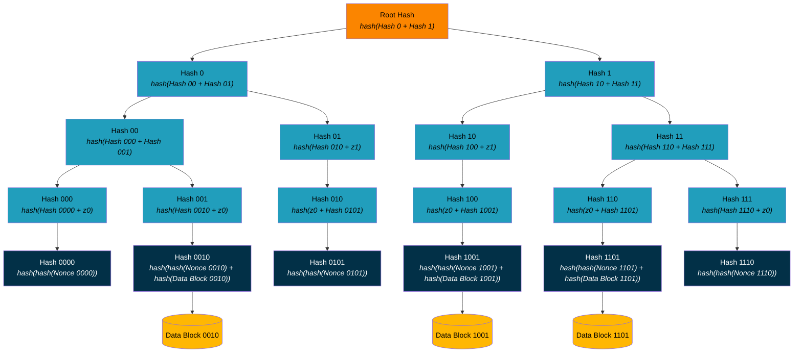



{{ links::include(root="../") }}


# Optimized Sparse Merkle Tree Implementation { #smt-implementation }

From [Wikipedia](https://en.wikipedia.org/wiki/Merkle_tree):

> In cryptography and computer science, a hash tree or Merkle tree is a tree in which every "leaf" node is labelled with the cryptographic hash of a data block, and every node that is not a leaf (called a branch, inner node, or inode) is labeled with the cryptographic hash of the labels of its child nodes. A hash tree allows efficient and secure verification of the contents of a large data structure. A hash tree is a generalization of a hash list and a hash chain.

```mermaid
flowchart TD
    classDef rootHash color:#000000,fill:#fb8500
    classDef nodeHash color:#000000,fill:#219ebc
    classDef leafHash color:#ffffff,fill:#023047
    classDef dataBlock color:#000000,fill:#ffb703

    RootHash["`Root Hash
    *hash(Hash 0 + Hash 1)*`"]:::rootHash

    RootHash --> Hash0["`Hash 0
    *hash(Hash 00 + Hash 01)*`"]:::nodeHash
    RootHash --> Hash1["`Hash 1
    *hash(Hash 10 + Hash 11)*`"]:::nodeHash

    Hash0 --> Hash00["`Hash 00
    *hash(Hash 000 + Hash 001)*`"]:::nodeHash
    Hash0 --> Hash01["`Hash 01
    *hash(Hash 010 + Hash 011)*`"]:::nodeHash

    Hash1 --> Hash10["`Hash 10
    *hash(Hash 100 + Hash 101)*`"]:::nodeHash
    Hash1 --> Hash11["`Hash 11
    *hash(Hash 110 + Hash 111)*`"]:::nodeHash

    Hash00 --> Hash000["`Hash 000
    *hash(Hash 0000 + Hash 0001)*`"]:::nodeHash
    Hash00 --> Hash001["`Hash 001
    *hash(Hash 0010 + Hash 0011)*`"]:::nodeHash

    Hash01 --> Hash010["`Hash 010
    *hash(Hash 0100 + Hash 0101)*`"]:::nodeHash
    Hash01 --> Hash011["`Hash 011
    *hash(Hash 0110 + Hash 0111)*`"]:::nodeHash

    Hash10 --> Hash100["`Hash 100
    *hash(Hash 1000 + Hash 1001)*`"]:::nodeHash
    Hash10 --> Hash101["`Hash 101
    *hash(Hash 1010 + Hash 1011)*`"]:::nodeHash

    Hash11 --> Hash110["`Hash 110
    *hash(Hash 1100 + Hash 1101)*`"]:::nodeHash
    Hash11 --> Hash111["`Hash 111
    *hash(Hash 1110 + Hash 1111)*`"]:::nodeHash

    Hash000 --> Hash0000["`Hash 0000
    *hash(Data Block 0000)*`"]:::leafHash
    Hash000 --> Hash0001["`Hash 0001
    *hash(Data Block 0001)*`"]:::leafHash

    Hash001 --> Hash0010["`Hash 0010
    *hash(Data Block 0010)*`"]:::leafHash
    Hash001 --> Hash0011["`Hash 0011
    *hash(Data Block 0011)*`"]:::leafHash

    Hash010 --> Hash0100["`Hash 0100
    *hash(Data Block 0100)*`"]:::leafHash
    Hash010 --> Hash0101["`Hash 0101
    *hash(Data Block 0101)*`"]:::leafHash

    Hash011 --> Hash0110["`Hash 0110
    *hash(Data Block 0110)*`"]:::leafHash
    Hash011 --> Hash0111["`Hash 0111
    *hash(Data Block 0111)*`"]:::leafHash

    Hash100 --> Hash1000["`Hash 1000
    *hash(Data Block 1000)*`"]:::leafHash
    Hash100 --> Hash1001["`Hash 1001
    *hash(Data Block 1001)*`"]:::leafHash

    Hash101 --> Hash1010["`Hash 1010
    *hash(Data Block 1010)*`"]:::leafHash
    Hash101 --> Hash1011["`Hash 1011
    *hash(Data Block 1011)*`"]:::leafHash

    Hash110 --> Hash1100["`Hash 1100
    *hash(Data Block 1100)*`"]:::leafHash
    Hash110 --> Hash1101["`Hash 1101
    *hash(Data Block 1101)*`"]:::leafHash

    Hash111 --> Hash1110["`Hash 1110
    *hash(Data Block 1110)*`"]:::leafHash
    Hash111 --> Hash1111["`Hash 1111
    *hash(Data Block 1111)*`"]:::leafHash

    Hash0000 --> DataBlock0000[("Data Block 0000")]:::dataBlock
    Hash0001 --> DataBlock0001[("Data Block 0001")]:::dataBlock
    Hash0010 --> DataBlock0010[("Data Block 0010")]:::dataBlock
    Hash0011 --> DataBlock0011[("Data Block 0011")]:::dataBlock
    Hash0100 --> DataBlock0100[("Data Block 0100")]:::dataBlock
    Hash0101 --> DataBlock0101[("Data Block 0101")]:::dataBlock
    Hash0110 --> DataBlock0110[("Data Block 0110")]:::dataBlock
    Hash0111 --> DataBlock0111[("Data Block 0111")]:::dataBlock
    Hash1000 --> DataBlock1000[("Data Block 1000")]:::dataBlock
    Hash1001 --> DataBlock1001[("Data Block 1001")]:::dataBlock
    Hash1010 --> DataBlock1010[("Data Block 1010")]:::dataBlock
    Hash1011 --> DataBlock1011[("Data Block 1011")]:::dataBlock
    Hash1100 --> DataBlock1100[("Data Block 1100")]:::dataBlock
    Hash1101 --> DataBlock1101[("Data Block 1101")]:::dataBlock
    Hash1110 --> DataBlock1110[("Data Block 1110")]:::dataBlock
    Hash1111 --> DataBlock1111[("Data Block 1111")]:::dataBlock
```



To use Merkle trees to signal commitments in [BTCR2 Beacons][BTCR2 Beacon]:

* The index (the identification of the leaf node) is the hash of the DID with the hash byte stream converted to an integer using big-endian conversion, i.e., `index = int(hash(did))`. The most significant bit selects the child of the root.
    * Each DID is therefore associated with one and only one leaf node.
    * Binding the index to the DID ensures that no other index can be used by a nefarious actor to post an update to the DID.
    * This produces a data structure with lots of unused leaves, making it a [Sparse Merkle Tree].
* The value at a leaf node is one of four values that the [SMT Proof Verification] algorithm specifies. The DID controller selects the value for that index in that signal: a `nonce` or no `nonce`, and an update or no update. The `nonce` is an OPTIONAL 256-bit value that is unique for each DID and each signal.
    * With a `nonce`, other parties (aggregators, other DID controllers, verifiers) cannot know if there is an update, or its contents. Only the DID controller can tell them. The DID controller keeps one `nonce` for each index and each signal for the life of the DID. If the DID controller does not have the `nonce`, the [SMT Proof] of that signal cannot be verified.
    * Without a `nonce`, all parties know if there is an update. If the update is on [CAS], all parties can also retrieve its contents, because the leaf value is the retrieval key.
    * [SMT Proof Verification] rejects a `nonce` or `updateId` that is not 32 bytes.
* An unused (empty) leaf takes a fixed *zero identity* value, defined as `hash(0 + 0)`, where `0` is 32 zero bytes. An empty subtree therefore has a fixed, precomputable value at each height of the tree — its *cached zero* — obtained by hashing the previous height's cached zero with itself, i.e., `cachedZero[0] = hash(0 + 0)` and `cachedZero[n] = hash(cachedZero[n-1] + cachedZero[n-1])`.
* The value of every node is the hash of the concatenation of its left value (bit 0) and its right value (bit 1), i.e., `node_value = hash(left_value + right_value)`. This holds even when a child is empty: the empty child contributes its cached zero value, so a hash is performed at every level all the way down the tree and no level is skipped.
    * Because the cached zero values are known to every verifier, the empty siblings along a path need not be transmitted in an [SMT Proof]; only the non-empty sibling hashes are sent, and the `collapsed` bitmap marks the positions where a cached zero is substituted. Accounting for every hash operation in this way is what makes the tree "optimized" while ensuring a single set of values cannot produce more than one valid path to the root.
* The only thing published in the [Beacon Signal] is the root hash (the Merkle root).

Throughout this appendix, `hash()` denotes SHA-256 {{#cite SHA256}} over a byte array, and the `+` operator concatenates byte arrays, not strings. The values carried in an [SMT Proof (data structure)] (`id`, `nonce`, `updateId`, `collapsed`, and the entries of `hashes`) are `base64url` {{#cite RFC4648}} encoded without padding and MUST be decoded to their raw bytes before being used in these operations; the quoted `Hash …` and `Nonce …` labels in the example below stand in for those decoded byte values.

Let's assume that indexes 0 (`0000`), 2 (`0010`), 5 (`0101`), 9 (`1001`), 13 (`1101`), and 14 (`1110`) have DIDs associated with them; and a signal includes updates for DIDs 2, 9, and 13 and non-updates for all others.

The optimized tree for this signal looks like this. Every node is still hashed from its two children, but each empty subtree contributes its precomputed cached zero value rather than being recomputed or transmitted. Empty leaves take the value `z0` (`cachedZero[0]`), and a subtree of two empty leaves takes `z1 = hash(z0 + z0)` (`cachedZero[1]`); these cached zeros are shown inline in the node formulas rather than drawn as separate nodes:



The DID controller has to prove that there is either an update or a non-update in the [Beacon Signal]. The DID controller gives an [SMT Proof (data structure)], and its `nonce` and `updateId` fields select the leaf value that [SMT Proof Verification] specifies. In addition, the DID controller provides the `collapsed` bitmap (marking which sibling positions are empty subtrees, recoverable from the cached zeros) and the hashes of the non-empty peers in the tree necessary to recompute the root hash to compare against the value in the [Beacon Signal].

Assuming that the DID of interest is at index 13 (`int(hash(did)) == int(1101) == 13`), the [Aggregation Service] (the party responsible for constructing the [Sparse Merkle Tree]) must provide the DID controller with the `collapsed` bitmap for the path above leaf node 13 and the hashes of the non-empty peers along that path (the empty peers are recovered from the cached zeros).

The [Aggregation Service] has the full [Sparse Merkle Tree] and can construct [SMT Proofs][SMT Proof]. DID controllers request the [SMT Proofs][SMT Proof] from the [Aggregation Service] and give them to verifiers. This is an example proof for the four-level tree above. Its values are labels, not bytes. [SMT Proof (data structure)] shows proofs of the 256-level tree with correct byte values.


```json
{
  "id": "<< base64url (no padding) of Root Hash >>",
  "nonce": "<< base64url (no padding) of Nonce 1101 >>",
  "updateId": "<< base64url (no padding) of hash(Data Block 1101) >>",
  "collapsed": "<< base64url (no padding) of 0001 >>",
  "hashes": [
      "<< base64url (no padding) of Hash 111 >>",
      "<< base64url (no padding) of Hash 10 >>",
      "<< base64url (no padding) of Hash 0 >>"
  ]
}
```

With an [SMT Proof], the verifier has everything necessary to verify that the [BTCR2 Update] is included or not. Assuming that the verifier can match the root hash in the [Beacon Signal] to `proof.id` and the [BTCR2 Update] to `proof.updateId`, the proof is verified as follows:

```javascript
index = int(hash(did)) // 1101

candidateHash = hash(hash(proof.nonce) + proof.updateId)

// First collapsed bit from right is 1, so the sibling subtree is empty;
// substitute the cached zero for this height. A hash is still performed.
// First index bit from right is 1, so the candidate hash goes to the right.
candidateHash = hash(cachedZero[0] + candidateHash)

// Next collapsed bit from right is 0, so take the next listed hash.
// Next index bit from right is 0, so the candidate hash goes to the left.
candidateHash = hash(candidateHash + "Hash 111")

// Next collapsed bit from right is 0, so take the next listed hash.
// Next index bit from right is 1, so the candidate hash goes to the right.
candidateHash = hash("Hash 10" + candidateHash)

// Next collapsed bit from right is 0, so take the next listed hash.
// Next index bit from right is 1, so the candidate hash goes to the right.
candidateHash = hash("Hash 0" + candidateHash)

// Listed hashes exhausted; the collapsed level used a cached zero.
// Candidate hash must equal root hash.
assert(candidateHash === proof.id)
```

The walk-through above is a concrete example for index 13; for the general (normative) verification algorithm and pseudocode — including the hashed-zero cache construction — see the [SMT Proof Verification] algorithm.
